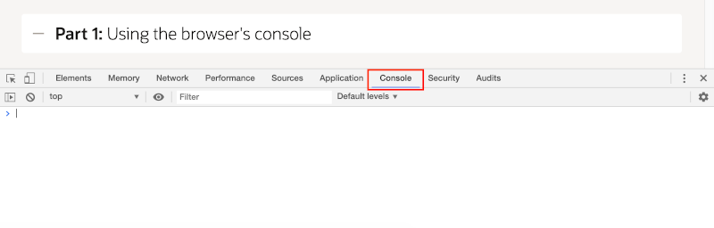
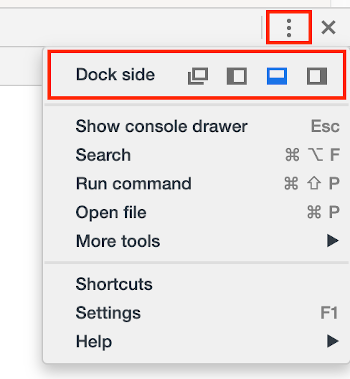
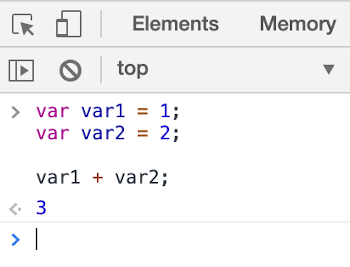
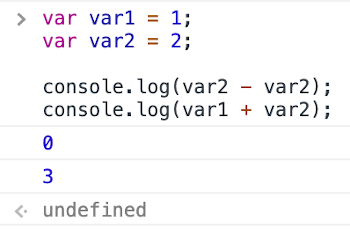
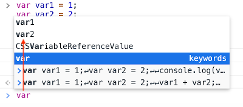

# JavaScriptの基本

## はじめに

このラボでは、JavaScriptの基本、変数、演算子、および関数を含む、ブラウザの開発者ツールのコンソールから作業を開始します。

このラボは<a href="https://developers.google.com/web/tools/chrome-devtools/" target="\_blank">Google ChromeのDevTools</a>を基にしていますので、可能であればそのブラウザを使用してください。他のブラウザを使用しても構いませんが、後続の指示を必要に応じて調整する必要があります。

このラボについて学ぶために、以下のビデオを再生してください。

[](youtube:02thxqv-m_c)

 <a href="https://www.slideshare.net/DanielMcGhan/module-1-javascript-basics" target="\_blank">こちらをクリック</a> してスライドを表示してください。

## タスク1：ブラウザのコンソールを使用する

このパートでは、ウェブブラウザのコンソールで変数を宣言し、さまざまな演算子を使用する方法を学びます。

1. Chromeでは、DevToolsコンソールタブを開くために**Command+Option+J**（Mac）または**Control+Shift+J**（Windows/Linux）を押します。

    

2. 開発者ツールウィンドウは、ブラウザに異なる方法でドッキングしたり、完全にドッキング解除したりできます。カスタマイズメニューを使用して、開発者ツールウィンドウのサイズ変更と位置変更を練習してください。

    開発者ツールウィンドウを好みの位置に配置するまで、次のステップに進んでください。

    

3. 次のコードを**コンソール**タブに入力します。コピーせずに入力してみてください。注意：**Enter**を押すとコンソールでコードが実行されます。新しい行を追加するには**Shift+Enter**を使用します。

    ```
    <copy>
    var var1 = 1;
    var var2 = 2;

    var1 + var2;
    </copy>
    ```

4. 前のステップで入力したコードを実行するために**Enter**キーを押します。コンソールに数値 `3` が出力されるはずです。

    

    ご覧の通り、コンソールはRead-Eval-Print-Loop（REPL）の実装です。コードを読み取り、実行し、最後の式からの出力を表示し、その後、すべてを繰り返すために制御を返します。

5. **上向き矢印**を押して、以前に実行したコードブロックを読み込みます。**上向き矢印**と**下向き矢印**は、コンソールの実行履歴をサイクルするために使用できます。コードを次のように変更します。

    ```
    <copy>
    var var1 = 1;
    var var2 = 2;

    console.log(var2 - var2);
    console.log(var1 + var2);
    </copy>
    ```

6. コードを実行するために**Enter**キーを押します。コンソールに以下のような出力が表示されるはずです。

    

    ご覧の通り、`console.log` メソッドはJavaScriptコードから出力を取得する手段を提供します。これはシンプルなデバッグに役立ちます。

    `undefined` は、最後のステートメント（`console.log` の呼び出し）が値を返さなかったために表示されます。まるで`undefined` を返したかのようです。

7. コンソールに戻り、前のコードで宣言された変数の名前を入力し始めます（例：`var1`）。変数の名前が表示されるオートコンプリートポップアップウィンドウが表示されるはずです。

    

    変数の完全な名前を入力して**Enter**キーを押すと、変数の値がコンソールに表示されることに注意してください。

8. ウェブページをリフレッシュして、変数の名前を再度入力してみてください。各ページがブラウザでロードされるたびに、それぞれ新しいJavaScriptコンテキストを取得するため、変数は表示されなくなります。

## タスク2：変数、データ型、および演算子

コンソールの基本的な操作についての知識が身についたので、JavaScriptを実際に活用してみましょう。

1. コンソールに以下のコードを入力します。次に、宣言をガイドにして、各種類の変数を1つずつ追加します。**Enter**キーを押し、変数の値をコンソールで確認します。

    ```
    <copy>
    var msg = 'Hello';
    var id = 123;
    var fun = true;
    var things = ['car', 'laptop', msg];
    </copy>
    ```

2. 前のステップのコードに、以下の演算子を使用する文を追加します。各タイプから少なくとも2つの演算子を選択し、合計8つの文を追加します。

    | 演算子のタイプ | 演算子 |
    | --- | --- |
    | 代入 | `=`, `+=`, `-=`, `*=`, `/=`, `%=` |
    | 算術 | `+`, `-`, `*`, `/`, `%`, `++`, `--` |
    | 比較 | `==`, `===`, `!=`, `!==`, `>`, `<`, `>=`, `<=` |
    | 論理 | `&&`, `||`, `!` |

## タスク3: 条件とループ

条件とループなしではプログラミングは不可能です。基本的な`if`ステートメントと`for`ループがJavaScriptを使い始めるために本当に必要です。

1. 前の部分のコードに、自分で選んだ`if`ステートメントを書き加えます。以下のコードをガイドとして使用してください。

    ```
    <copy>
    if (msg === 'bye') {
      fun = false;
    }
    </copy>
    ```

    必要に応じてコードを実行してテストします。さらに練習するために、`if-then-else`ステートメントを書いてみてください。

2. 前のステップのコードに、Step 1で宣言した配列の値を表示するループを書き加えます。以下のコードをガイドとして使用してください。

    ```
    <copy>
    for (var x = 0; x < things.length; x += 1) {
      console.log(things[x]);
    }
    </copy>
    ```

    必要に応じてコードを実行してテストします。

## タスク4: オブジェクトと関数

オブジェクトと関数はJavaScriptでコードを構成し、組織化するために使用されます。より複雑なトピックに移る前に、それらがどのように機能するかの基本的な理解を持つことが重要です。

1. 以下のコードをコンソールに入力し、実行します。

    ```
    <copy>
    var person = {
      first: '',
      last: ''
    };

    function sayHello(p) {
      console.log('Hi ' + p.first + ' ' + p.last);
    }
    </copy>
    ```

2. コンソールを使用して、`person`変数の`first`および`last`属性の値を設定するコードを入力し、実行します。

3. コンソールを使用して、`person`変数を引数として渡しながら`sayHello`関数を呼び出すコードを入力し、実行します。

4. 時間が許す場合、次の改良を考えてみてください：

    * 人々の配列を受け入れ、それぞれに挨拶する新しい関数「sayHello2」を追加します。
    * 「sayHello2」を更新して、人々のファーストネームまたはラストネームが空の文字列（`''`）、`null`、または`undefined`の場合、挨拶をしないようにします。


## **まとめ**

これでラボ1が完了しました。この時点で、コンソールとJavaScriptの基本的な概念に慣れてきたはずです。次に、ラボ2に進んでください。


## **Acknowledgements**
 - **Author** -  Dan McGhan, Database Product Management
 - **Contributors** - Arabella Yao, Jeffrey Malcolm Jr, Robert Ruppel, LiveLabs QA
 - **Last Updated By/Date** - Jeffrey Malcolm Jr, LiveLabs QA, June 2020
