# APEXアプリにJavaScriptを追加する

## はじめに

ここまでは、APEXの外でJavaScriptを操作してきました。このラボでは、APEXアプリケーションにJavaScriptを追加する一般的な方法を学びます。オプションには、動的アクション、JavaScriptフックを使用した動的アクション、ページおよびコンポーネントレベルの属性、アプリケーションファイルがあります。

これらのオプションは、順を追って進化するものと考えてください。それぞれが、JavaScript、APEXのJavaScript API、Web開発全般のより多くの知識を必要とします。新しいAPEX開発者は、動的アクションから学び始め、より高度なアプローチがなければアプリケーションの要件を満たすことができない場合にのみ、後続のオプションに進むべきです。一般的に、ソリューションが宣言的であればあるほど、実装とメンテナンスが容易になります。

このラボのビデオをご覧ください。

[](youtube:-l6E5LuNU3U)

<a href="https://www.slideshare.net/DanielMcGhan/module-2-adding-javascript-to-apex-apps" target="\_blank">こちらをクリック</a>してスライドをご覧ください。

## タスク1: 動的アクションの使用

動的アクションは、APEXアプリケーションにJavaScriptを追加する最も簡単な方法です。多くの場合、完全に宣言的(コード不要)にできます。このステップでは、アイテムの値に基づいてページコンポーネントを非表示/表示する動的アクションを作成します。  

1. APEXワークスペースにログインしてください。このラボの導入で説明した手順を使用してワークスペースを作成した場合、**ワークスペース**と**ユーザー名**は `DEMO` で、**パスワード** は `SecretPassw0rd` です。

    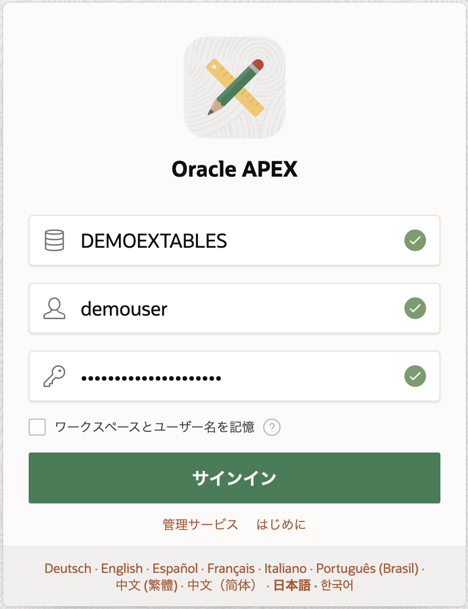

2. **アプリケーション・ビルダー**に移動し、**Sample Database Application**インポートしてインストールしてください。

    **アプリケーション・ビルダー**画面で、**インポート**をクリックします。
    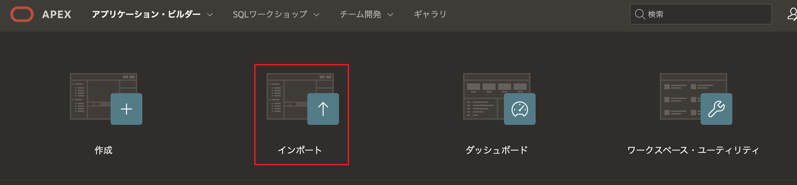  

    **インポートウィザード**画面が表示されます、ここで**ドラッグ・アンド・ドロップ**をクリックします。
    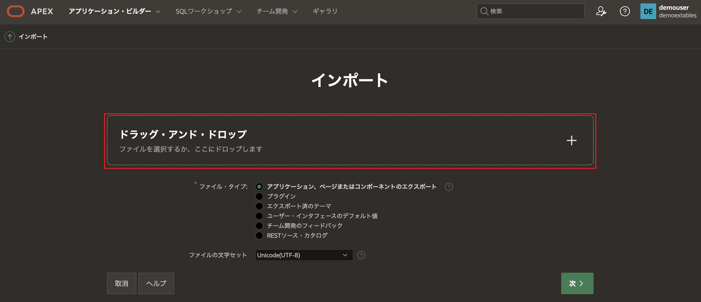  

    ファイル**SampleDatabaseApplication_Apex\_19.2.sql**を選択します。
    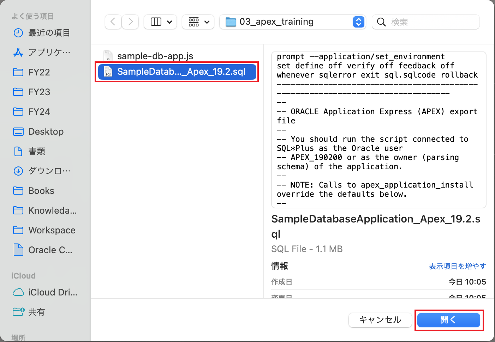  

    **次へ**をクリックします。
    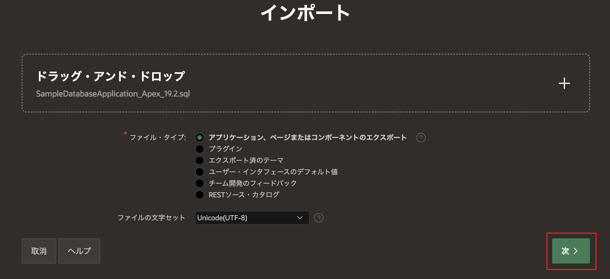 

    **次へ**をクリックします。 
    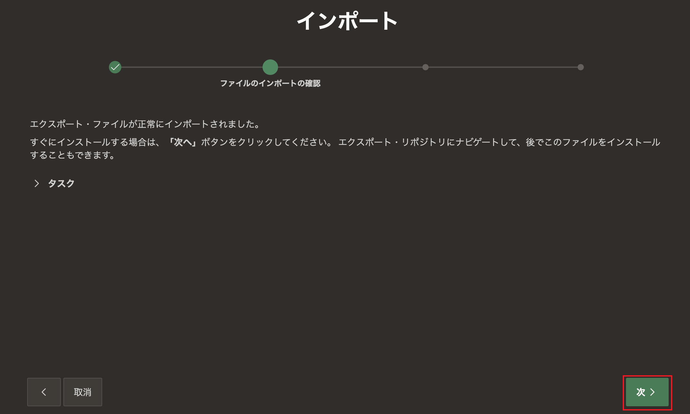  

    **アプリケーションのインストール**をクリックします。
    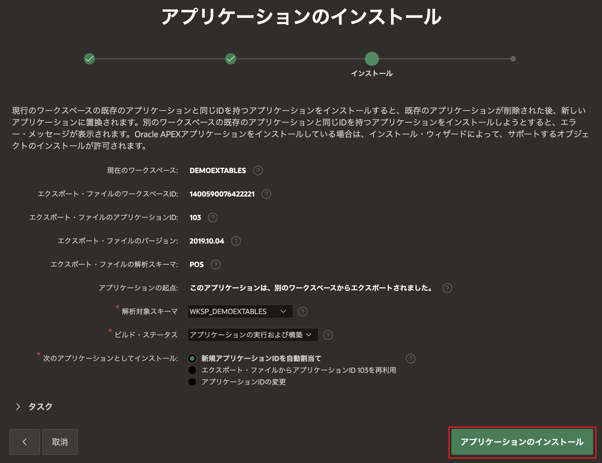  

    **次へ**をクリックします。
    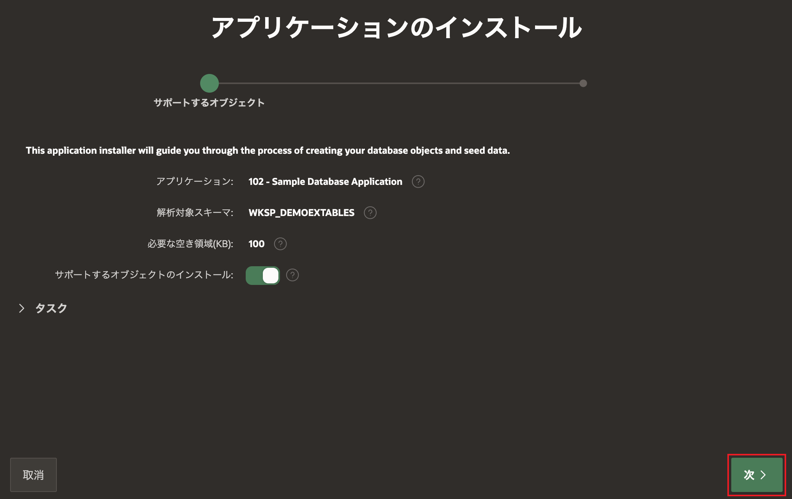 

    **インストール**をクリックします。 
    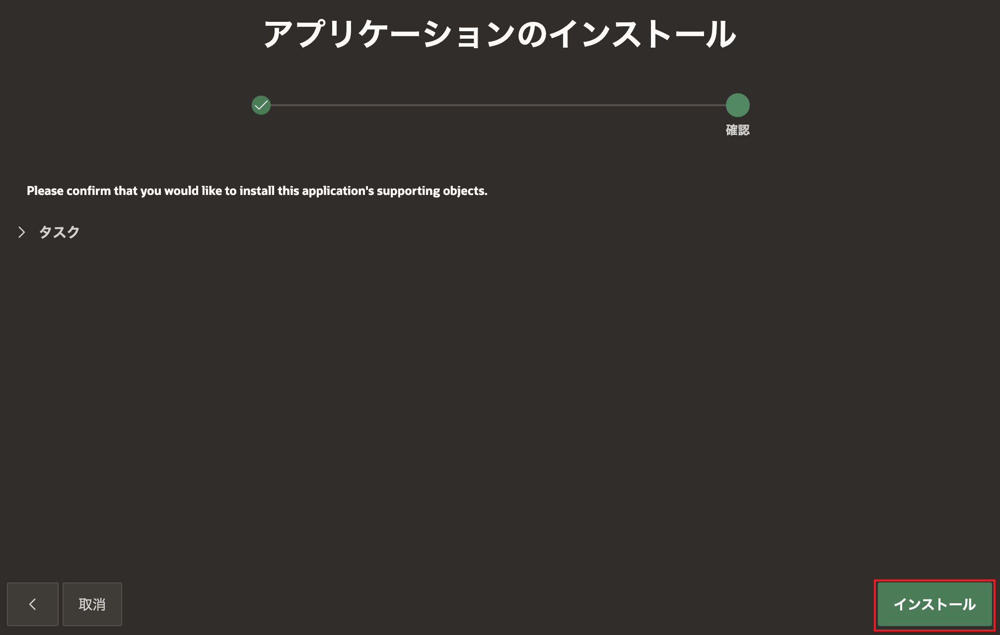  

    **アプリケーションの実行**をクリックして、アプリケーションを実行します。
    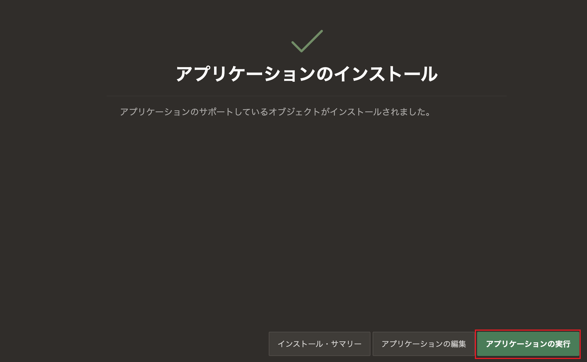  

3. アプリを実行し、**Products**ページに移動します。 **Bag**などの製品の**Name**をクリックします。次のようなフォームが表示されます。 

    

    現時点では、**Product Image**アイテムとイメージを表示する領域の両方が、**Product Available**アイテムが**No**に設定されているときに表示されます。次のステップでは、**Product Available**アイテムが**No**に設定されているときに、イメージアイテムと関連する領域を非表示にする動的アクションを実装します。

4. サンプルアプリのページ6、Product Detailsページのページデザイナーに移動します。左のレンダリングパネルで、**P6\_PRODUCT\_AVAIL**という名前のアイテムを右クリックし、**動的アクションの作成**を選択します。

    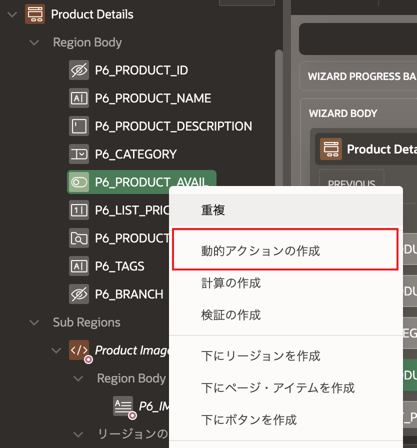

5. 右のプロパティパネルで、**名前**を**P6\_PRODUCT_AVAIL changed**に設定します。**イベント**、**選択タイプ**、**アイテム**の選択はすべて正しく設定されています。これは、アクションが**P6\_PRODUCT\_AVAIL**を右クリックして作成されたためです。続ける前に、**イベント**の選択リストを開いて、使用可能な他のイベントを確認してください。

    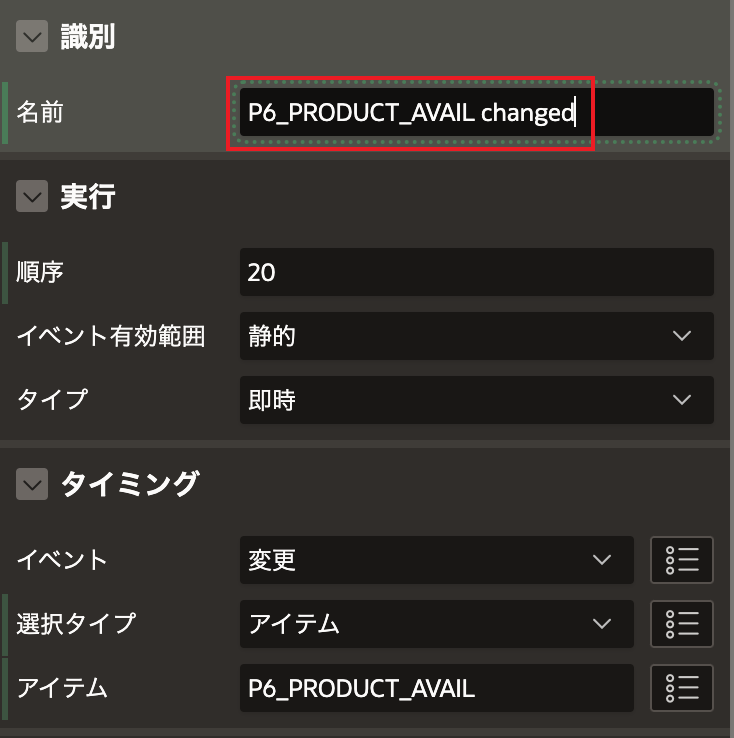

6. 真偽のアクションを定義するには、クライアントサイドの条件を定義する必要があります。 **クライアントサイドの条件**セクションで、**タイプ**を**アイテム = 値**に、**アイテム**を**P6\_PRODUCT\_AVAIL**(デフォルト)に、**値**を**Y**に設定します。

    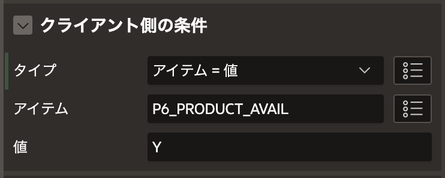

7. 左のパネルで、**表示**アクションを選択します。これはデフォルトで作成されたアクションですが、必要なアクションだったことがわかります。

    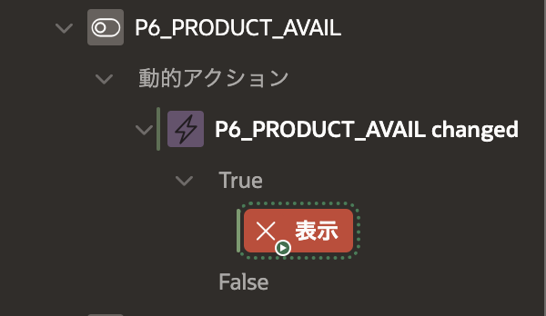

8.  右のパネルで、**選択タイプ**を**アイテム**に、**アイテム**を**P6\_PRODUCT\_IMAGE**に設定します。

    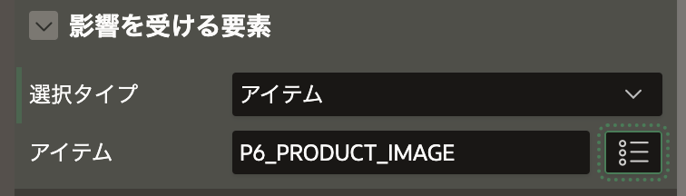

    これにより、イメージアイテムが正しく表示されますが、リージョンも考慮する必要があります。次にそれを行います。

9.  左のパネルの**表示**アクションを右クリックし、**複製**を選択します。

    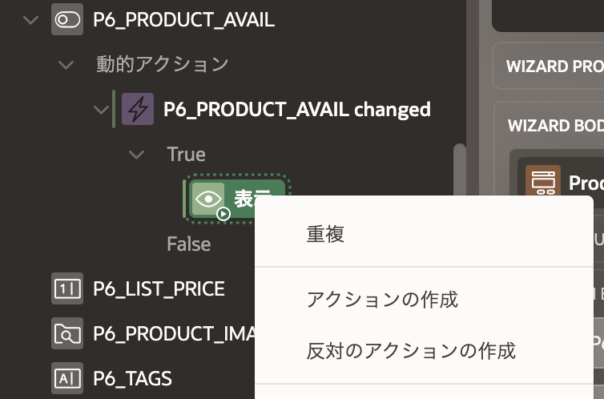

10. 右のプロパティパネルで、**選択タイプ**を**リージョン**に、**リージョン**を**..Product Image**に設定します。

    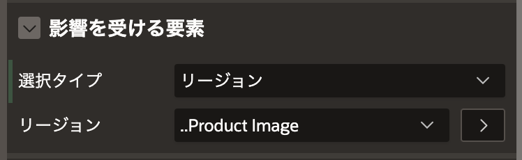

11. この時点で、表示アクションは正しく設定されていますが、非表示アクションはまだ作成する必要があります。 非表示は表示の反対なので、APEXではこれを非常に簡単にできます。 左のパネルで両方の表示アクションを選択した後、アクションのいずれかを右クリックし、**逆のアクションの作成**を選択します。

    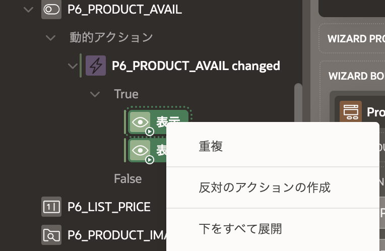

    動的アクションのFalseブランチの下に、2つの新しい非表示アクションが表示されるはずです。 最高の点は、前のアクションの設定がすでに設定されていることです。

12. 変更を保存し、ランタイムアプリケーションに戻ります。フォームページを閉じ、製品を再度クリックすることで再度開きます。 これで、イメージアイテムとリージョンは、**製品の可用性**の値に基づいて非表示/表示されるはずです。 動的アクションを使用すると、1行のJavaScriptコードも書かずにそれをすべて実現できます。

    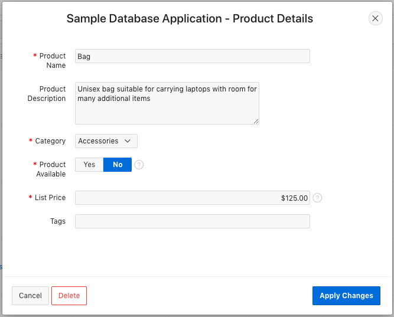


## タスク2: JavaScriptフックとともに動的アクションを使用する

動的アクションフレームワークは、少しJavaScriptを知っている開発者向けのさまざまなJavaScriptフックまたは機能を提供します。 これらの機能により、フレームワークをより強力で柔軟なものにすることができます。

このステップでは、前のステップで作成した動的アクションでこれらの機能を使用します。 最終結果は同じですが、必要に応じて利用できるJavaScriptフックのより良いアイデアが得られます。

1. ページ6のページデザイナーに戻り、前のステップで作成した動的アクションを選択します。

    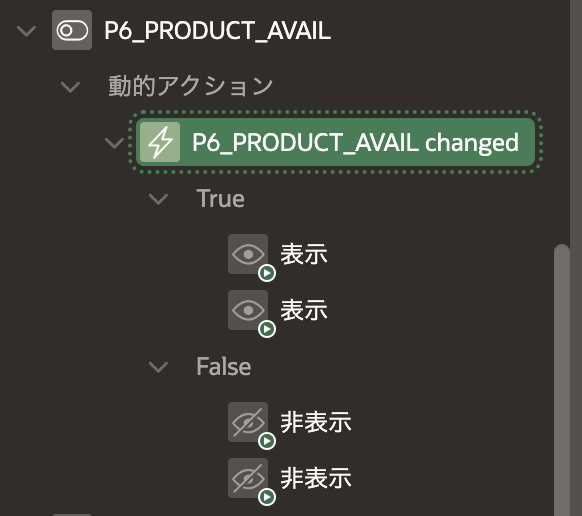

2. 右パネルの**When**セクションで、**Event**を**Custom**に、**Custom Event**を**change**に、**Selection Type**を**jQuery Selector**に、**jQuery Selector**を**#P6_PRODUCT_AVAIL**に設定します。

    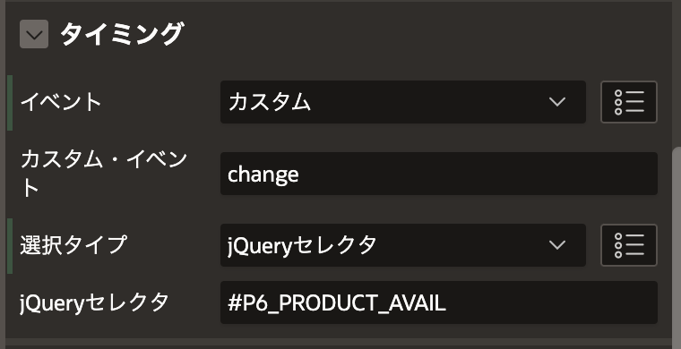

    これらの設定は、宣言型の設定と同じです。 次のラボで、イベント、jQuery、jQueryセレクターの詳細を学習します。

3. **Client-side Condition**セクションで、**Type**を**JavaScript Expression**に、**JavaScript Expression**をこのコードに設定します: `$v(this.triggeringElement.id) === 'Y'`

    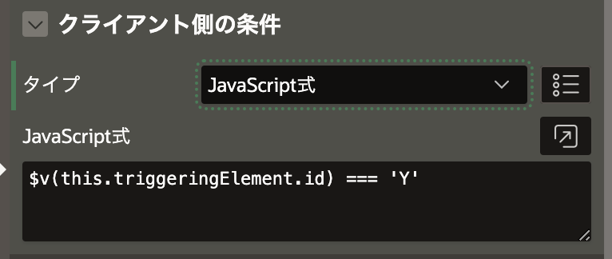

    `$v` は [APEX用JavaScript API](https://apex.oracle.com/jsapi) によって提供される関数です。 アイテムの値を返します。 アイテムのidプロパティは動的に取得されるため、名前が変更されても式を更新する必要はありません。

4. アクションを変更する前に、リージョンのプロパティを設定して、製品イメージリージョンの一貫したidを提供する必要があります。 左のパネルで、**Product Image**リージョンを選択します。

    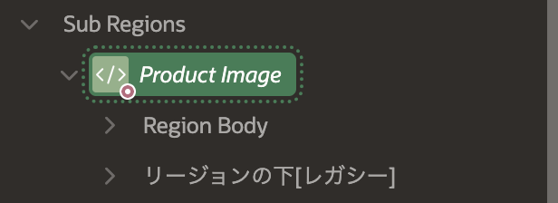

5. 右のパネルで、**Static ID**を**product-image-reg**に設定します。

    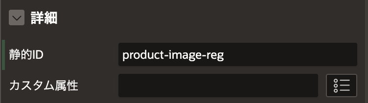

6. 左のパネルで、**Dynamic Action**タブを選択します。 これは、宣言型セレクターを使用していたときにアイテムに直接リンクされていなかったために必要です。

    **Show**アクションの1つを右クリックして**Delete**します。 残りの**Show**アクションを選択します。

    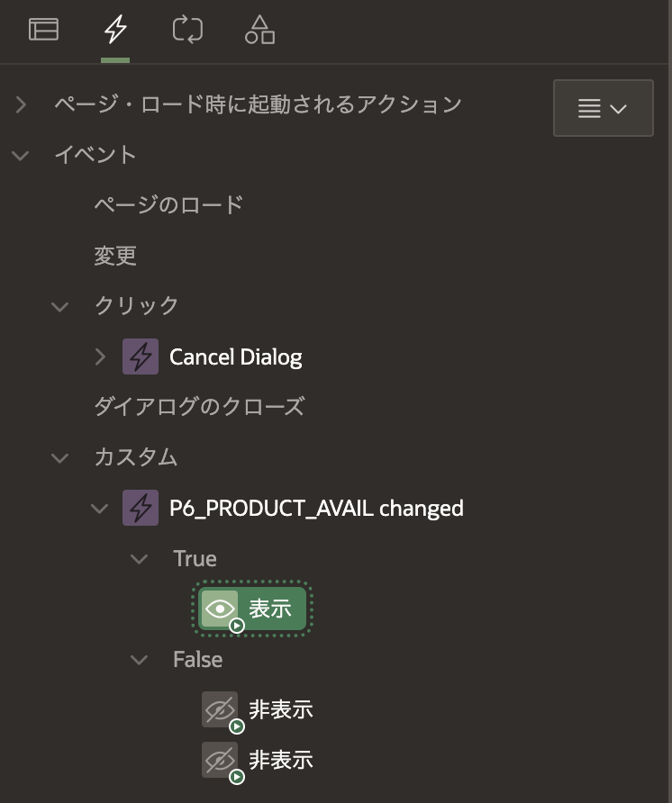

7. 右のパネルで、**Action**を**Execute JavaScript**に設定し、次のコードを**Code**属性に入力します。

    ```
    <copy>
    $('#product-image-reg').show();
    $('#P6_PRODUCT_IMAGE')
    .closest('.t-Form-fieldContainer')
    .show();
    </copy>
    ```

    そのコードは、次のラボで説明されるDOMのトラバースと操作のメソッドを使用しています。アクションは次のように表示される必要があります。

    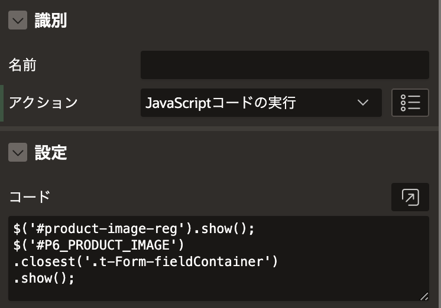

8. **Fire on Initialization**属性を**On**に設定します。

    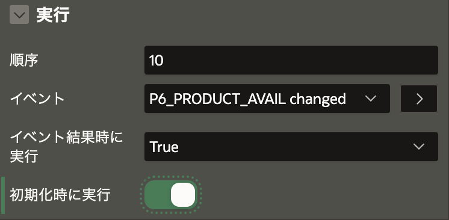

9. 左のパネルで、**Dynamic Action**タブを選択します。 **Hide**アクションの1つを右クリックして**Delete**します。 残りの**Hide**アクションを選択します。

    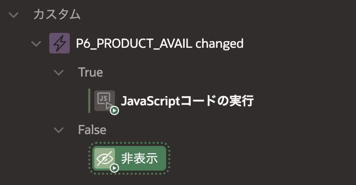

10. 右のパネルで、**Action**を**Execute JavaScript**に設定し、次のコードを**Code**属性に入力します。

    ```
    <copy>
    $('#product-image-reg').hide();
    $('#P6_PRODUCT_IMAGE')
    .closest('.t-Form-fieldContainer')
    .hide();
    </copy>
    ```

    アクションは次のように表示される必要があります。

    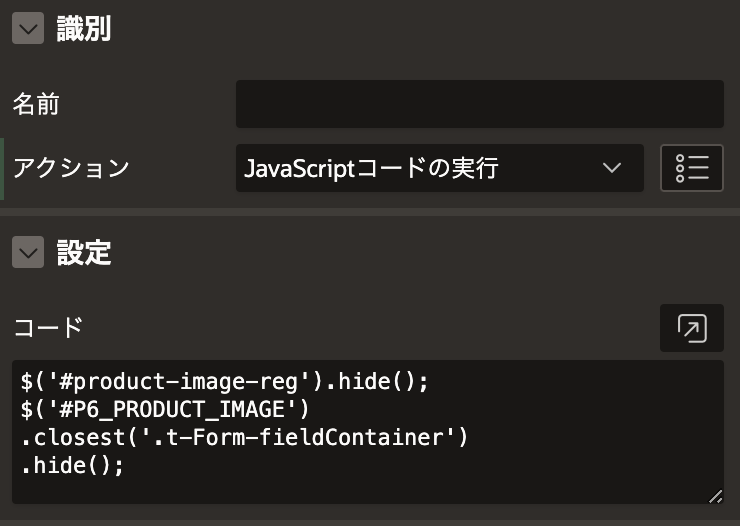

11. **Fire on Initialization**属性を**On**に設定します。 

    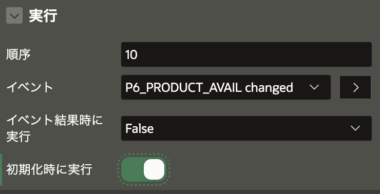

12. 変更を保存し、フォームページを再度開きます。以前とまったく同じようにすべて機能するはずです。宣言型のオプションのほうが、JavaScriptフックを使用するよりはるかに簡単であることに同意されることを願っています。ただし、それらが提供する柔軟性が必要な場合は、フックがそこにあることを嬉しく思うでしょう!


## タスク3: ページとコンポーネントレベルの属性を使用する

動的アクションに加えて、ページとコンポーネントレベルには、JavaScript向けのさまざまな属性があります。 このステップでは、それらの属性がどこにあるかと、それらがどのように使用されるかを学習します。

1. ページ1のページデザイナー、つまりホームページに戻り、レンダリングタブの下のツリー内のルート要素を選択します。

    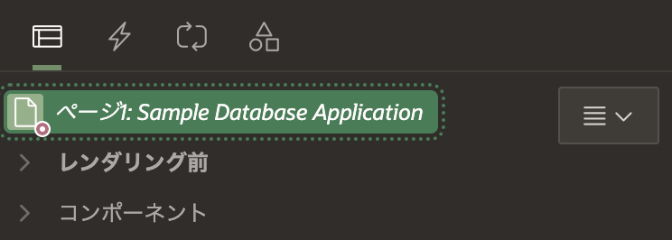

2. 右のパネルで、プロパティをスクロールダウンし、**JavaScript**セクションを見つけます。 次の関数を**Function and Global Variable Declaration**プロパティに入力します。

    ```
    <copy>
    function doWork() {
      console.log('doWork fired!');
    }
    </copy>
    ```

    そのプロパティのコードは、グローバルスコープで実行されます - DOMの読み込みイベントとAPEXコンポーネントの初期化の前に。

    次に、このコードを**Execute when Page Loads**プロパティに追加します。

    ```
    <copy>
    doWork();
    </copy>
    ```

    そのプロパティのコードは、関数スコープで実行されます - DOMの読み込みイベントとAPEXコンポーネントの初期化の後に。

    設定は次のようになります。

    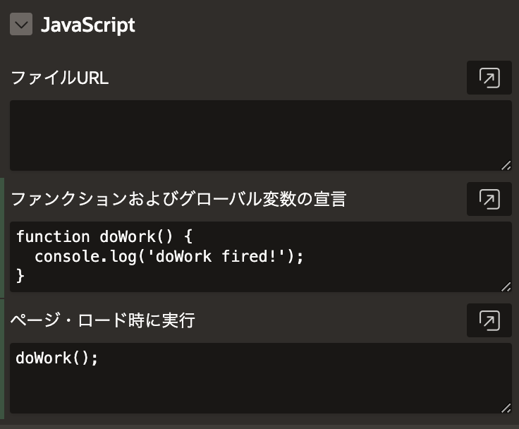

3. 変更を保存し、ブラウザのコンソールを開いた状態でホームページを実行します。 `doWork`関数が呼び出されたときにメッセージが表示されるはずです。 このシンプルなサンプルは機能的には何も行いませんが、次のラボで行えることの種類の詳細を学習します。

    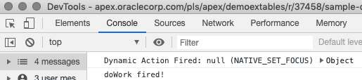  

4. **レポート** > **カテゴリ別売上** に移動します。 現在、チャート内のカテゴリに割り当てられた色はランダムに選択されています。 さまざまな緑色の色合いを明示的に設定するJavaScriptコードを追加します。

    

5. ページ16のページデザイナーに移動し、**カテゴリ別売上**リージョンを選択します。 ページデザイナーの右側にあるプロパティエディターで**属性**タブをクリックします。 プロパティをスクロールダウンし、**JavaScript Initialization Code**に来るまで、次の関数をそのフィールドにコピーします。

    ```
    <copy>
    function(options) {
      options.dataFilter = function(data) {
        data.series[0].color = '#0B6623';
        data.series[1].color = '#9DC183';
        data.series[2].color = '#708238';

        return data;
      };
      return options;
    }
    </copy>
    ```

    この無名関数はオプションオブジェクトを受け取り、`dataFilter`関数を追加することでそれを変更します。 dataFilter関数は、チャートの各シリーズに明示的な色を割り当てます。

    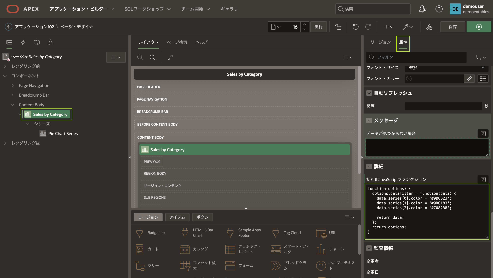

6. 変更を保存し、ページを再実行します。 緑の色でチャートが表示されるはずです。 

    

## タスク4: 静的ファイルの使用  

最後のステップでは、ページとコンポーネントレベルの属性に直接JavaScriptコードを追加しました。 パフォーマンスと再利用性の理由から、JavaScriptコードを静的ファイルに移動することが望ましい場合があります。 サンプルデータベースアプリケーションにはこれらのメリットを実現するのに十分なJavaScriptコードがありませんが、このステップでは、以前に追加したコードを静的ファイルに移動して、その方法を確認します。

1. 次のコードには、ホームページで呼び出されている`doWork`関数と、カテゴリ別売上チャートの色付けを行う関数が含まれています。 2番目の関数への唯一の変更は、現在名前が付いていることです(以前は無名関数でした)。

    **このリンクをクリック**して、このラボのJavascriptファイル`sample-db-app.js`をローカルコンピュータにダウンロードしてください。

    または、コンピュータ上に**sample-db-app.js**という名前の新しいファイルを作成し、以下のコードを保存することもできます。

    ```
    <copy>
    function doWork() {
      console.log('doWork fired!');
    }

    function styleSalesByCatChart(options) {
      options.dataFilter = function(data) {
        data.series[0].color = '#0B6623';
        data.series[1].color = '#9DC183';
        data.series[2].color = '#708238';

        return data;
      };

      return options;
    }
    </copy>
    ```

2. **共有コンポーネント** > **静的アプリケーションファイル** に移動します。**ファイルのアップロード**をクリックし、前のステップで作成した **sample-db-app.js** ファイルを **ファイル** 項目で選択して、**アップロード** をクリックします。新しくアップロードされたファイルの **参照** 列の文字列に注意してください:**#APP_IMAGES#sample-db-app.js**。これは次のステップで利用します。

    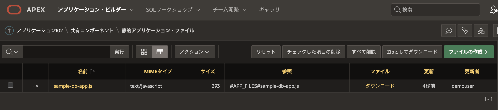

3. ページ16のページデザイナーに移動し、**カテゴリ別売上** リージョンの **属性** をドリルダウンします。**JavaScript Initialization Code** の値を次のように置き換えます:`styleSalesByCatChart`

    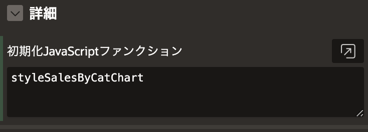

    関数の末尾に括弧がないことに注意してください。これにより、関数の呼び出しではなく、ファイルで宣言された関数への参照になります。APEXは適切なタイミングで関数を呼び出します。
   
4. ページレベルの属性(レンダリングタブの下のルートノード)を選択し、**JavaScript** セクションの **File URL(s)** 項目に次のファイル参照を入力します:**#APP_IMAGES#sample-db-app.js**

    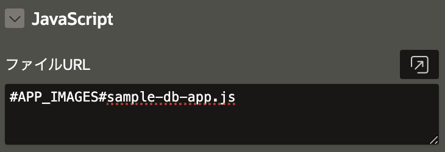
   
5. 変更を保存し、ページを実行します。チャートは以前と同じ緑色のグラデーションでスタイル設定されるはずですが、今回はJavaScriptは静的ファイルで定義されています。関数が十分に汎用的であれば、アプリケーションの他の場所でも使用できます。
   
6. ページ1のページデザイナーに移動し、ページレベルの属性をドリルダウンします。**Function and Global Variable Declaration** フィールドの値をクリアし、**JavaScript** セクションの **File URL(s)** 項目に次のファイル参照を入力します:**#APP_IMAGES#sample-db-app.js**

    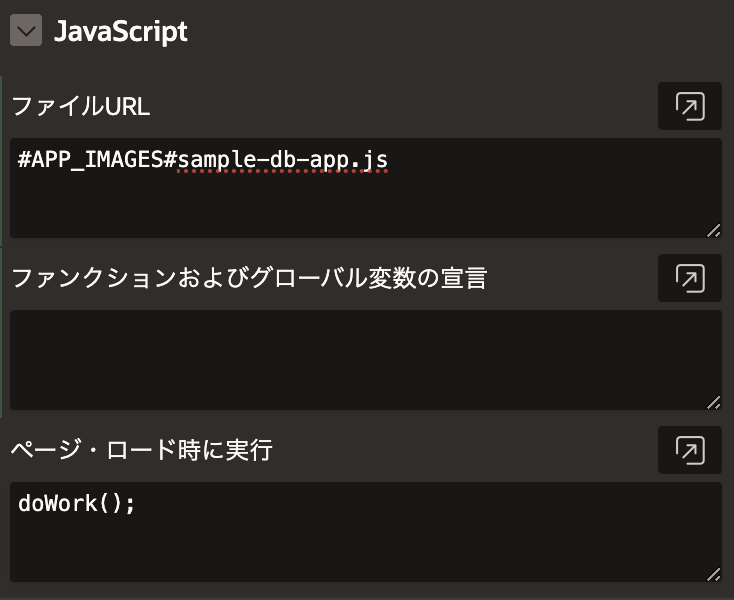

7. 変更を保存し、ページを実行します。以前と同じ `doWork` 関数からのメッセージが表示されるはずですが、今回は関数が静的ファイルで定義されています。

## **まとめ**

これでLab 2が完了しました。この時点で、APEXアプリケーションにJavaScriptを追加するために利用できるオプションについて確かな理解が得られたはずです。次にLab 3に進んでください。


## **謝辞**
 - **著者** -  Dan McGhan, Database Product Management
 - **寄稿者** - Arabella Yao, Jeffrey Malcolm Jr, Robert Ruppel, LiveLabs QA
 - **最終更新者/日付** - Arabella Yao, Product Manager Intern, Database Management, July 2020

