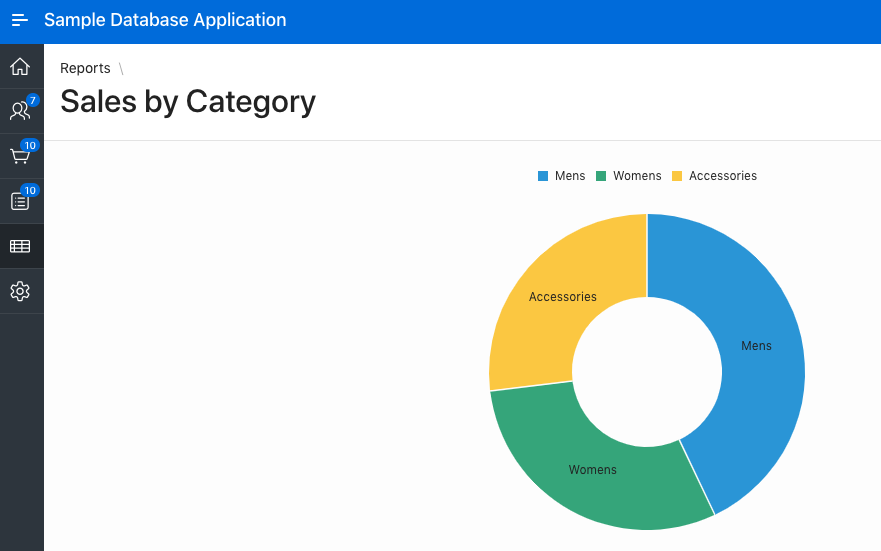

# APEXアプリにJavaScriptを追加する

## はじめに

ここまでは、APEX外でJavaScriptを使用してきました。このラボでは、APEXアプリケーションにJavaScriptを追加する最も一般的な方法を学びます。オプションには、ダイナミックアクション、JavaScriptフックを備えたダイナミックアクション、ページおよびコンポーネントレベルの属性、およびアプリケーションファイルが含まれます。

これらのオプションをプログレッションと考え、それぞれがJavaScript、APEXのJavaScript API、およびWeb開発全般に関するより多くの知識を必要とするものと考えてみてください。新しいAPEX開発者は、Dynamic Actionsを学び、アプリケーションの要件がより高度なアプローチなしでは満たされない場合にのみ、後続のオプションに進むことを検討すべきです。一般的に、ソリューションが宣言的であればあるほど、実装および保守が容易になります。

このラボについての詳細を学ぶために、以下のビデオを再生してください。

[](youtube:-l6E5LuNU3U)

<a href="https://www.slideshare.net/DanielMcGhan/module-2-adding-javascript-to-apex-apps" target="\_blank">ここをクリック</a> してスライドを表示します。

## タスク1: ダイナミックアクションの使用

Dynamic Actionsは、APEXアプリケーションにJavaScriptを追加する最も簡単な方法です。ほとんどの場合、完全に宣言的であることがあります（コードは不要）。このステップでは、アイテムの値に基づいてページコンポーネントを非表示および表示するDynamic Actionを作成します。

1. APEXワークスペースにログインします。このラボの導入手順でワークスペースを作成した場合、**Workspace**と**Username**は`DEMO`で、**Password**は`SecretPassw0rd`になります。

    

2. **App Gallery**に移動し、**Sample Database Application**をインストールします。

    

3. アプリケーションを実行し、**Products**ページに移動します。製品の**Name**をクリックします（たとえば**Bag**）。次のようなフォームが表示されるはずです。

    

    現時点では、**Product Available**アイテムが**No**に設定されている場合に、**Product Image**アイテムと画像を表示する領域の両方が表示されています。次のステップでは、**Product Available**アイテムが**No**に設定された場合に画像アイテムと関連する領域を非表示にするDynamic Actionを実装します。

4. サンプルアプリ内のページ6、製品詳細ページのPage Designerに移動します。左側のレンダリングペインで、**P6\_PRODUCT\_AVAIL**というアイテムを右クリックし、**Create Dynamic Action**を選択します。

    

5. 右側のプロパティペインで、**Name**を**P6\_PRODUCT\_AVAIL changed**に設定します。**Event**、**Selection Type**、および**Item(s)**の選択肢がすべて正しいことに注意してください。このアクションは**P6\_PRODUCT\_AVAIL**を右クリックして作成されたためです。続行する前に、**Event**の選択リストを開いて利用可能な他のイベントをすべて表示します。

    

6. trueおよびfalseのアクションを両方持つ機会を作成するには、クライアントサイドの条件を定義する必要があります。**Client-side Condition**セクションで、**Type**を**Item = Value**、**Item**を**P6\_PRODUCT\_AVAIL**（デフォルトであるはず）、**Value**を**Y**に設定します。

    

7. 左側のペインで**Show**アクションを選択します。これはデフォルトで作成されたアクションですが、要件に合ったものです。

    

8. 右側のペインで、**Selection Type**を**Item(s)**に設定し、**Item(s)**を**P6\_PRODUCT\_IMAGE**に設定します。

    

    これにより、画像アイテムが正しく表示されるようになりますが、領域についても考慮する必要があります。次に進みましょう。

9. 左側のペインで**Show**アクションを右クリックし、**Duplicate**を選択します。

    

10. 右側のプロパティペインで、**Selection Type**を**Region**に設定し、**Region**を**..Product Image**に設定します。

    

11. この時点で、Showアクションは正しく構成されていますが、Hideアクションはまだ作成されていません。HideはShowの反対ですので、APEXはこれを非常に簡単に行います。左側のペインでShowアクションを2つ選択し、どちらかのアクションを右クリックし、**Create Opposite Action**を選択します。

    

    新しいHideアクションがDynamic ActionのFalseブランチに2つ表示されるはずです。何よりも、前のアクションの設定で既に構成されています。

12. 変更を保存し、ランタイムアプリケーションに戻ります。フォームページを閉じて、製品をクリックして再度開きます。今度は、**Product Available**の値に基づいて画像アイテムと領域が非表示または表示されるはずです。Dynamic Actionsを使用すると、JavaScriptコードを一行も書かずにすべてを行うことができます！

    


## タスク2: JavaScriptフックを使用したダイナミックアクション

Dynamic Actionフレームワークは、少しJavaScriptを知っている開発者向けのさまざまなJavaScriptフックまたは機能を提供します。これらの機能は、フレームワークをより強力かつ柔軟にすることができます。

このステップでは、前のステップで作成したDynamic Actionでこれらの機能を使用します。最終的な結果は同じですが、必要に応じて利用できるJavaScriptフックについての理解が深まります。

1. 前のステップで作成したDynamic Actionを選択するため、ページ6のPage Designerに戻ります。

    

2. 右側の**When**セクションで、**Event**を**Custom**、**Custom Event**を**change**、**Selection Type**を**jQuery Selector**、および**jQuery Selector**を**#P6\_PRODUCT\_AVAIL**に設定します。

    

    これらの設定は宣言的な設定と同じです。次のラボでイベント、jQuery、およびjQueryセレクタについて詳しく学びます。

3. **Client-side Condition**セクションで、**Type**を**JavaScript Expression**、**JavaScript Expression**を以下のコードに設定します： `$v(this.triggeringElement.id) === 'Y'`

    

    `$v`は[JavaScript APIs for APEX](https://apex.oracle.com/jsapi)で提供される関数です。これはアイテムの値を返します。アイテムのidプロパティは動的に取得されるため、名前が変更されても式を更新する必要はありません。

4. アクションを変更する前に、一貫したIDを提供するためのリージョンプロパティを設定する必要があります。左側のペインで**Product Image**リージョンを選択します。

    

5. 右側のペインで、**Static ID**を**product-image-reg**に設定します。

    

6. 左側のペインで**Dynamic Action**タブを選択します。これは、デクラレーティブなセレクタを使用した場合とは異なり、Dynamic Actionがアイテムに直接リンクされないため必要です。

    1つの**Show**アクションを右クリックして**Delete**します。その後、残りの**Show**アクションを選択します。

    

7. 右側のペインで**Action**を**Execute JavaScript**に設定し、次のコードを**Code**属性に配置します。

    ```
    <copy>
    $('#product-image-reg').show();
    $('#P6_PRODUCT_IMAGE')
    .closest('.t-Form-fieldContainer')
    .show();
    </copy>
    ```

    このコードは、次のラボで説明されるDOMトラバーサルと操作メソッドを使用しています。アクションは次のように表示されます。

    

8. **Fire on Initialization**属性を**On**に設定します。

    

9. 左側のペインで**Dynamic Action**タブを選択します。**Hide**アクションを1つ削除してから、残りの**Hide**アクションを選択します。

    

10. 右側のペインで**Action**を**Execute JavaScript**に設定し、次のコードを**Code**属性に配置します。

    ```
    <copy>
    $('#product-image-reg').hide();
    $('#P6_PRODUCT_IMAGE')
    .closest('.t-Form-fieldContainer')
    .hide();
    </copy>
    ```

    アクションは次のように表示されます。

    

11. **Fire on Initialization**属性を**On**に設定します。

    

12. 変更内容を保存し、フォームページを再度開きます。すべてが以前と同じように動作するはずです。宣言的なオプションはJavaScriptフックを使用するよりもはるかに簡単だと思いますが、提供する柔軟性が必要な場合、フックがあることを喜ぶでしょう！


## タスク3: ページおよびコンポーネントレベルの属性の使用

Dynamic Actionsに加えて、JavaScript用に設計されたさまざまなページおよびコンポーネントレベルの属性があります。このステップでは、これらの属性がどこにあるか、およびどのように使用されるかを学びます。

1. ホームページであるページ1のPage Designerに戻り、レンダリングタブのツリーでルート要素を選択します。

    

2. 右側のペインで、**JavaScript**セクションを見つけるまでプロパティをスクロールし、次の関数を**Function and Global Variable Declaration**プロパティに配置します。

    ```
    <copy>
    function doWork() {
      console.log('doWork fired!');
    }
    </copy>
    ```

    このプロパティ内のコードはグローバルスコープで実行され、DOMのロードイベントとAPEXコンポーネントの初期化の前に実行されます。

    次に、次のコードを**Execute when Page Loads**プロパティに追加します。

    ```
    <copy>
    doWork();
    </copy>
    ```

    このプロパティ内のコードは、関数スコープで実行され、DOMのロードイベントとAPEXコンポーネントの初期化後に実行されます。

    設定は次のようになります。

    

3. 変更内容を保存し、ブラウザのコンソールを開いた状態でホームページを実行します。`doWork`関数が呼び出されるとメッセージが表示されるはずです。この単純な例では機能的なことは何も行いませんが、次のラボでできることの種類について詳しく学びます。

    

4. **Reports** > **Sales by Category**に移動します。現在、グラフのカテゴリに割り当てられた色はランダムに選択されています。これに対して、異なる緑色の色を明示的に設定するJavaScriptコードを追加します。

    

5. ページ16のPage Designerに移動し、**Sales by Category**リージョンを選択します。右側のProperty Editorの**Attributes**タブをクリックします。プロパティをスクロールし、**JavaScript Initialization Code**に次の関数をコピーします。

    ```
    <copy>
    function(options) {
      options.dataFilter = function(data) {
        data.series[0].color = '#0B6623';
        data.series[1].color = '#9DC183';
        data.series[2].color = '#708238';

        return data;
      };
      return options;
    }
    </copy>
    ```

    この匿名関数はオプションオブジェクトを受け取り、それに`dataFilter`関数を追加して、チャートの各シリーズに明示的な色を設定します。

    

6. 変更内容を保存し、ページを再実行します。チャートは以前と同じように緑色でスタイリングされているはずです。

    

## タスク4: 静的ファイルの使用

前のステップでは、JavaScriptコードを直接ページおよびコンポーネントレベルの属性に追加しました。パフォーマンスおよび再利用性の観点から、JavaScriptコードを静的ファイルに移動することは有益です。サンプルデータベースアプリケーションに十分なJavaScriptコードが含まれていないため、このステップでは、以前に追加したコードを静的ファイルに移動して、その方法を確認します。

1. 以下のコードには、ホームページで呼び出されている`doWork`関数と、Sales by Categoryチャートの色をスタイリングしている関数が含まれています。2番目の関数の唯一の変更点は、関数に名前が付いていることです（以前は匿名関数でした）。

    **ここをクリック**<a href="https://objectstorage.us-ashburn-1.oraclecloud.com/p/LNAcA6wNFvhkvHGPcWIbKlyGkicSOVCIgWLIu6t7W2BQfwq2NSLCsXpTL9wVzjuP/n/c4u04/b/livelabsfiles/o/developer-library/sample-db-app.js" download="sample-db-app.js" target="\_blank">ここ</a>をクリックして、このラボ用のJavaScriptファイル`sample-db-app.js`をダウンロードして、ローカルコンピュータに保存します。

    または、コードをローカルコンピュータに**sample-db-app.js**という名前の新しいファイルとして保存できます。

    ```
    <copy>
    function doWork() {
      console.log('doWork fired!');
    }

    function styleSalesByCatChart(options) {
      options.dataFilter = function(data) {
        data.series[0].color = '#0B6623';
        data.series[1].color = '#9DC183';
        data.series[2].color = '#708238';

        return data;
      };

      return options;
    }
    </copy>
    ```

2. **Shared Components** > **Static Application Files**に移動します。**Upload File**をクリックし、**File(s)**アイテムを使用して前のステップで作成した**sample-db-app.js**ファイルを選択し、**Upload**をクリックします。新しくアップロードされたファイルの**Reference**列にある文字列に注意してください：**#APP_IMAGES#sample-db-app.js**。次の手順でこれを使用します。

    

3. ページ16のPage Designerに移動し、**Sales by Category**リージョンの**Attributes**にドリルダウンします。右側のProperty Editorの**JavaScript Initialization Code**の値を`styleSalesByCatChart`に置き換えます。

    

    関数の末尾に括弧がないことに注意してください。これにより、関数の呼び出しではなく、ファイルで宣言された関数への参照になります。APEXは適切なタイミングで関数を呼び出します。

4. ページレベルの属性（レンダリングタブのルートノード）を選択し、**JavaScript**セクションの**File URL(s)**アイテムに次のファイル参照を入力します：**#APP_IMAGES#sample-db-app.js**

    

5. 変更内容を保存し、ページを実行します。チャートは以前と同じように緑色でスタイリングされているはずです。関数が十分に一般的であれば、アプリケーション内の他の場所でも使用できるでしょう。

6. ページ1のPage Designerに移動し、ページレベルの属性にドリルダウンします。**Function and Global Variable Declaration**フィールドの値をクリアし、**File URL(s)**アイテムのJavaScriptセクションに次のファイル参照を追加します：**#APP_IMAGES#sample-db-app.js**

    

7. 変更内容を保存し、ページを実行します。関数は以前と同じメッセージが表示されるはずですが、関数は静的ファイルに定義されています。

## **まとめ**

これでラボ2が完了しました。この時点で、APEXアプリケーションにJavaScriptを追加するための利用可能なオプションについてしっかりと理解しているはずです。次に、ラボ3に進んでください。


## **Acknowledgements**
 - **Author** -  Dan McGhan, Database Product Management
 - **Contributors** - Arabella Yao, Jeffrey Malcolm Jr, Robert Ruppel, LiveLabs QA
 - **Last Updated By/Date** - Arabella Yao, Product Manager Intern, Database Management, July 2020

