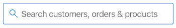
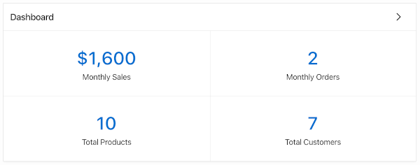

# DOMとjQueryの操作

## はじめに

Webブラウザー上でDOMを操作し、イベントを処理できなければ、JavaScriptは役に立ちません。このラボでは、要素を選択して操作するためにjQueryを使用する練習をします。さらに、コードを通じてイベントハンドラを追加する練習をすることで、その動作についてよりよく理解できます。

このラボのすべての作業は、ブラウザーのコンソールを通じて行われます。ただし、一旦理解されれば、コードは前のラボで説明したテクニックを使用して簡単にAPEXアプリケーションに追加できます。

以下のビデオを視聴して、このラボの概要を学習してください。

[](youtube:uK7vCqfXxNs)

<a href="<https://www.slideshare.net/DanielMcGhan/module-3-working-with-the-dom-and-jquery>" target="\_blank">こちらをクリック</a>して、スライドをご覧ください。

## タスク1: DOMでの基本的な選択、移動、操作

jQueryを使用すると、要素の選択、DOMツリーの移動、必要に応じたDOMの変更が簡単になります。このステップでは、それを可能にするjQueryメソッドのいくつかを使用する練習をします。

1. APEXワークスペースにログインし、**アプリケーションビルダー > サンプルデータベースアプリケーション**(前のラボでインストール済み)に移動して、アプリケーションを実行し、ログインします。ホームページが表示されるはずです。

   

2. ブラウザーの開発者ツールを開き、右上隅にあるアプリケーション検索用テキスト要素のidを特定するために使用します。

   

   見ての通り、APEXアイテムの**名前**は、ページがレンダリングされるときにそのidになります。複数の要素で構成されるより複雑なアイテム(チェックボックス、ラジオグループ、シャトルなど)の場合、**名前**はDOM上の少し上のコンテナ要素にマッピングされます。

   次に、コンソールを使用して、以下のコードを入力して実行し、アイテムを無効化します。

    ```
    <copy>
    $('#P1_SEARCH').attr('disabled', 'disabled');
    </copy>
    ```

   コードが機能することを、検索の実行を試みることで確認してください。アイテムを操作できないはずです。

   次に、以下のコードを実行して、アイテムを元の状態に戻します。

    ```
    <copy>
    $('#P1_SEARCH').removeAttr('disabled');
    </copy>
    ```

3. ブラウザーの開発者ツールを使用して、ダッシュボードリージョンのidを特定します。

   

   リージョンIDはデフォルトでランダムに生成されるため、**R2177368582615194411**のようなものが表示されるはずです。これらのIDは本番デプロイ時に通常変更されるため、JavaScriptコードで使用しない方がよいでしょう。

   ページ1、ホームページのページデザイナーに移動し、左のレンダリングパネルでダッシュボードリージョンを選択します。右のプロパティパネルで、**静的ID**(詳細の下)を次のように設定します:**dashboard-reg**

   ページを再実行し、リージョンが新しい静的IDを使用していることを確認します。以下のコードを実行して、リージョンを選択して非表示にします。

    ```
    <copy>
    $('#dashboard-reg').hide();
    </copy>
    ```

   次に、以下のコードを実行して、リージョンを元の状態に戻します。

    ```
    <copy>
    $('#dashboard-reg').show();
    </copy>
    ```

   `hide`と`show`メソッドをそれぞれ`fadeOut`と`fadeIn`に置き換えて試すこともできます。

4. ブラウザーの開発者ツールを使用して、右上隅のナビゲーションバーを調べます。

   

   見ての通り、ナビゲーションバーはリンクを持つ複数の`li`要素を含む`ul`要素で構成されています。

   次のコードを実行して、`ul`内の2番目の`li`にクラスを追加します。

    ```
    <copy>
    $('.t-NavigationBar').children().eq(1).addClass('icon-only');
    </copy>
    ```

   次に、以下のコードを実行して、リストアイテムを元の状態に戻します。

    ```
    <copy>
    $('.t-NavigationBar').children().eq(1).removeClass('icon-only');
    </copy>
    ```

## タスク2: イベントとイベントデリゲーションの処理

このステップでは、基本的な通常のイベントリスナーを作成し、APEXでイベントデリゲーションが必要な場合がある理由を学習します。

1. サンプルデータベースアプリケーションの製品ページに移動します。以下のコードを実行して、レポート内の画像のクリックイベントにイベントハンドラを追加します。

    ```
    <copy>
    $('img').on('click', function() {
      console.log('You clicked an image!');
    });
    </copy>
    ```

   コードの実行後、画像をクリックしてみてください。コンソールに「You clicked an image!」メッセージが表示されるはずです。

   次に、レポートの検索バーの`Go`ボタンをクリックして、もう一度画像をクリックしてみます。前のバインディングがない新しい要素で行が置き換えられたため、メッセージは表示されなくなります。次のステップでは、この問題を修正するためにイベントデリゲーションを使用します。

2. 次のコードを実行して、レポートに1つのイベントハンドラを追加します。このイベントハンドラは、DOMツリーの下のレベルの画像のクリックイベントをリッスンします。

    ```
    <copy>
    $('#productsIRR').on('click', 'img', function() {
      console.log('You clicked an image!');
    });
    </copy>
    ```

   コードの実行後、動作を確認するためにいくつかの画像をクリックしてください。次に、`Go`ボタンをもう一度クリックし、さらに画像をクリックしてください。今回は、メッセージがコンソールに継続して記録されるはずです。

3. イベントデリゲーション、DOMの移動、DOM操作を使用したより完全な例として、次のコードを実行し、いくつかの画像をクリックしてください。

    ```
    <copy>
    $('#productsIRR').on('click', 'img', function() {
      $img = $(this);

      // DOMをトラバースして製品名を取得する
      productName = $img.parent('td').next('td').children('a').text();

      // クリックした画像の製品名を含むパンくずを変更する
      $('.t-Breadcrumb-label').text(productName + 'をクリックしました');
    });
    </copy>
    ```

   これは最も実用的な例ではありませんが、DOMとjQueryの良い理解がどれほど強力になりうるかがわかり始めたことと思います。

## **まとめ**

これでラボ3が完了しました。この時点で、jQueryを使用してDOM要素を選択、トラバース、操作する方法についての良いアイデアが持てるはずです。さらに、イベントの動作原理とAPEXでイベントデリゲーションを使用する基本的な理解も得られるはずです。

## **謝辞**
 - **著者** -  Dan McGhan, Database Product Management
 - **寄稿者** - Arabella Yao, Jeffrey Malcolm Jr, Robert Ruppel, LiveLabs QA
 - **最終更新者/日付** - Jeffrey Malcolm, LiveLabs QA, June 2020

