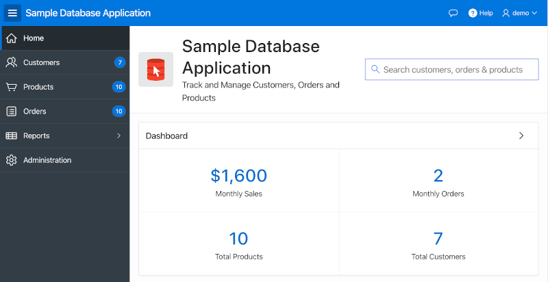

# DOMとjQueryの操作

## はじめに

DOMの操作とイベント処理がなければ、WebブラウザでJavaScriptは役立たないでしょう。このラボでは、jQueryを使用して要素を選択し、操作する方法を練習します。また、コードを使用してイベントハンドラを追加し、その動作原理を理解します。

このラボの作業はすべてブラウザのコンソールを使用して行います。ただし、理解すれば、前のラボで学んだテクニックを使用して、コードを簡単にAPEXアプリケーションに追加できます。

このラボについてのビデオを再生するには、以下をクリックしてください。

[](youtube:uK7vCqfXxNs)

<a href="https://www.slideshare.net/DanielMcGhan/module-3-working-with-the-dom-and-jquery" target="\_blank">ここをクリック</a>してスライドを表示します。

## タスク1: DOMでの基本的な選択、トラバーサル、および操作

jQueryを使用すると、要素の選択、DOMツリーのトラバーサル、必要に応じてDOMへの変更が簡単に行えます。このステップでは、それを可能にするいくつかのjQueryメソッドの使用を練習します。

1. APEXワークスペースにログインし、**App Builder > サンプルデータベースアプリケーション**（前のラボでインストール済み）に移動し、アプリケーションを実行してログインします。ホームページが表示されるはずです。

    

2. ブラウザの開発者ツールを開き、右上隅にあるアプリケーションの検索に使用されているテキスト要素のIDを特定します。

    

    ターゲットのAPEXアイテムの**Name**が、ページがレンダリングされるときにそのIDになることがわかります。より複雑なアイテムでは、複数の要素で構成されています（チェックボックス、ラジオボタン、シャトルなど）。これらの場合、**Name**はDOM内の少し上のコンテナ要素にマップされます。

    次に、コンソールを使用して次のコードを入力して実行し、アイテムを無効にします。

    ```
    <copy>
    $('#P1_SEARCH').attr('disabled', 'disabled');
    </copy>
    ```

    コードが正常に動作していることを確認するには、検索を実行しようとしてもアイテムを操作できないはずです。

    次に、次のコードを実行してアイテムを元の状態に戻します。

    ```
    <copy>
    $('#P1_SEARCH').removeAttr('disabled');
    </copy>
    ```

3. ブラウザの開発者ツールを使用して、ダッシュボード領域のIDを特定します。

    

    リージョンのIDはデフォルトではランダムに生成されるため、**R2177368582615194411**のようなものが表示されるはずです。これらのIDは通常、本番環境にデプロイするときに変更されるため、JavaScriptコードには使用すべきではありません。

    レンダリングパネルの左側でページ1、ホームページのPage Designerに移動し、プロパティパネルの右側で**Static ID**（Advancedの下）を次のように設定します：**dashboard-reg**

    ページを再実行して、リージョンが新しい静的IDを使用していることを確認します。次のコードを実行してリージョンを選択して非表示にします。

    ```
    <copy>
    $('#dashboard-reg').hide();
    </copy>
    ```

    次に、リージョンを元の状態に戻すには、次のコードを実行します。

    ```
    <copy>
    $('#dashboard-reg').show();
    </copy>
    ```

    `hide`と`show`の代わりに`fadeOut`と`fadeIn`を使用してみることもできます。

4. ブラウザの開発者ツールを使用して、右上隅のナビゲーションバーを検査します。

    

    ナビゲーションバーは、複数のリンクを持つ`li`要素を持つ`ul`要素で構成されていることがわかります。

    次のコードを実行して、`ul`内の2番目の`li`にクラスを追加します。

    ```
    <copy>
    $('.t-NavigationBar').children().eq(1).addClass('icon-only');
    </copy>
    ```

    次に、リストアイテムを元の状態に戻すには、次のコードを実行します。

    ```
    <copy>
    $('.t-NavigationBar').children().eq(1).removeClass('icon-only');
    </copy>
    ```

## タスク2: イベントとイベントデリゲーションの操作

このステップでは、基本的な通常のイベントリスナーを作成し、なぜイベントデリゲーションがAPEXで必要な場合があるかを学びます。

1. サンプルデータベースアプリケーションのProductsページに移動します。次のコードを実行して、レポート内の画像のクリックイベントにイベントハンドラを追加します。

    ```
    <copy>
    $('img').on('click', function() {
      console.log('You clicked an image!');
    });
    </copy>
    ```

    コードを実行した後、画像をクリックしてみてください。コンソールに 'You clicked an image!' のメッセージが表示されるはずです。

    次に、レポートの検索バーの`Go`ボタンをクリックし、再び画像をクリックしてみてください。メッセージはもう表示されなくなります。これは、行が以前のイベントバインディングを持たない新しい要素に置き換えられたためです。次のステップでは、この問題を修正するためにイベントデリゲーションを使用します。

2. 次のコードを実行して、レポートに単一のイベントハンドラを追加します。このイベントハンドラは、DOMツリー内の下位の画像のクリックイベントを監視します。

    ```
    <copy>
    $('#productsIRR').on('click', 'img', function() {
      console.log('You clicked an image!');
    });
    </copy>
    ```

    コードを実行した後、いくつかの画像をクリックして動作を確認してください。次に、再び`Go`ボタンをクリックし、さらにいくつかの画像をクリックしてください。今回は、メッセージがコンソールに続けて記録されるはずです。

3. イベントデリゲーション、DOMトラバーサル、DOM操作を使用したより完全な例として、次のコードを実行し、いくつかの画像をクリックしてみてください。

    ```
    <copy>
    $('#productsIRR').on('click', 'img', function() {
      $img = $(this);

      // DOMをトラバースして製品名を取得する
      productName = $img.parent('td').next('td').children('a').text();

      // クリックした画像の製品名を含むパンくずを変更する
      $('.t-Breadcrumb-label').text(productName + 'をクリックしました');
    });
    </copy>
    ```

    これは最も実用的な例ではありませんが、DOMとjQueryの理解がどれほど強力であるかを理解し始めることができるはずです。

## **まとめ**

これでラボ3が完了しました。この時点で、jQueryを使用してDOM要素を選択、トラバース、操作する方法についての良いアイデアが持てるはずです。さらに、イベントの動作原理とAPEXでイベントデリゲーションを使用する基本的な理解も得られるはずです。

## **謝辞**
 - **著者** -  Dan McGhan, Database Product Management
 - **寄稿者** - Arabella Yao, Jeffrey Malcolm Jr, Robert Ruppel, LiveLabs QA
 - **最終更新者/日付** - Jeffrey Malcolm, LiveLabs QA, June 2020

