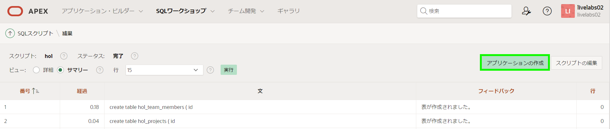
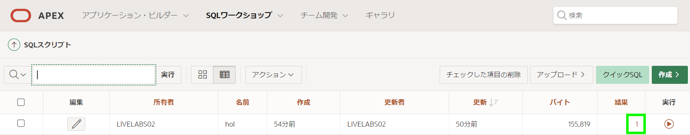
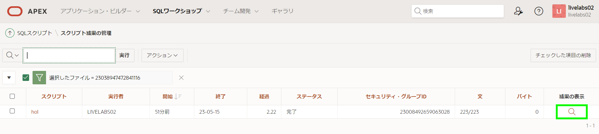
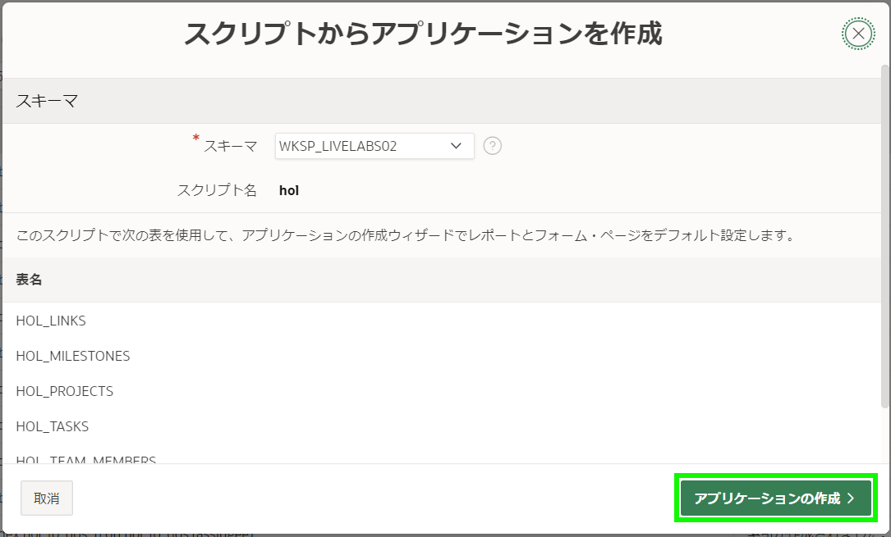
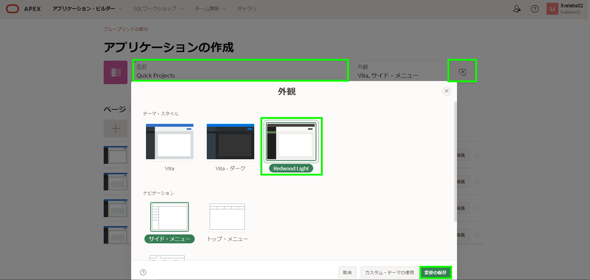
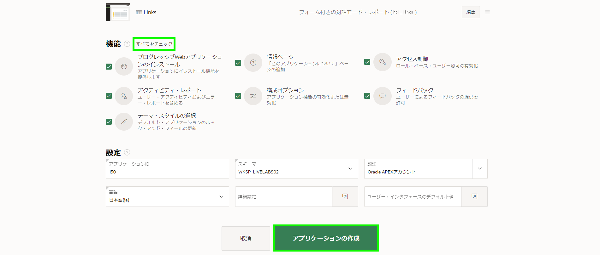
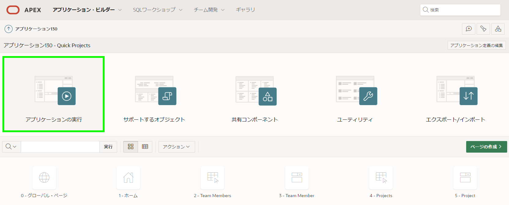
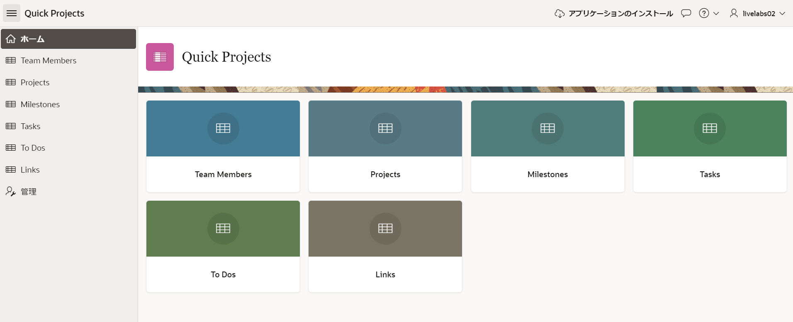
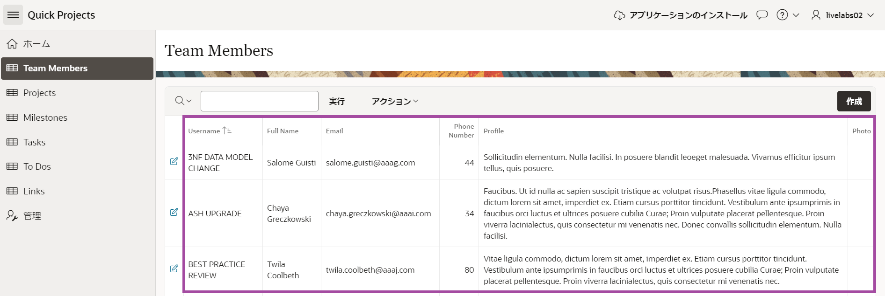

# アプリケーション作成ウィザードを使用する

## はじめに

このラボでは、前のラボで作成したデータ構造を使用して対話型アプリケーションを構築します。

### 目的
- 前のLabで使用したテーブルとデータを使用して対話型アプリケーションを作成する

### 必要なもの

- Oracle Cloudの有料アカウント、LiveLabsアカウント、または無料トライアル。 
- サンプルデータを含むデータ構造

## タスク1:アプリ作成ウィザードを実行する

1. SQL Scripts > Resultsから、**Create App**をクリックします。

    

    *注:* "Create App"ボタンが表示されない場合は、次の手順を実行します:
    - *Results列内で、たった今実行したスクリプトの"1"をクリックします。*

      

    - *View Resultsの下にある拡大鏡アイコンをクリックします。*

    

    *上記に示した結果ページが再度表示されるはずです。*

2. Create App from Scriptダイアログで、**Create Application**をクリックします。

      

3. Create an Applicationページで、Nameに**Quick Projects**と入力します。
   **Appearance**をクリックします。    
   Theme Styleで**Vita-Slate**を選択します。     
   **Save Changes**をクリックします。

   

4. Featuresで**Check All**をクリックします。   
   **Create Application**をクリックします。

   

## タスク2:アプリケーションを実行する

1. 新しいアプリケーションがPage Designerに表示されます。

   **Run Application**をクリックします。

   

2. ランタイム環境では、ログインページが表示されます。

   **Username**と**Password**を入力します(UsernameはDemo)。   
   **Sign In**をクリックします。

   新しいアプリケーションが表示されます。

     

3. アプリケーションを試してみて、さまざまなページを探索してみましょう。  

   レコードはすべてのレポートに表示されるため、特にレポートの場合、ページのレビューが格段に容易になります。データが列に正確に合っていない場合でも、データを更新して現実的にするのは非常に簡単なので、重要ではありません。

     

## **まとめ**  
今では、SQL Scriptsから直接Create Application ウィザードを使用してアプリケーションの最初の切り取りを作成する方法を知っています。

## **謝辞**

  - **著者** - Salim Hlayel, Principle Product Manager
  - **寄稿者** - Oracle LiveLabs Team (Robbie Ruppel, Functional Lead; Marilyn Isabella Kessinger, QA Intern; Arabella Yao, Product Manager Intern)
  - **最終更新者/日付** - Anoosha Pilli, Product Manager, DB Product Management, June 2020
