# リンクの改善

## 紹介

このラボでは、URLを変更する方法を学び、新しいウィンドウにリストされているコンテンツを表示するために使用できます。

推定時間：5分

### 目的

- 値のプロジェクトリストを改善します
- アプリケーションのリンクセクションを更新します

### 必要なものは?

- Oracle Cloudの有料アカウント、LiveLabsアカウント、またはフリートライアル。  
- APEXワークスペースとアプリケーション

## タスク1:レポートに列を追加する  

To Dosレポートを変更したのと同様に、Linksレポートを更新してプロジェクトとマイルストーンの列を含める必要があります。

1. ランタイムアプリケーションから、Linksレポートページに移動し、Page Designerに移動します。

    Developer Toolbarの**Edit Page11**をクリックします。
    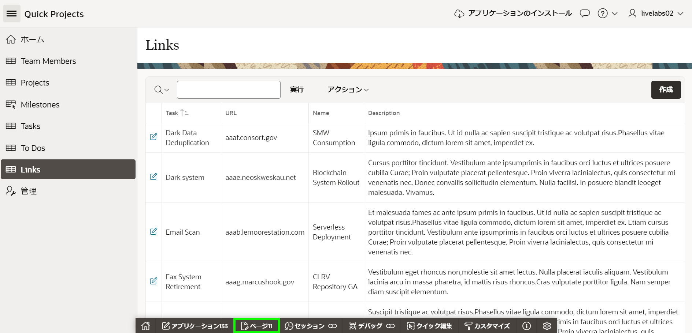

    Page Designerで**Page 11: Links**がロードされているはずです。


2. Links用に定義されたクエリを更新する必要があります。

    Page Designer内で、Rendering tree(左パネル)の**Links**をクリックします。

    Property Editor(右パネル)で、Source > Typeの**SQL Query**を選択します。
    *{注:SQLクエリが入力されます。SQLステートメントはHOL_LINKSテーブルのすべての列を選択します。}*

    Source > SQL Queryに次の内容を入力します:

    ```
    <copy>
    select ID,
       (select p.name
        from hol_projects p, hol_tasks t
        where p.id = t.project_id
        and t.id = l.task_id
       ) project,
       (select m.name
        from hol_milestones m, hol_tasks t
        where m.id = t.milestone_id
        and   t.id = l.task_id
       ) milestone,
       TASK_ID,
       ROW_VERSION,
       URL,
       NAME,
       DESCRIPTION,
       CREATED,
       CREATED_BY,
       UPDATED,
       UPDATED_BY
  from HOL_LINKS l
  </copy>
    ```
    
  

    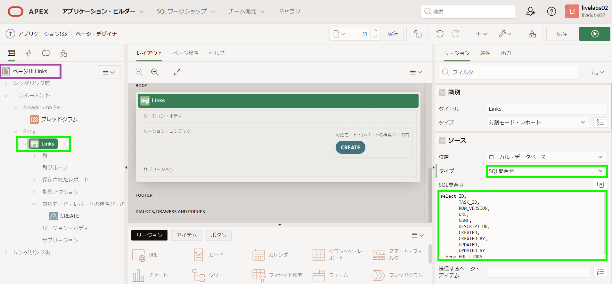  

3. レポート内のURL列を更新する必要があります。

    Page Designerで、Rendering tree(左パネル)のLinks領域の下で、**Columns**を展開します。

    列のリストで、**URL**をクリックします。
    Property Editor(右パネル)に次の内容を入力します。
    - Identification > Type  - **Link**を選択します。
    - Link > Target - **No Link Defined**をクリックし、次の内容を入力します。  
        - Target > Type - **URL**を選択します。
        - Target > URL - **#URL#**と入力します。   
        *{注:これにより、URL列の値にリンクされます。}*    

        **OK**をクリックします。 

    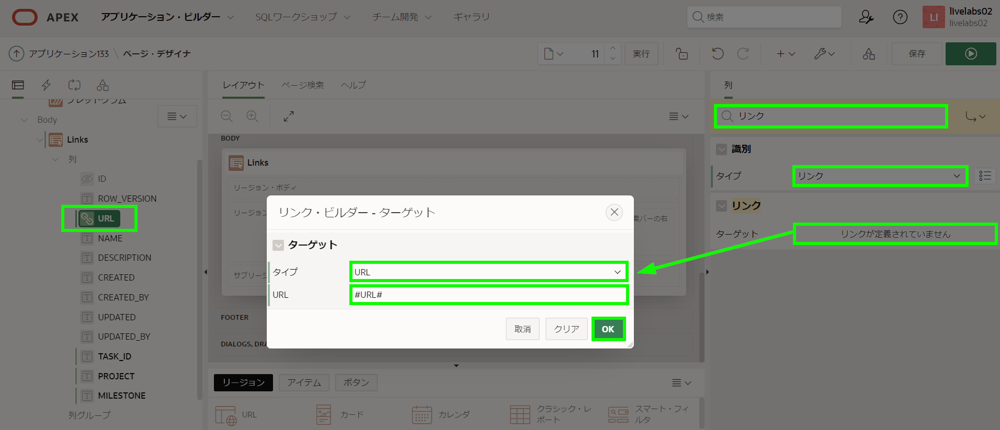

    - Link > Link Attributes - **target="_blank"**と入力します。
    *{注:ヘルプ(中央パネル)をクリックして例を確認してください。}*

    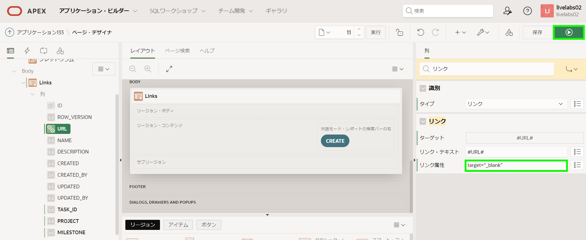  

4. ページをレビューする時間です。

    Page Designerツールバーの**Save and Run**をクリックします。  

    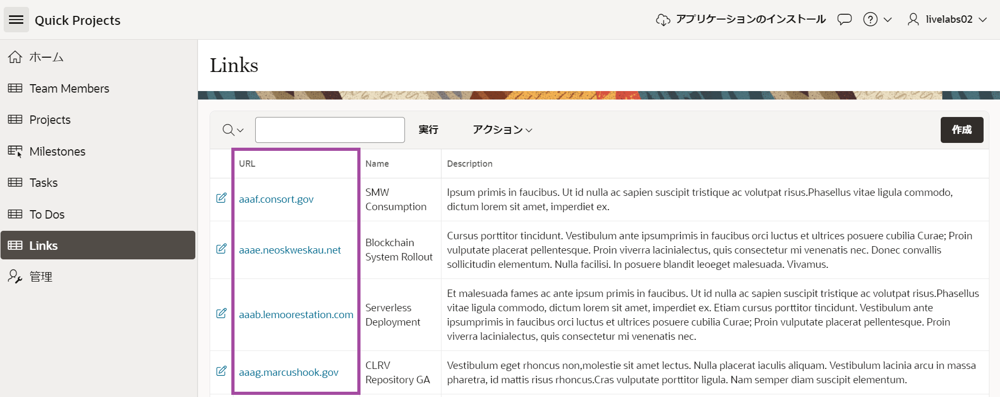

    *{注:URL列はリンクになっています。リンクの1つをクリックすると新しいページが開きますが、URLにはハイパーテキスト転送プロトコル(httpやhttps)が欠落していて、値は架空のサイトアドレスです。}*

5. 新しい列はレポートの最後の列に配置されていますが、最初の列に移動される必要があります。

    ランタイム環境で、Linksレポートメニューの**Actions**をクリックします。     
    ドロップダウンから**Columns**を選択します。

    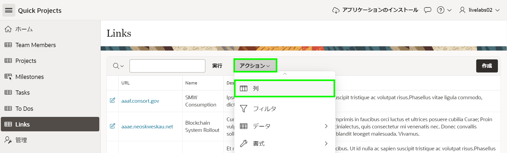  

6. Select Columnsダイアログで、**Project**をクリックします。         
    [Shift]キーを押しながら**Milestone**をクリックします。     
    ダイアログの右側のオプションで**Top**をクリックします。        
    **Apply**をクリックします。

    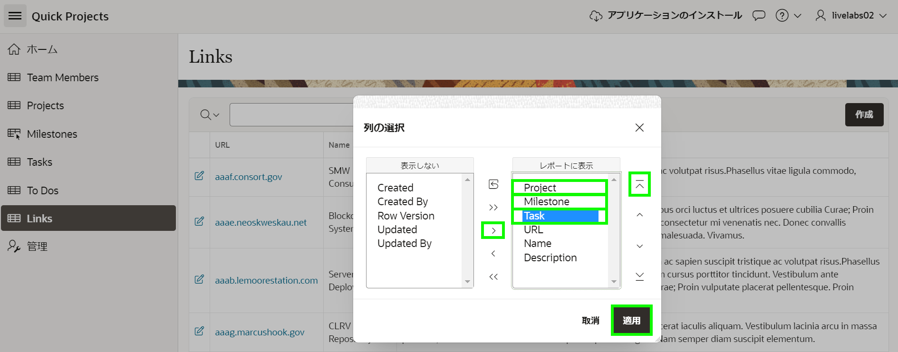   

7. 改訂されたレポートレイアウトを保存する必要があります。他のユーザーが新しく改善された列の配置を見ることができます。

    ランタイム環境で、Linksレポートメニューの**Actions**をクリックします。      
    ドロップダウンから**Report**を選択し、**Save Report**をクリックします。

    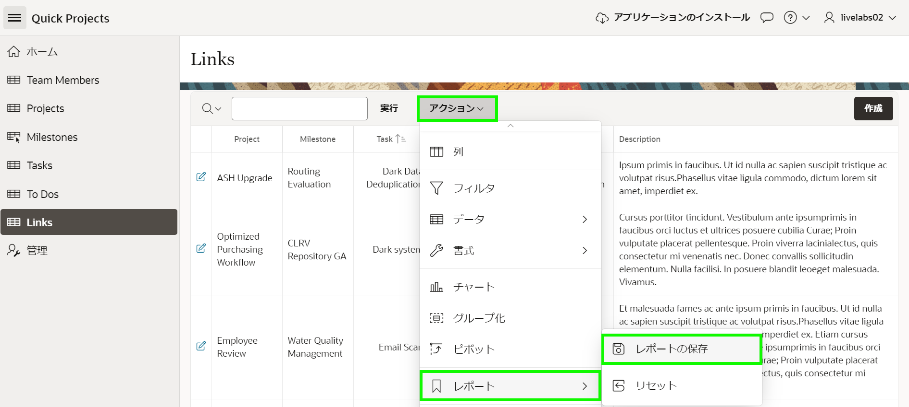  

8. Save Reportダイアログで、Save(開発者のみ表示)の**As Default Report Settings**を選択します。

    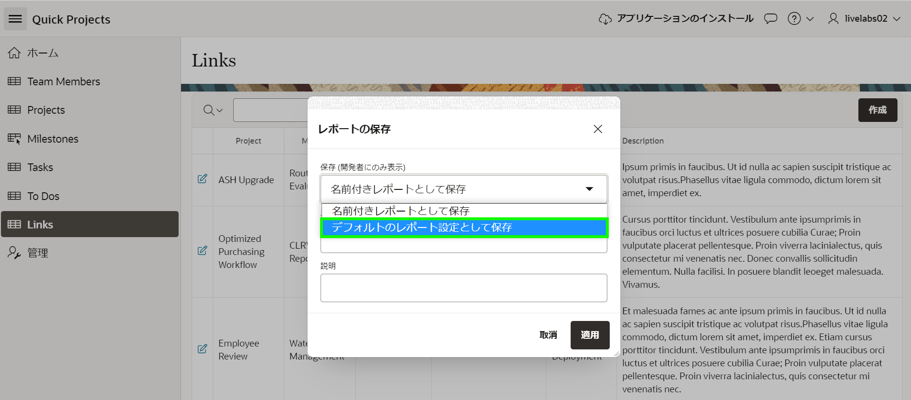  

9.  Save Default Reportダイアログで、**Apply**をクリックします。      

    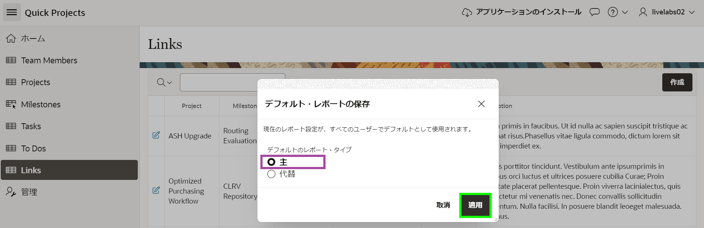  

    *{注:レポートをPrimaryとして保存する必要があります。ユーザーがページに移動すると、現在の表示がエンドユーザーに表示されます。}*

## タスク2:フォームページを更新する
Linksフォームページをレビューすると、レポートの編集アイコンをクリックすると、Taskアイテムにプロジェクトとマイルストーンが表示されないことがわかります。以前のラボでタスクのLOVを更新して追加の表示列を含めました。したがって、現在する必要があるのはタスクアイテムをポップアップLOVに更新するだけです。

1. ランタイム環境で、Developer Toolbarの**Edit Page 12**をクリックします。
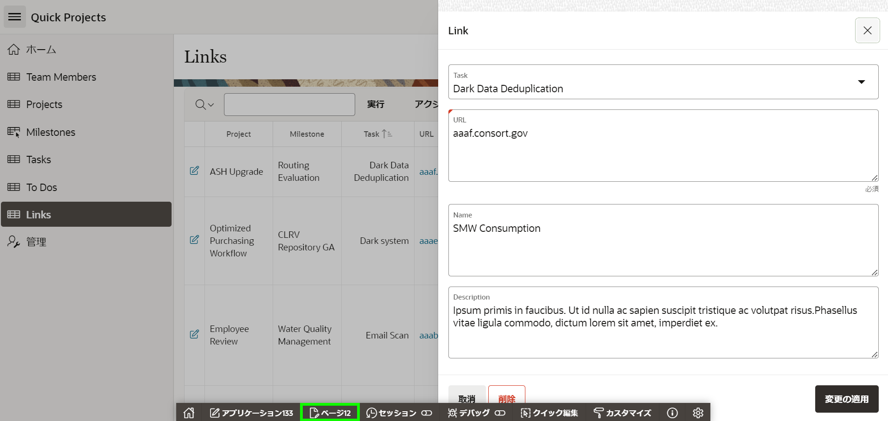  

2. Page Designer内で、Rendering tree(左パネル)の**P12_TASK_ID**をクリックします。
    Property Editor(右パネル)で、Identification > Typeの**Popup LOV**を選択します。

    Page Designerツールバーの**Save**をクリックします。

    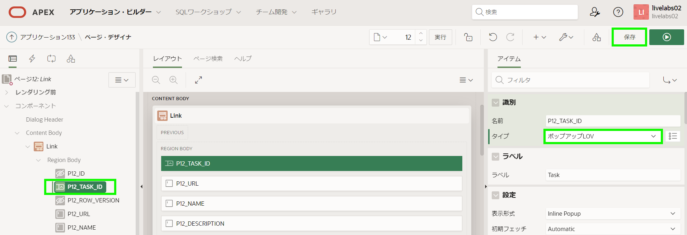   


3. 完成したフォームページをレビューする時間です。     

    ランタイム環境タブまたはブラウザに移動します。
    **Links**に移動し、ページをリフレッシュします。
    Linkの編集アイコンをクリックします。

    Taskの下向き矢印をクリックしてタスクのポップアップLOVを表示します。     
    検索条件を入力して[Enter]キーを押します。

    URLに[https://apex.oracle.com]と入力します。     
    **Apply Changes**をクリックします。

    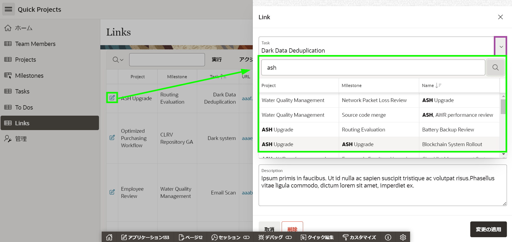     

    Linksレポートページで、更新したレコードのURLをクリックします。
    新しいブラウザタブまたはウィンドウでメインのAPEXサイトが開くはずです。

## **まとめ**

これで、URL値を別のブラウザタブまたはウィンドウへのリンクに変更する方法を知っています。

## さらに詳しく - *役立つリンク*

- [Autonomous Database上のAPEX](https://apex.oracle.com/autonomous)
- [APEXコラテラル](https://apex.oracle.com)
- [チュートリアル](https://apex.oracle.com/en/learn/tutorials)
- [コミュニティ](https://apex.oracle.com/community)
- [外部サイト + Slack](http://apex.world)

## **謝辞**

  - **著者** - Salim Hlayel, Principle Product Manager
  - **寄稿者** - LiveLabs QA Team (Arabella Yao, Product Manager Intern | Dylan McLeod, QA Intern)
  - **最終更新者/日付** - Salim Hlayel, Principle Product Manager, November 2020
