# タスクの改善

## 紹介

このラボでは、改善されたLOVを利用してタスクフォームページを改善する方法を学びます。

推定時間: 15分  

### 目的
- プロジェクトのLOVを改善する
- タスクフォームページを更新する

### 必要なもの 
- Oracle Cloudの有料アカウント、LiveLabsアカウント、または無料トライアル 
- APEXアプリケーション 

## タスク1:プロジェクトの値のリストを改善する  

ランタイム環境でタスクに移動し、任意のレコードの編集アイコンをクリックしてタスクフォームページを開きます。プロジェクトを選択するリストをクリックして、プロジェクトレコードがどのように表示されるかを確認します。

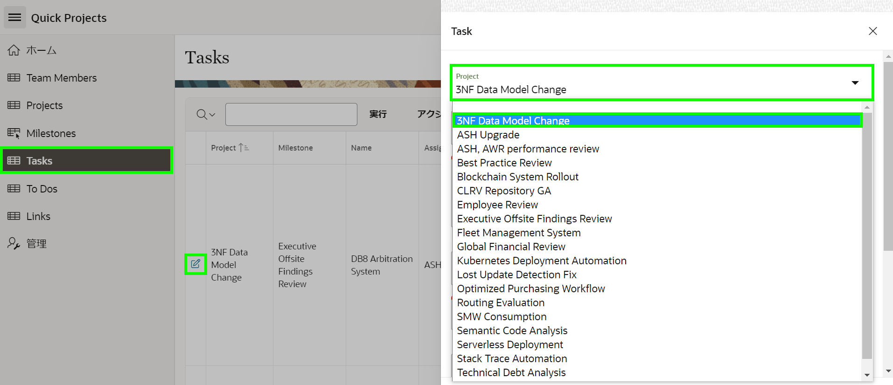  

プロジェクトに関連する追加の詳細を見ることが有益だと思います。   

1. ランタイムアプリケーションから、Page Designerのタスクフォームページに移動します。  

    APEX App Builderからこのアプリを実行した場合は、画面の下部にDeveloper Toolbarが表示されます。*{注:アプリに直接ログインするエンドユーザーはこのツールバーを表示しません。}*

    Developer Toolbarの**Edit Page 8**をクリックします。

    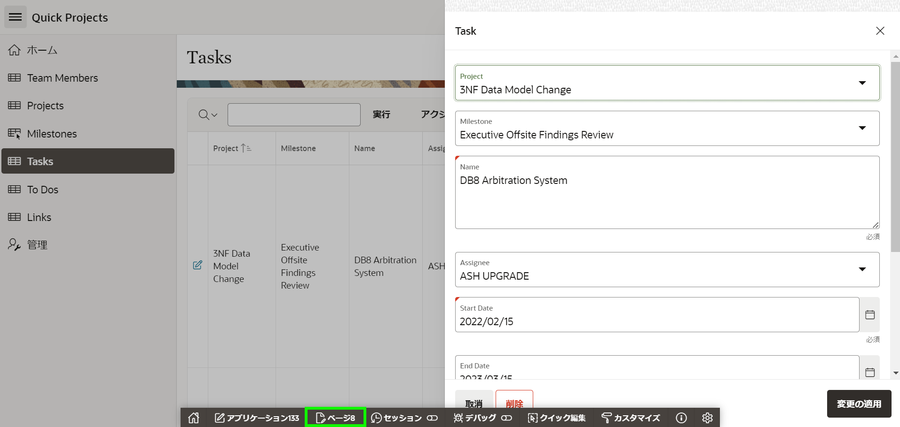    

     または、適切なブラウザータブやウィンドウを選択することにより、手動でブラウザのAPEX App Builderタブに戻ることもできます。   
     App Builderに入ると、**8 - Task**をクリックします。

    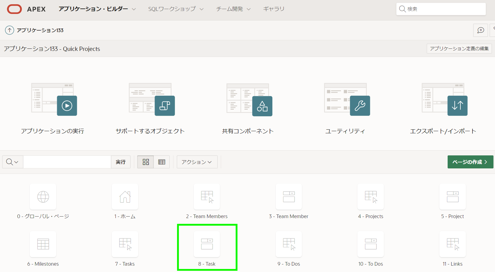  

    Page Designerで**Page 8: Task**がロードされた状態になっているはずです。  


2. プロジェクトに現在使用されている値のリストを確認する必要があります。  

    Page Designer内で、Rendering tree(左パネル)の**P8\_PROJECT_ID**をクリックします。  

    Property Editor(右パネル)で、フィルターに**list**と入力します。      
    *{注:長いリストをスクロールダウンして探す代わりに、フィルターを入力すると特定の属性を見つけやすくなります。}*  

    Property Editor(右パネル)で、**List of Values**の矢印をクリックします。

    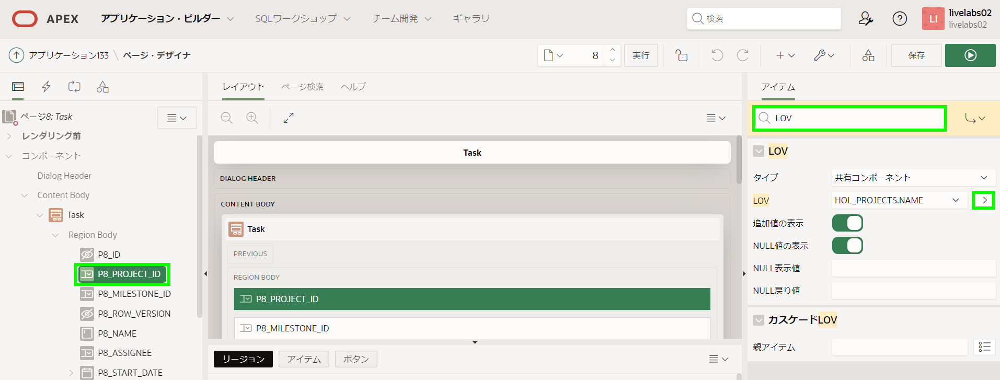  

    *{注:List of Values > Typeは_Shared Component_なので、適切な共有コンポーネントを編集する必要があります。}*   

3. 左パネルがShared Componentsタブに変わり、適切なList of Valuesがハイライトされます。  

    Property Editor(右パネル)で、**Edit Component**をクリックします。

    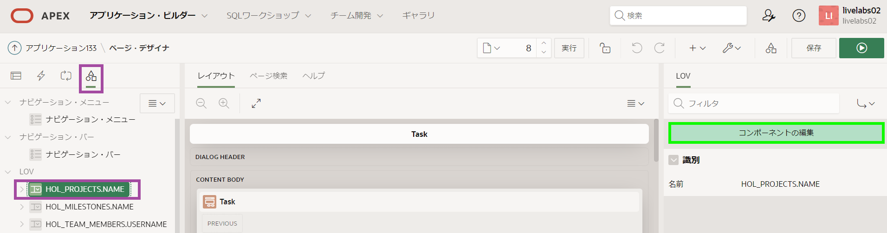 

4. 追加の表示列を追加します。

    List of Values: HOL_PROJECTS.NAMEページで、**Select Columns**をクリックします。     

    Select Additional Display Columnsダイアログで、次の列をダブルクリックします:  
    -   STATUS  
    -   COMPLETED_DATE  
    -   DESCRIPTION  

    **Update**をクリックします。  

    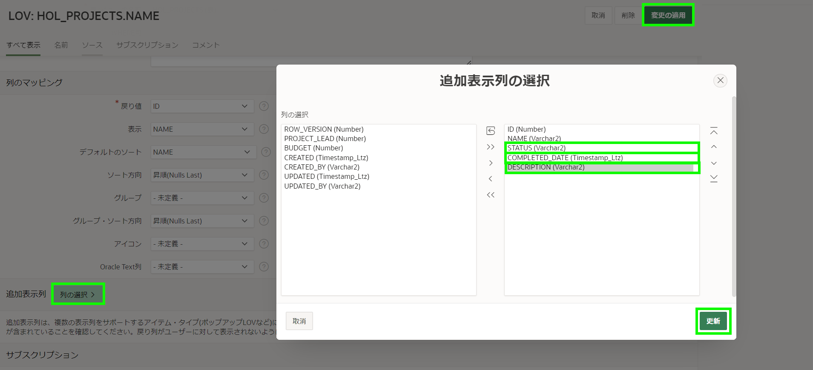

    **Apply Changes**をクリックします。     
     *{注:Page DesignerにPage 8が選択された状態で戻されます。}*

5. 追加の表示値を表示するには、Select Listの代わりにPopup LOVにページアイテムを更新する必要があります。  

    Page Designer内で、Layout(中央パネル)の**P8\_PROJECT_ID**をクリックします。  

    Property Editor(右パネル)で、Identification > Typeの**Popup LOV**を選択します。  

    Page Designerツールバーで、**Save**をクリックします

    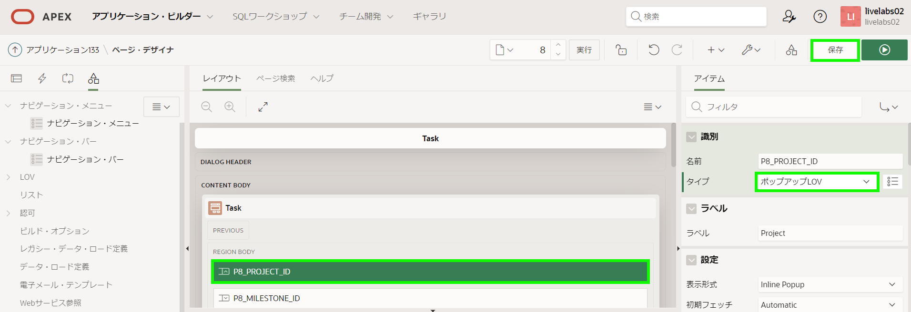

    *{注: _Save_の代わりに_Run and Save_ をクリックすると、ページは保存されますが、このページはモーダルページなのでPage Designerから直接実行できないため、警告が表示されます。}*

    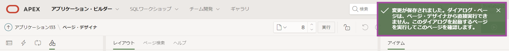

6. 改善されたプロジェクトアイテムを確認する時間です!

    ランタイム環境タブまたはブラウザに移動します。     
    **タスク**に移動し、ページを更新します。     
    タスクの編集アイコンをクリックし、**Project**の下矢印をクリックして新しいポップアップLOVを確認します。

    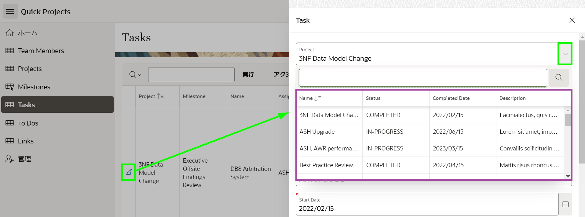

    *{注:Popup LOVに表示される列のサイズと列の並び替えが可能です。}*

## タスク2:カスケーディングリストオブバリュースの定義
マイルストーンの選択リストを確認すると、すべてのマイルストーンがリストされていることに気付くでしょう。リストされた値は、選択されたプロジェクトに関連付けられたものにのみ制限される必要があります。これを行うには、マイルストーン(**P8\_MILESTONE\_ID**)を_Cascading LOV_として定義する必要があります。これには、マイルストーンLOV内の親アイテム(**P8\_PROJECT\_ID**)を指定し、親アイテムを使用して返されるマイルストーンを制限する新しい値のリストステートメントを作成する必要があります。  

1. 開発環境に戻ります。  
2. Page Designer内で、Page 8が選択されている状態で、Page Designerツールバーの**Shared Components**をクリックします。 

    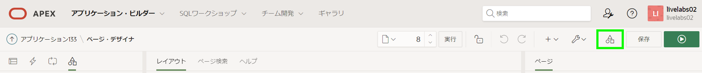

    または、アプリケーションのホームページから**Shared Components**をクリックします。

    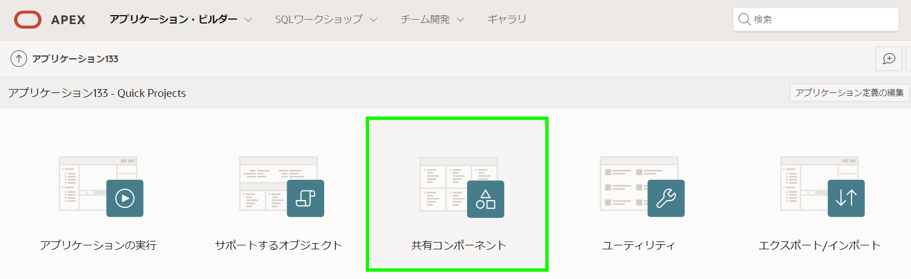

3. Shared Componentsから、他のコンポーネントの下にある**List of Values**をクリックします。

    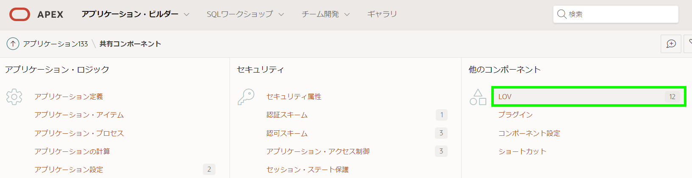  

4. List of Valuesページから**Copy**をクリックします。

    Copy List of Valuesダイアログで次の内容を入力します:
    - Copy List of Values - **HOL_MILESTONES.NAME - Dynamic**を選択 
    - New List of Values Name - **HOL_MILESTONES.NAME PAGE 8**と入力  

    **Copy**をクリックします。  

    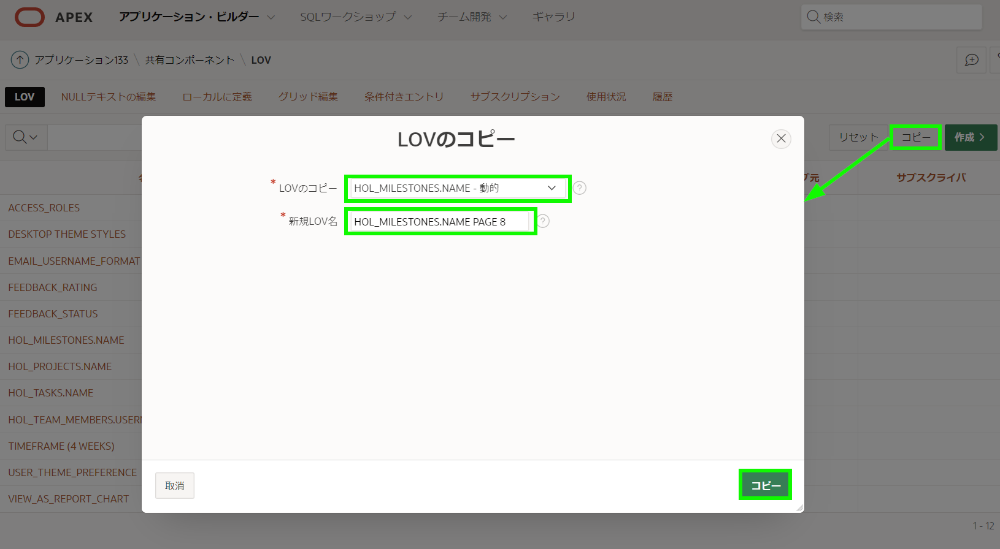  

5. 新しいLOVをカスタマイズする必要があります。  

    List of Valuesのレポートで、**HOL_MILESTONES.NAME PAGE 8**をクリックします。   

    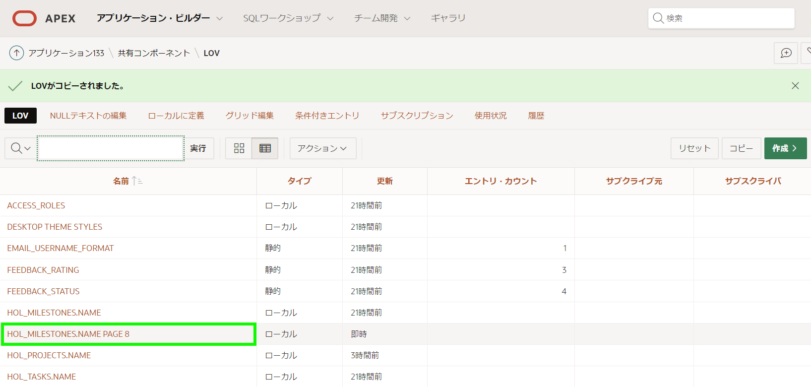  

6. List of Values編集ページで、Where Clauseに次の内容を入力します:

    ```
    <copy> project_id = :P8_PROJECT_ID
    </copy>
    ```   
      

    *{注:これにより、プロジェクトアイテム_P8\_PROJECT\_ID_で現在選択されている値に基づいて返されるマイルストーンが制限されます。}*

    **Apply Changes**をクリックします。

    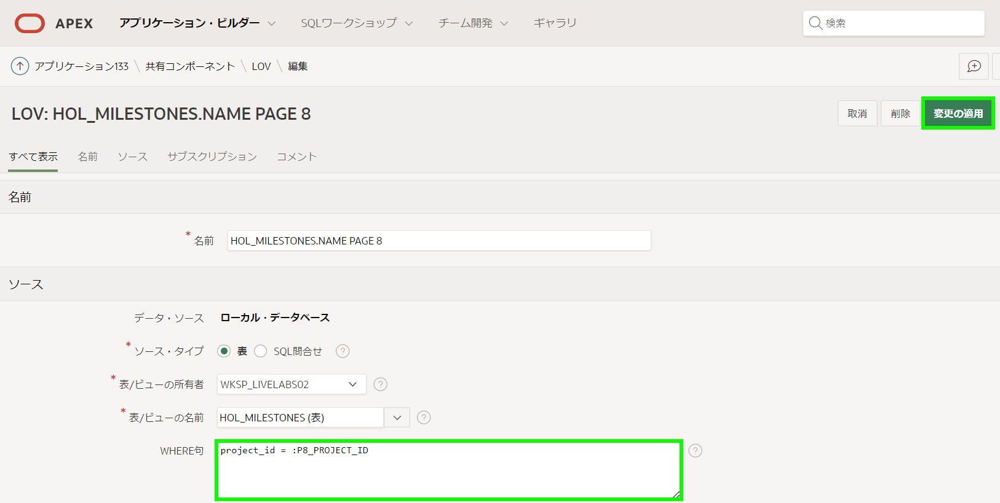

## タスク3:タスクフォームページの更新 

1. 新しいLOVをPage 8のアイテムにフックアップする必要があります。  

    List of Valuesページから、ツールバーの**Edit Page 8**をクリックします。 

    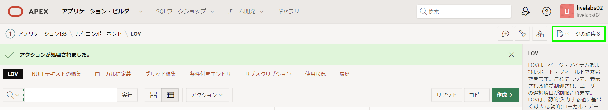  

2. Page Designerで、左パネルの**Rendering**アイコンをクリックします。  
    Rendering tree(左パネル)で、**P8\_MILESTONE_ID**をクリックします。

    Property Editor(右パネル)で、次の内容を入力します:
    - List of Values - **HOL_MILESTONES.NAME PAGE 8**を選択
    - Cascading LOV Parent Item(s) - **P8\_PROJECT_ID**を選択
    *{注:親アイテムを指定することは極めて重要です。そうしないと、選択されたプロジェクトの値が設定されず、マイルストーンLOV は値を返しません。}*  

    **Save**をクリックします。

    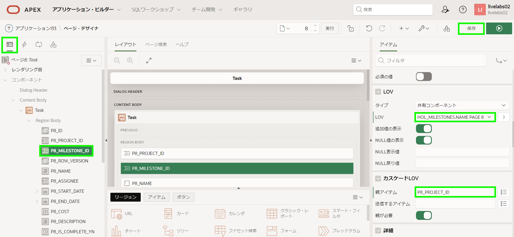

3. マイルストーンアイテムをテストする時間です。 

    ランタイム環境タブまたはブラウザに移動します。     
    **タスク**に移動し、ページを更新します。     
    タスクの編集アイコンをクリックし、**マイルストーン**のセレクターをクリックしてカスケーディングLOVを確認します。

    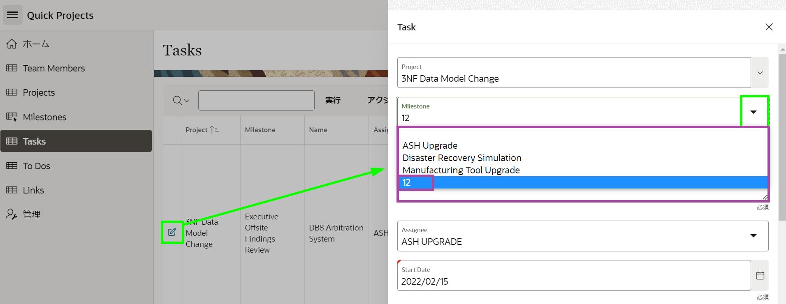  

    *{注:マイルストーンアイテムには定期的に名前の代わりに番号がリストされます。これは、サンプルデータが作成されたときにプロジェクトとマイルストーンがランダムに選択されたためです。サンプルデータジェネレータは、関連するテーブルが同じテーブル内の2番目の外部キーカラムの子テーブルでもあるかどうかを判断するために各外部キー関係を確認しません。}*

    *このサンプルデータの問題を修正するには、利用可能なリストから名前の1つを選択するだけで済みます。これらは選択したプロジェクトに関連付けられたマイルストーンを表します。}*  

4. プロジェクトが選択されていない場合に何が起こるかを最も簡単に確認する方法は、新しいタスクを作成することです。  

    ランタイム環境で、モーダルページを閉じてタスクレポートページに戻ります。  
    タスクレポートページで、**Create**をクリックします。     
    プロジェクトを選択しないでください。代わりに、**マイルストーン**のセレクターをクリックします。

    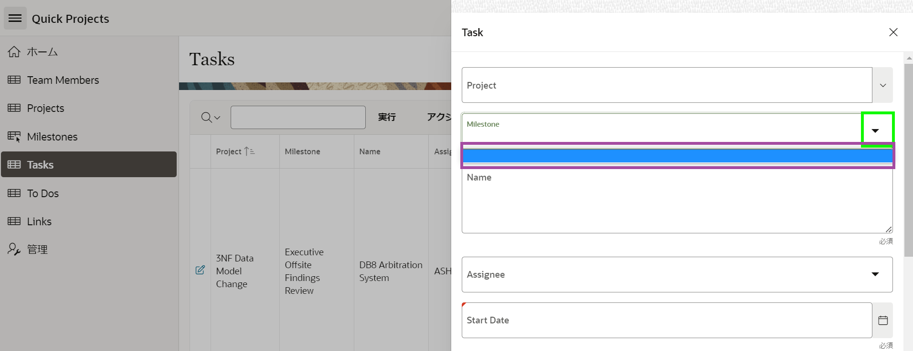  

    *{注:プロジェクトが選択されていないため、マイルストーンはリストされません。}*

## **まとめ**

さまざまな種類の値のリストを使用して、追加の列を表示する方法、およびカスケードLOVを定義する方法を知っています。


## **謝辞**

  - **著者** - Salim Hlayel, Principle Product Manager
  - **寄稿者** - LiveLabs QA Team (Arabella Yao, Product Manager Intern | Dylan McLeod, QA Intern)
  - **最終更新者/日付** - Salim Hlayel, Principle Product Manager, November 2020
