# TODOSの改善

## 紹介

このラボでは、レポートに追加の列を追加し、値のリストを改善する方法を学びます。

推定時間：10分

### 目的

- 値のプロジェクトリストを改善します
- アプリケーションをDOSセクションに更新します

### あなたは何が必要ですか？

* Oracle Cloudの有料アカウント、Livelabsアカウント、または無料トライアル。
* 頂点ワークスペースとアプリケーション

## タスク1:レポートに列を追加する  

ランタイム環境でTo Dosに移動すると、レポートにはタスクが含まれていますが、関連するプロジェクトとマイルストーンは含まれていないことに気付きます。レポートでこれらの値を取得するには、プロジェクトとマイルストーンテーブルに関連付けられたSQLを利用する必要があります。これは内部選択または複数のテーブルを結合することで実行できます。シンプルにするために、内部SELECTステートメントを実装します。


1. ランタイムアプリケーションから、To Dosレポートページに移動し、Page Designerに移動します。

    Developer Toolbarの**Edit Page 9**をクリックします。

    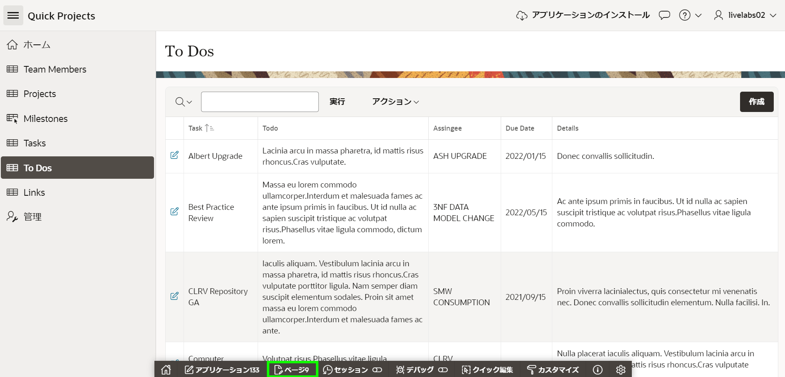

    Page Designerに**Page 9: To Dos**がロードされているはずです。


2. To Dos用に定義されたクエリを更新する必要があります。

    Page Designer内で、Rendering tree(左パネル)の**To Dos**をクリックします。

    Property Editor(右パネル)で、Source > Typeの**SQL Query**を選択します。   
    *{注:SQLクエリが入力されます。SQLステートメントはHOL\_TO\_DOSテーブルのすべての列を選択します。}* 

    Source > SQL Queryの**Code Editor**アイコンをクリックします。
    Code Editorで、次の内容を入力します:

    ```
    <copy>select ID,
         (select p.name
          from hol_projects p, hol_tasks t
          where p.id = t.project_id
          and t.id = td.task_id
         ) project,
         (select m.name
          from hol_milestones m, hol_tasks t
          where m.id = t.milestone_id
          and   t.id = td.task_id
         ) milestone,
         TASK_ID,
         ROW_VERSION,
         TODO,
         ASSINGEE,
         DUE_DATE,
         DETAILS,
         CREATED,
         CREATED_BY,
         UPDATED,
         UPDATED_BY
    from HOL_TO_DOS td</copy>
    ```

    Code Editorツールバーの**Validate**をクリックします。
    **OK**をクリックします。

    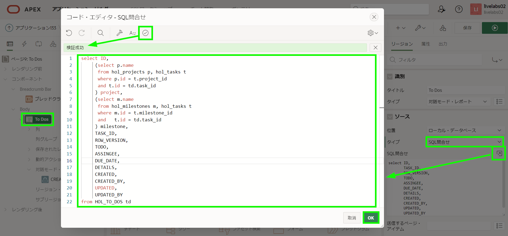

    *{注:2つの内部選択ステートメントは、プロジェクト/マイルストーンテーブルをタスクテーブルに、タスクテーブルをtodosテーブルに接続します。}*   

3. アプリケーションを実行して、新しいプロジェクトとマイルストーンの列が正しく表示されることを確認します。

    Page Designerツールバーの**Save and Run**をクリックします。

    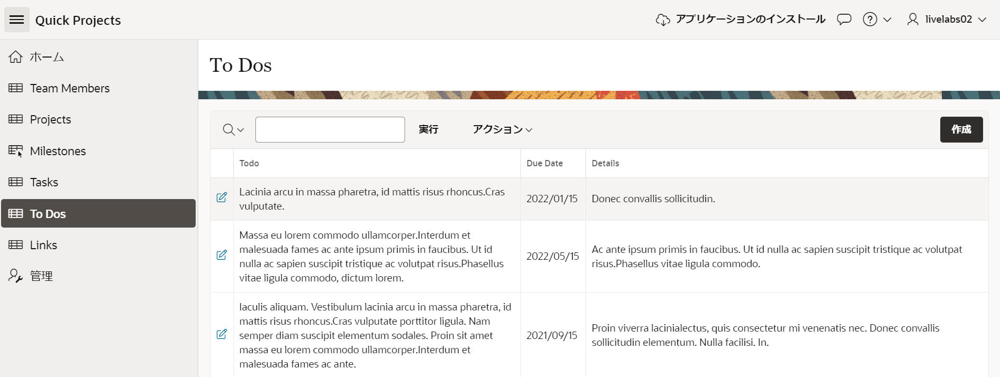   

4. 新しいプロジェクトとマイルストーンの列はレポートの最後の列に配置されていますが、最初の列に移動する必要があります。   

    ランタイム環境で、To Dosレポートメニューの**Actions**をクリックします。     
    ドロップダウンから**Columns**を選択します。

    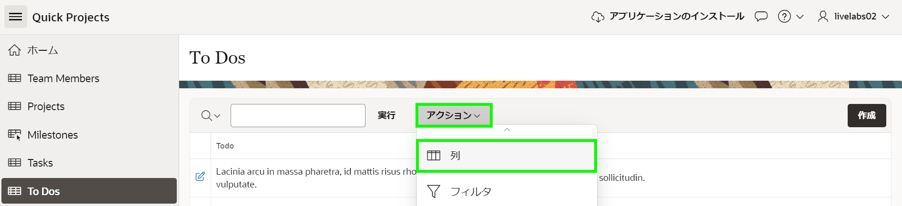 
5. Select Columnsダイアログで、**Project**をクリックします。         
    [Shift]キーを押しながら**Milestone**をクリックします。     
    ダイアログの右側のオプションで**Top**をクリックします。        
    **Apply**をクリックします。

    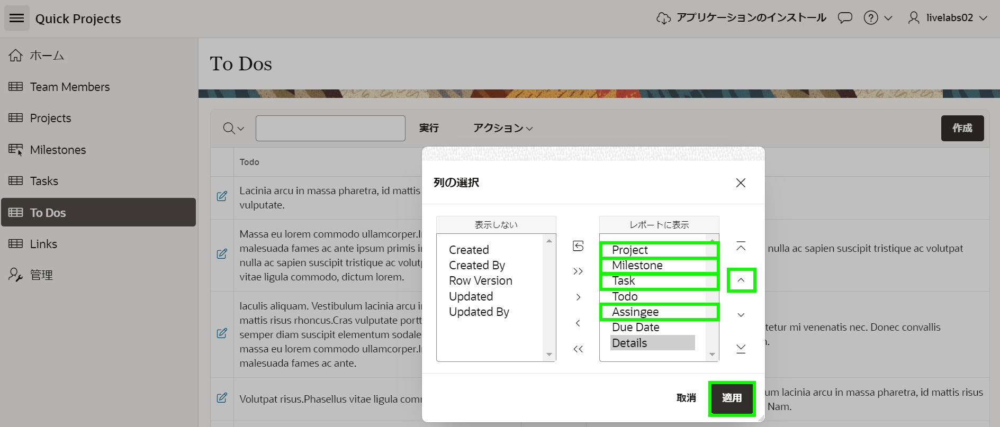   

6. 改訂されたレポートレイアウトを保存する必要があります。他のユーザーが新しく改善された列の配置を見ることができます。

    ランタイム環境で、To Dosレポートメニューの**Actions**をクリックします。      
    ドロップダウンから**Report**を選択し、**Save Report**をクリックします。

    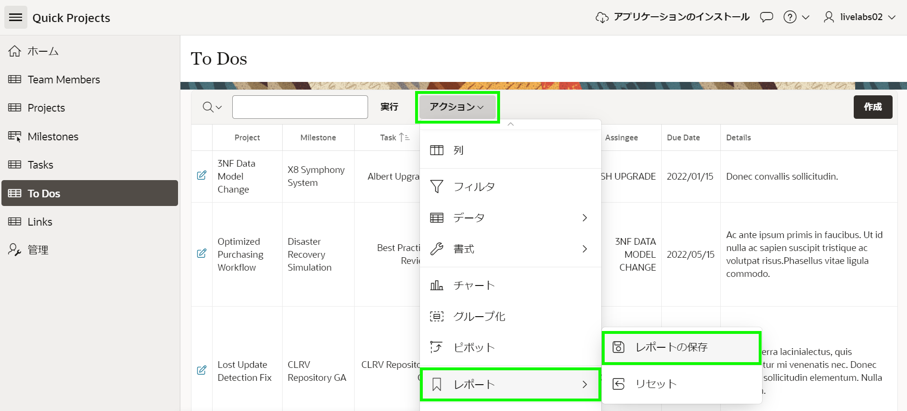  

7. Save Reportダイアログで、Save(開発者のみ表示)の**As Default Report Settings**を選択します。

    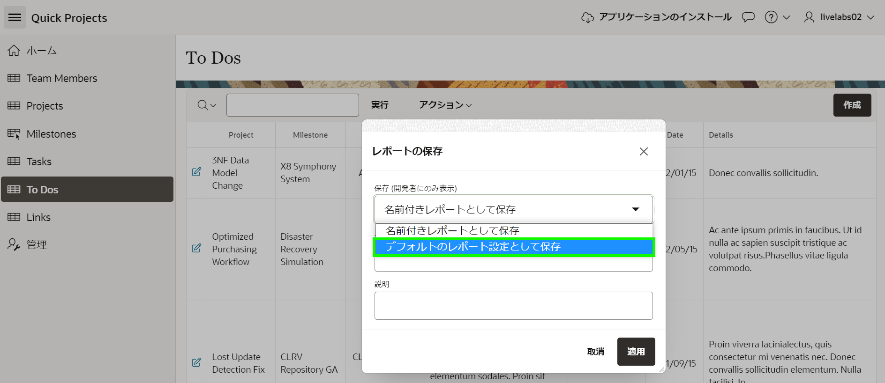  

8. Save Default Reportダイアログで、**Apply**をクリックします。      

    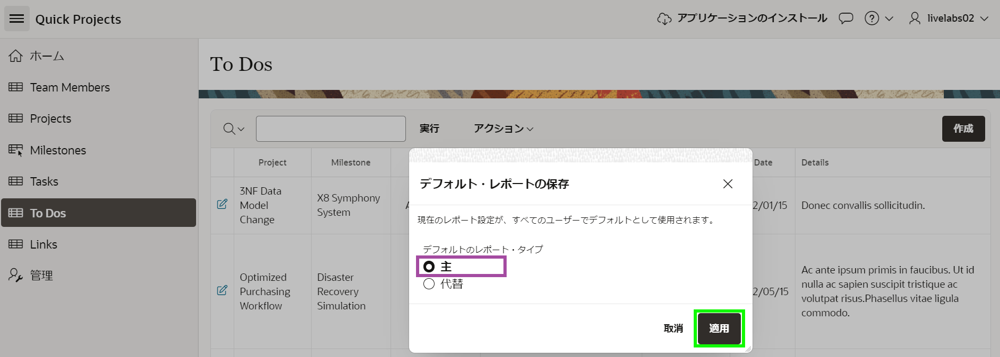  

    *{注:レポートをPrimaryとして保存する必要があります。ユーザーがページに移動すると、現在の表示がエンドユーザーに表示されます。}*

## タスク2:タスクのLOVを更新する
To Dosフォームページをレビューすると、レポートの編集アイコンをクリックすると、フォームページにプロジェクトとマイルストーンがないことがわかります。データ入力を簡素化するために、タスクの選択リストをポップアップLOVに変更し、プロジェクトとマイルストーンを含めます。  

同じLOVはLinksフォームページでも使用されているため、そこでも再利用できます。

1. ランタイム環境で、Developer Toolbarの**Application xxxxx**をクリックします。   

2. アプリケーションホームページから、**Shared Components**をクリックします。

    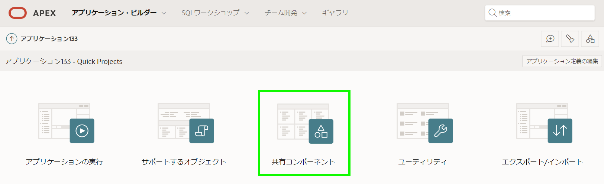  

3. Shared Componentsから、Other Componentsの下の**List of Values**をクリックします。   

4. List of Valuesページから、**HOL_TASKS.NAME**をクリックします。   

5. List of Valuesページで、次の内容を入力します。  
    - Source > Source Type -  **SQL Query**をクリックします。
    - Source > SQL Query - 次の内容を入力します。   

        ```
        <copy>
        select id
        ,      (select p.name from hol_projects p where p.id = t.project_id) project
        ,      (select m.name from hol_milestones m where m.id = t.milestone_id) milestone
        ,      name
        from hol_tasks t
        </copy>
        ```
        

    - Column Mapping > Return - **ID**を選択します。  
    - Column Mapping > Display - **NAME**を選択します。 
    - Column Mapping > Default Sort - **NAME**を選択します。

    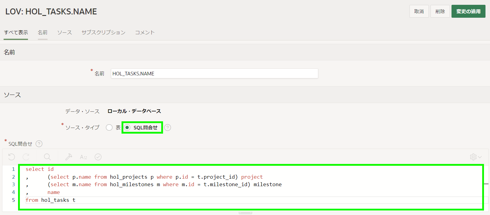

    追加の列を表示するには、**Select Columns**をクリックします。

    Select Additional Display Columnsで、次のアクションを実行します。      
    - **PROJECT (Varchar2)** を右パネルに移動             
    - **MILESTONE (Varchar2)** を右パネルに移動    
    - **NAME (Varchar2)** を右パネルのMilestoneの下に移動      
    *{注:ID列はリストに含める必要がありますが、Visible = Noとしてマークされるため表示されません。}*

    **Update**をクリックします。

    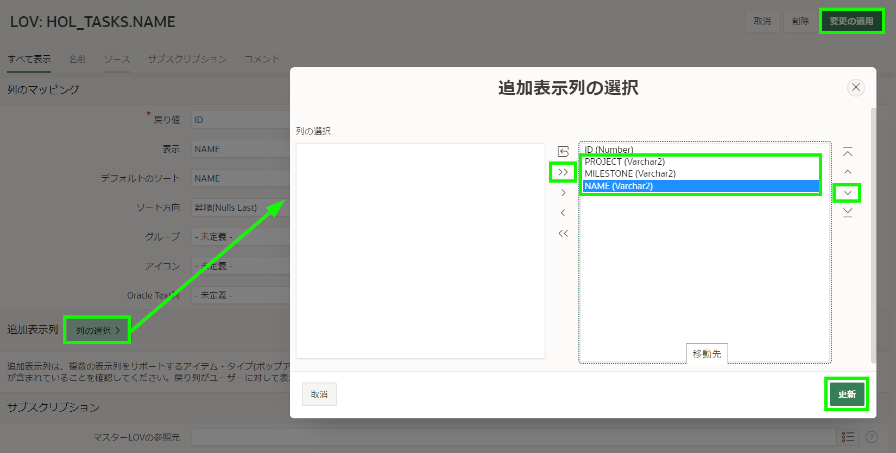

    List of Valuesツールバーの**Apply Changes**をクリックします。

5. To Doフォームページでは、タスクのアイテムタイプを更新する必要があります。    

    Shared Componentsから、ブレッドクランブ内で、**Application xxxxx**をクリックします。  
    アプリケーションホームページから、ページのリストで**10 - To Dos**をクリックします。  

    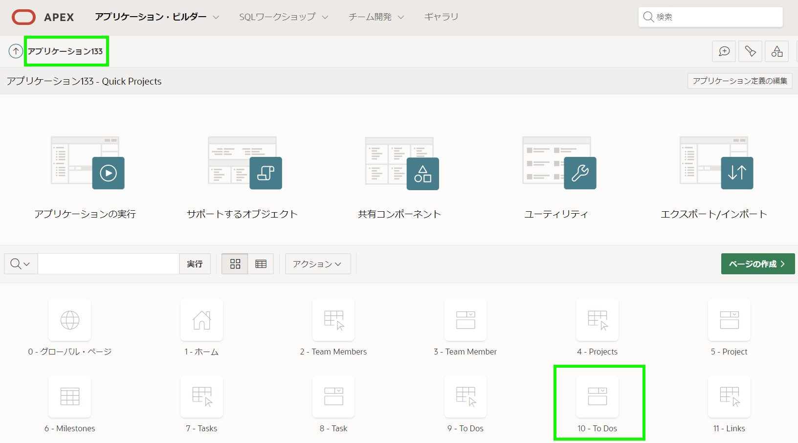   

7. Page Designer内で、Rendering tree(左パネル)の**P10_TASK_ID**をクリックします。
    Property Editor(右パネル)で、Identification > Typeの**Popup LOV**を選択します。

    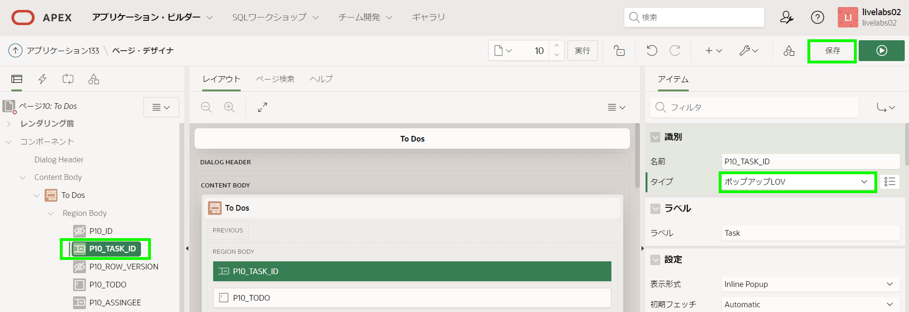   

7. Page Designerツールバーの**Save**をクリックします。   

8. 完成したフォームページをレビューする時間です。   

    ランタイム環境タブまたはブラウザに移動します。
    **To Dos**に移動し、ページをリフレッシュします。
    To Doの編集アイコンをクリックします。

    Taskの下向き矢印をクリックしてタスクのポップアップLOVを表示します。  
    検索条件を入力して[Enter]キーを押します。

    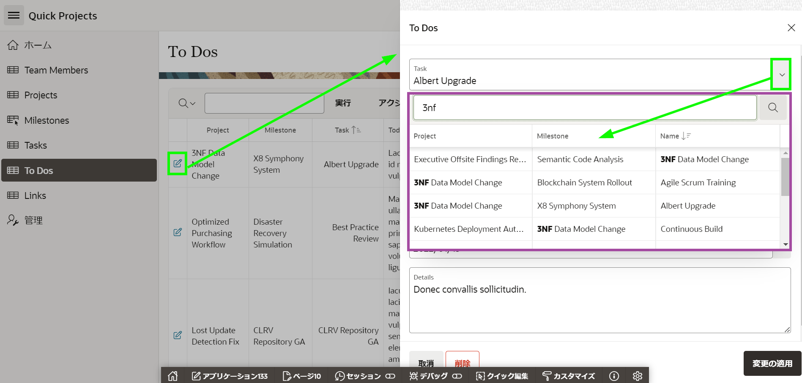 

## **まとめ**

これで、関連する詳細を表示するためにレポートと値クエリのリストを強化する方法を知っています。


## **謝辞**

  - **著者** - Salim Hlayel, Principle Product Manager
  - **寄稿者** - LiveLabs QA Team (Arabella Yao, Product Manager Intern | Dylan McLeod, QA Intern)
  - **最終更新者/日付** - Salim Hlayel, Principle Product Manager, November 2020
