# クイックSQLを使用して新しいデータ構造を定義します

## 序章

データベース・オブジェクトを作成し、維持するためのSQLを記憶することは難しいかもしれません。しかし、省略記法やグラフィカル・ユーザー・インターフェースに基づいてコードを生成してくれるツールが存在します。このラボでは、Quick SQL でデータ構造を定義してテーブルとビューを作成する方法を学びます。

推定時間：15分

### 問題の定義

ほとんどの組織で、スプレッドシートが盛んに使われています。スプレッドシートは、簡単なデータの確認や個人的なデータの追跡には適していますが、例えば、チームメンバー間のデータを収集するには非常に不向きです。

よくある使用例として、マネージャーが自分のチームが取り組んでいるさまざまなプロジェクトを追跡する必要がある場合があります。マネージャーは、重要なデータ要素を含むスプレッドシートを作成しました。しかし、チームが成長した現在、スプレッドシートの更新を管理することは不可能になりつつあり、単一の真実のソースを得ることはほとんど不可能になっています。

以下は、マネージャーがチームに送信しているスプレッドシートからの抜粋です：

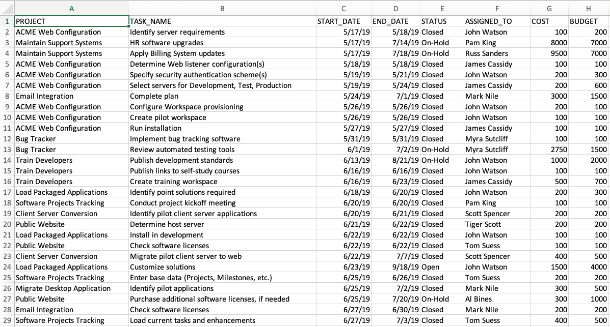

### Napkin Design-プロジェクトのデータモデルの改善

スプレッドシートに基づいて単一のプロジェクト・タスク・テーブルを作成するのではなく、データ構造のコレクションを定義することで、関係をよりよくモデル化し、価値のある追加情報を収集することができます。

以下は、プロジェクト情報を収集するためのナプキンデザインです：

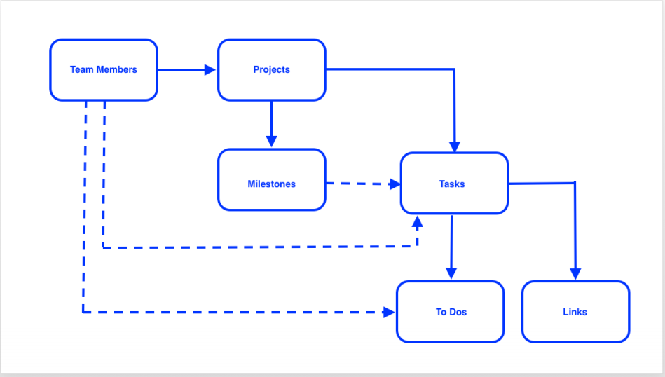

新しいモデルでは、チームメンバーをプロジェクトに割り当てられるだけでなく、オプションでタスクやToDoに割り当てることができることにお気づきでしょうか。プロジェクトはマイルストーンを持つという概念が導入されましたが、タスクがマイルストーンに関連付けられるかどうかは任意です。さらに、ToDoとリンクがタスクに追加されました。

### 目的

- Oracle APEX Workspaceにテーブルを追加し、データを挿入する。

### あなたは何が必要ですか？

- Oracle Cloudの有料アカウント、Livelabsアカウント、または無料トライアル。
- APEXワークスペース

## タスク1：クイックSQLを開きます

1. ワークスペースにログインします。
2. **SQLワークショップ**をクリックします。
3. **SQLスクリプト**をクリックします。

   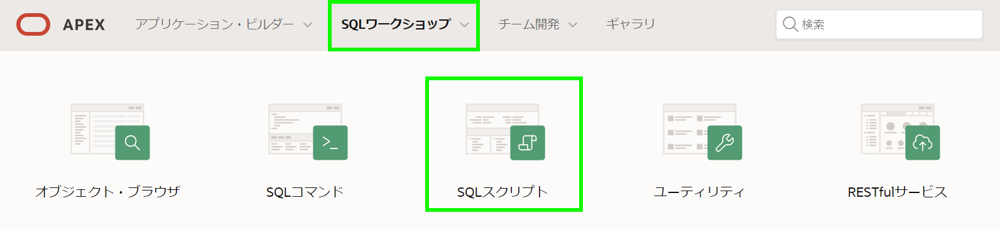

4. **Quick SQL**をクリックします

   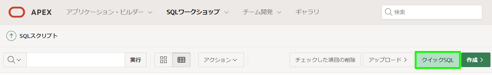

## タスク2：表には速記を入力します

Quick SQLは、インデントされたテキストドキュメントからリレーショナルデータモデルを作成するために必要なSQLを簡単に生成する簡単な方法を提供します。

*{注意：入力するのは、テーブルの一部と各テーブルのカラムの一部だけです。この演習は、Quick SQL の概念を学ぶためのものであり、入力の練習ではありません。完成したスクリプトは、このラボの後半で提供されます。}*

1. 最初のテーブルといくつかの列を入力します。

   クイックSQL（左ペイン）で、テーブル名を入力してください。

   2つ以上のスペースをインデントし、いくつかの列名を入力します。

   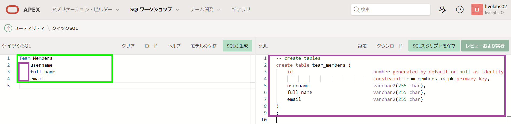

   *{注：各行を入力すると、SQL（右ペイン）が必要なSQLで更新され、定義するテーブルが作成されます。

2. 2番目のテーブルといくつかの列を入力します。

   クイックSQL（左ペイン）で、最初の列にテーブル名を入力します。

   2つ以上のスペースをインデントして、列名を入力します。

   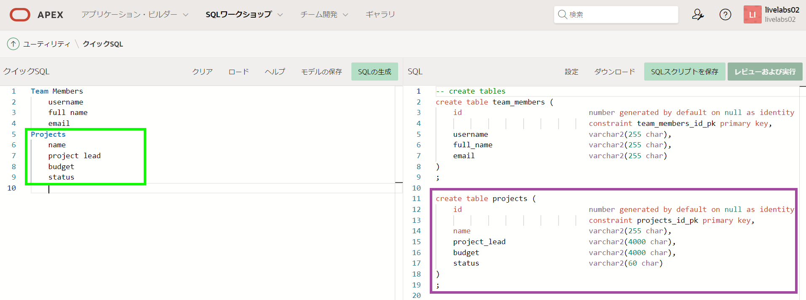

## タスク3：速記を改善します

これまでのところ、いくつかの基本的なテーブルを定義し、デフォルトを使用していますが、速記に追加できる多くのディレクティブとデータ型があり、生成されたSQLを改善できます。

1. [**ヘルプ]をクリックします**

   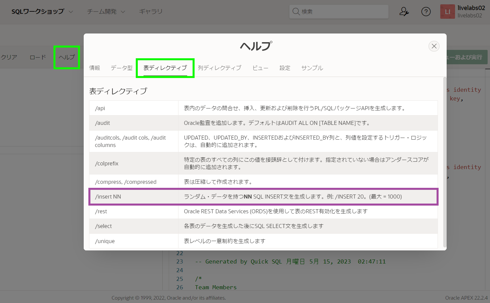

2. [**列のディレクティブ]をクリックします**

   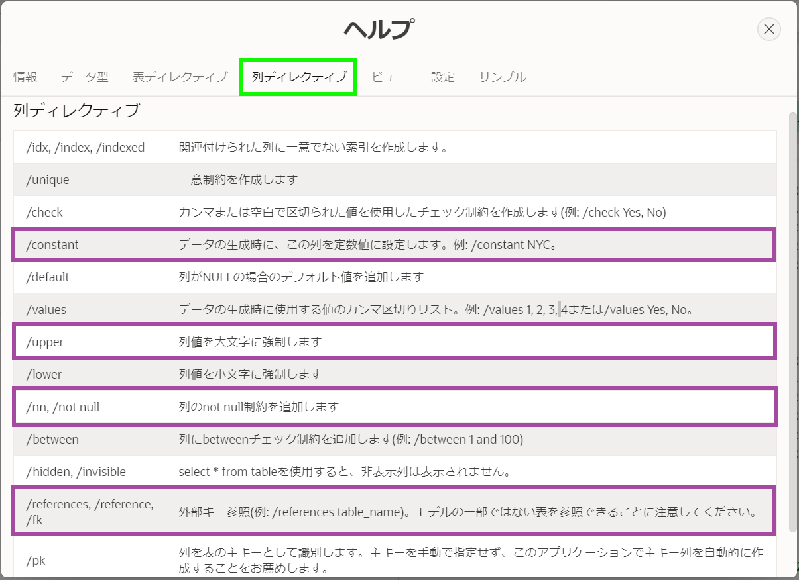

3. **データ型をクリックします**

   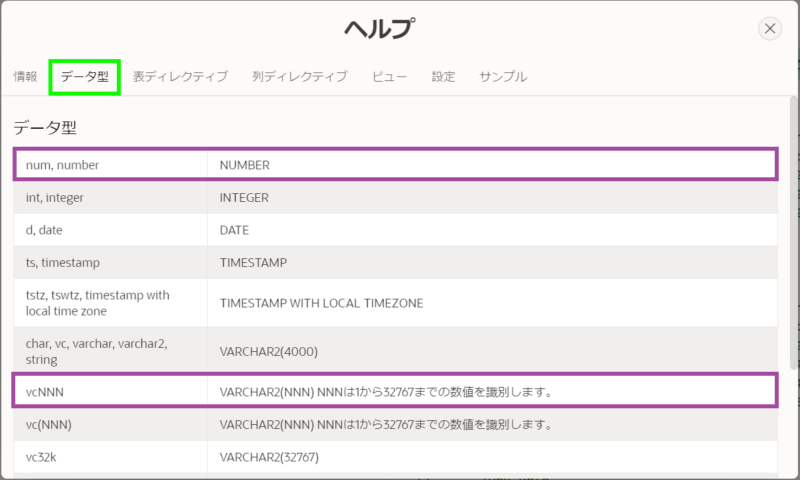

4. 閉じる**ヘルプ**
5. クイックSQL（左ペイン）で、チームメンバーのテーブルを次のもので更新します。
    - 表：チームメンバー-10 **を挿入する**/挿入*{これは10のサンプルレコードを挿入します}*
    - 列：username -add ** /nn /upper ***{これにより、列が大文字と必須になります}*
    - 列：電子メール -  **/nn **を追加

   以下のプロジェクトテーブルを更新してください。
    - テーブル：プロジェクト-10/挿入20 ***{これにより、20のサンプルレコードが挿入されます}*
    - 列：名前 - 追加**/nn **
    - 列：プロジェクトリード-Add **/References Team_Members **
    - 列：予算 - 追加** num ***{これにより、列が数値になります}*
    - 列 - ステータス - 追加*vc30 /nn /nn /check割り当て、in_progress、完了***{これにより、必須列の長さを定義し、指定された3つの値を使用してチェック制約を追加します}**

   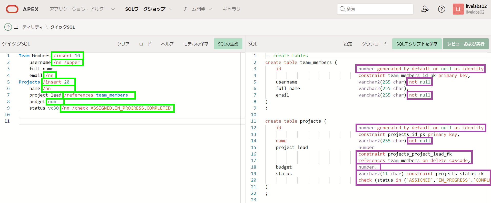

   *{注：SQL（右ペイン）内で下にスクロールして、_username_で_/apper_の実装についてチームメンバーのトリガーを確認する必要があります。

## タスク4：子テーブルを入力します

テーブル名をインデントすることにより、新しいテーブルを上のテーブルの子テーブルとして定義でき、SQLは2つのテーブル間に外部キー関係を生成します。

1. プロジェクトに関連する子テーブルを入力します。

   クイックSQL（左ペイン）で、テーブル名と指令を入力してください。

   2つ以上のスペースをインデントして、列名とディレクティブを入力します。

   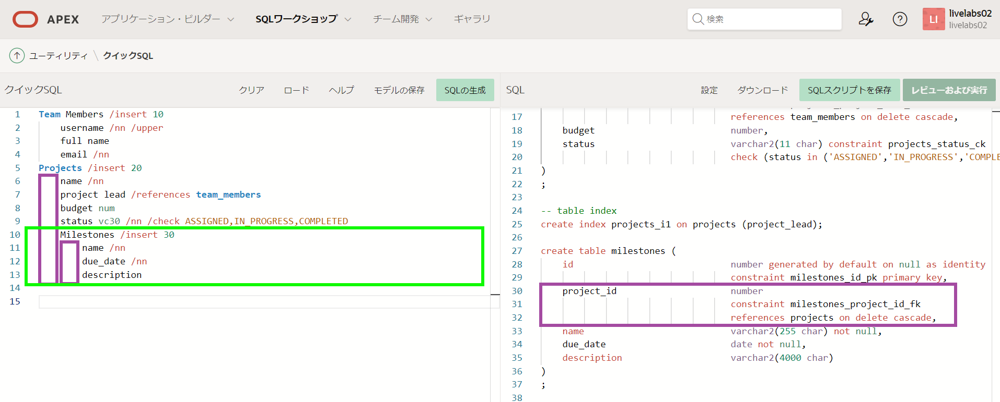

   *{注：MilestonesテーブルのSQLには、Project_id列と、親テーブルとの外部キー関係が含まれます。プロジェクト。}*

2. プロジェクトに関連する別のチャイルドテーブルを入力します。

   クイックSQL（左ペイン）で、テーブル名と指令を入力してください。

   2つ以上のスペースをインデントして、列名とディレクティブを入力します。

   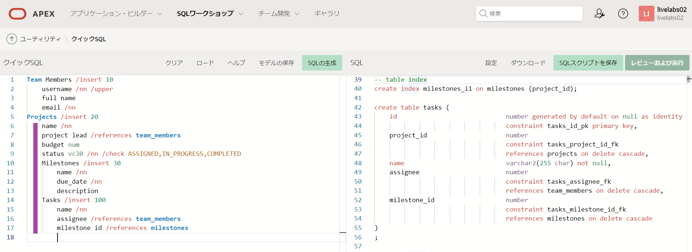

## タスク5：設定を更新します

生成されたSQLをさらに改善するために、多数の設定を定義できます。

1. SQL（右ペイン）ツールバーで、[**設定] **をクリックします

   [設定]ダイアログで、次のものを入力してください。
    - オブジェクトプレフィックス-Enter ** hol **
    - deleteで -  [制限] **を選択します**
    - プライマリキー-Select ** ID列**
    - 日付データタイプ-Select **ローカルタイムゾーンでタイムスタンプ**
    - 監査列 -  **チェック**
    - 行バージョン番号 -  **チェック**

   [変更]をクリックします** **

   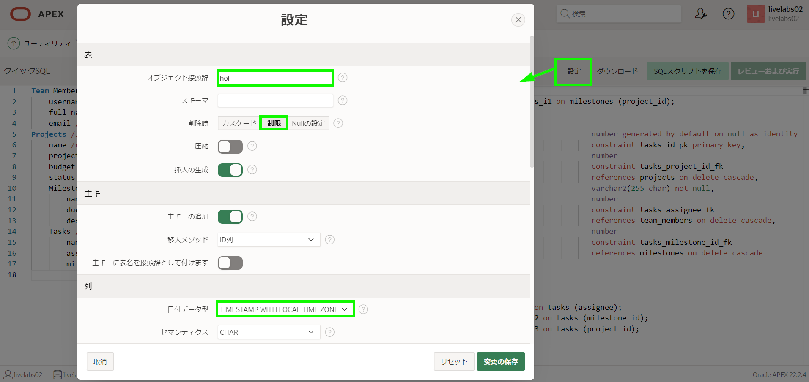

   生成されたSQLは著しく変化しました。

   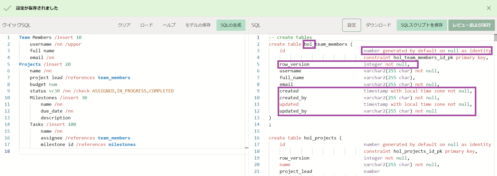

## タスク6：完全な速記でコピーします

1. クイックSQL（左ペイン）で、既存の速記のすべてを以下に置き換えます。


   ```
   <copy>
   # settings = { prefix: "hol", ondelete: "restrict", pk: "identity" }
   # date: "timestamp with local time zone"
   # auditcols: true
   # rowVersion: true

   team_members /insert 10
     username /nn /upper
     full name
     email /nn
     phone_number
     profile
     photo file
   projects /insert 20
     name /nn
     project_lead /nn /references team_members
     budget num
     status vc30 /nn /check ASSIGNED, IN-PROGRESS, COMPLETED
     completed_date
     description
     milestones /insert 30
       name /nn
       due_date /nn
       description
     tasks /insert 100
       name /nn
       assignee /references team_members
       milestone_id /references milestones
       start_date /nn
       end_date
       cost num
       description
       is_complete_yn /check Y, N
       to dos /insert 20
         todo vc(255) /nn
         assingee /references team_members
         due_date
         details
       links /insert 10
         url vc(255) /nn /lower
         name
         description

   view project_tasks projects tasks
   </copy>
   ```

   [** SQL **を生成]をクリックします

   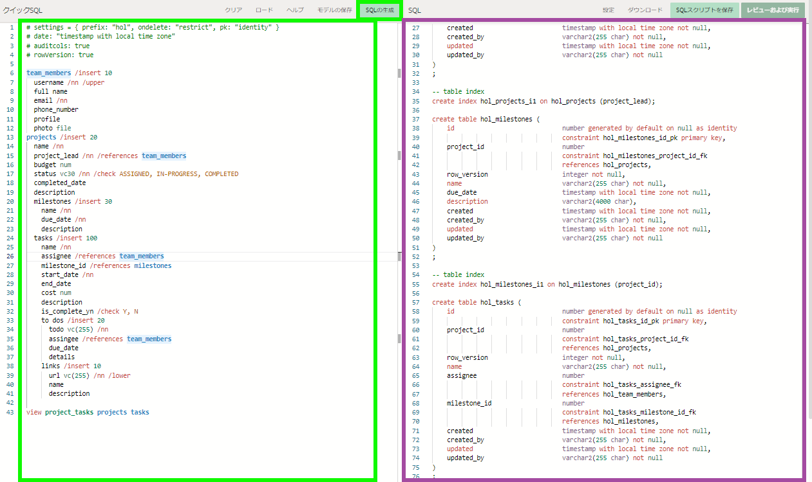

   *{注：全速記は、必要なすべての設定を定義します。

## タスク7：スクリプトを実装します

この段階で、SQLステートメントのリストを作成しました。

1. 
2. [スクリプトの保存]ダイアログで、スクリプト名については、** hol **を入力します。

   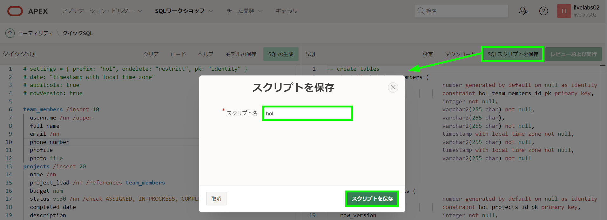

3. SQL（右ペイン）ツールバーで、[**レビューと実行]をクリックします。

   [** run **]をクリックします。

   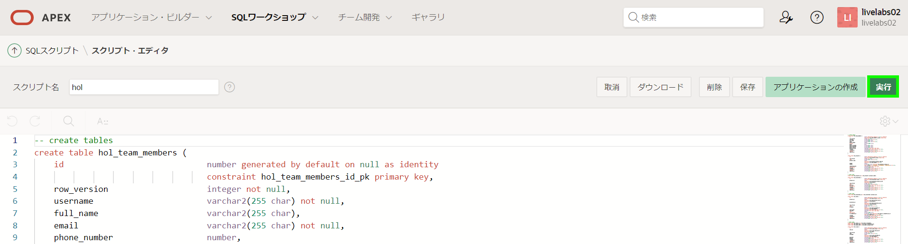

4. [実行]ページで、[今すぐ実行]をクリックします**。

   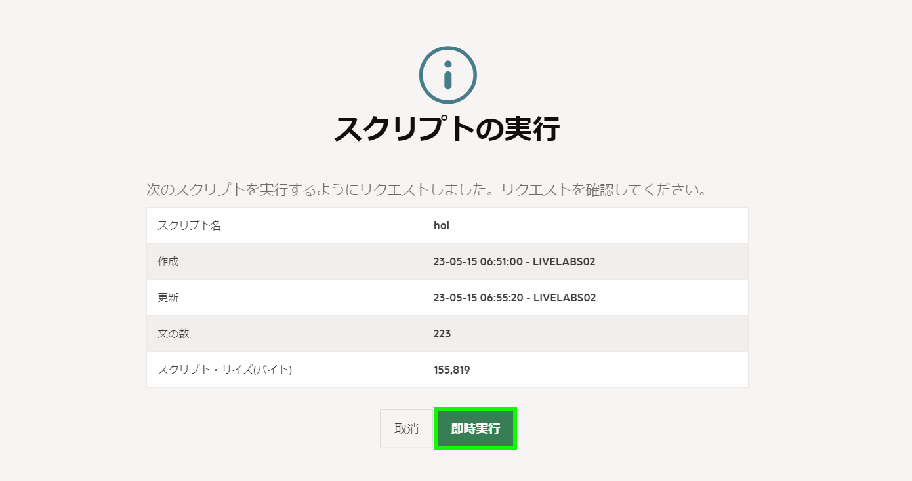
5. スクリプト結果ページが表示され、処理され、成功したステートメント、エラーが表示されます。

   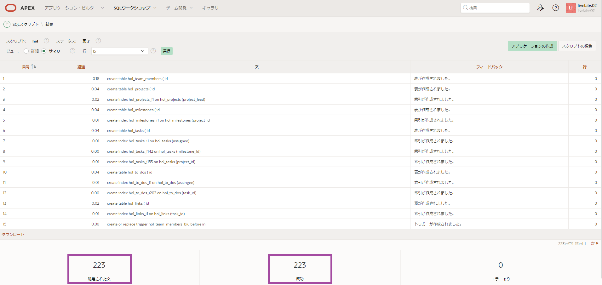

   *{注：217のステートメントが処理されていない場合は、Quick SQLに戻り、_generate sql_をクリックして、スクリプトを再設定してから再度実行します。

## **まとめ**

これで、クイックSQLを使用して複雑なデータ構造を構築し、サンプルデータを完成させる方法を知っています。

## **謝辞**

  - **著者** - Salim Hlayel, Principle Product Manager
  - **寄稿者** - LiveLabs QA Team (Arabella Yao, Product Manager Intern | Dylan McLeod, QA Intern)
  - **最終更新者/日付** - Salim Hlayel, Principle Product Manager, November 2020
