# アプリケーションの再生成

## はじめに

このラボでは、開発のためのより良い出発点を作成するためにアプリケーションを再生成します。  

Milestonesレポートとフォームをレビューすると、わずか4項目しかありません。次に、エンドユーザーと話をすると、特定のプロジェクトに対して一度に多くのマイルストーンを入力したいとよく言われることが分かります。

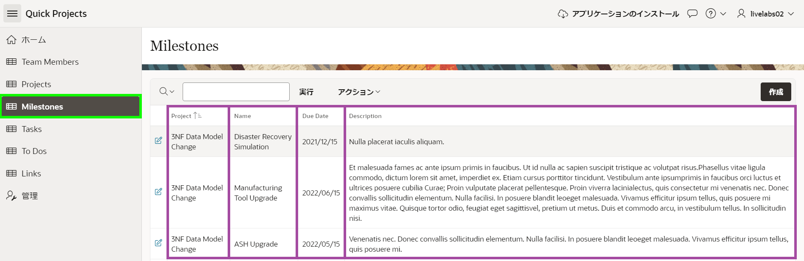

したがって、現在のレポートとフォームをInteractive Gridに置き換えることが望ましいでしょう。Interactive Gridはスプレッドシートに似ており、1ページで複数のレコードを管理できます。  

生成したばかりのアプリケーションで追加の開発が行われていないため、現在のアプリケーションを削除してから新しいアプリケーションを再生成するのが最も迅速で簡単な方法です。  

*{注:アプリケーションで開発が行われていた場合、再生成すると変更が失われます。これを避けるには、Create Page Wizardを使用して新しいInteractive Gridページを作成し、既存のレポートとフォームを削除した後、ナビゲーションリストを新しいページを指すように変更できます。}*  

推定所要時間:5分  

### 目的
- 開発者に優しい環境のためにアプリケーションを再生成する  
- アプリケーションのステップを更新する  

### 必要なもの  

- Oracle Cloudの有料アカウントまたは無料トライアル。30日間$300のクレジットを含むトライアルアカウントにサインアップするには、[こちら](http://oracle.com/cloud/free)をクリックしてください。  
- APEXアプリケーション

## タスク1:既存のアプリケーションを削除する
同じ名前の2つのアプリケーションがあることに起因する混乱を避けるために、作成したばかりのアプリケーションを削除することが重要です。

1. アプリケーションのホームページに戻ります。  

   APEX App Builderからこのアプリを実行したため、画面下部にDeveloper Toolbarが表示されます。     
   *{注:アプリに直接ログインするエンドユーザーはこのツールバーは見えません。}*

   Developer Toolbarの**Application xxxxx**をクリックします。

   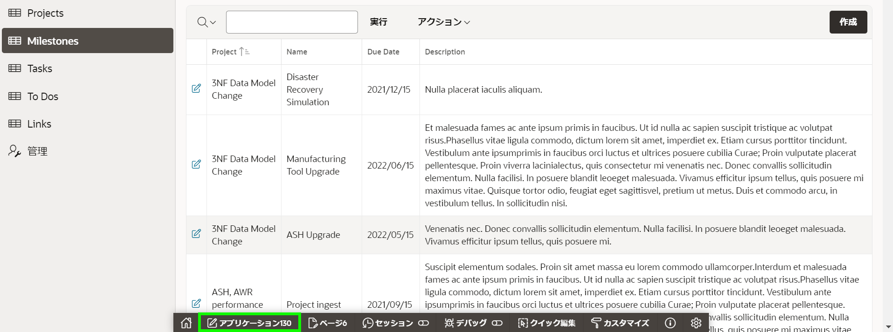  

   または、ブラウザのタブまたはウィンドウを選択してAPEX App Builderタブに手動で戻ることもできます。

2. 開発環境から、アプリケーションのホームページで、右パネルのTasksの下にある**Delete Application**をクリックします。

   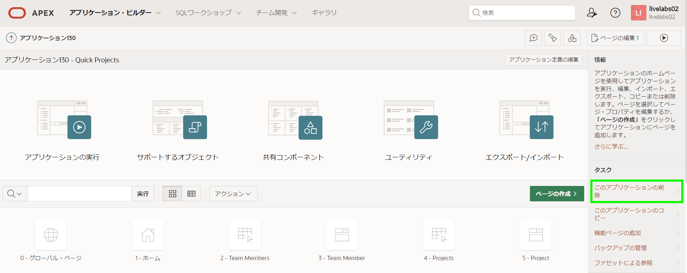  

3. Confirm Deleteページで、**Permanently Delete Now**をクリックします。

   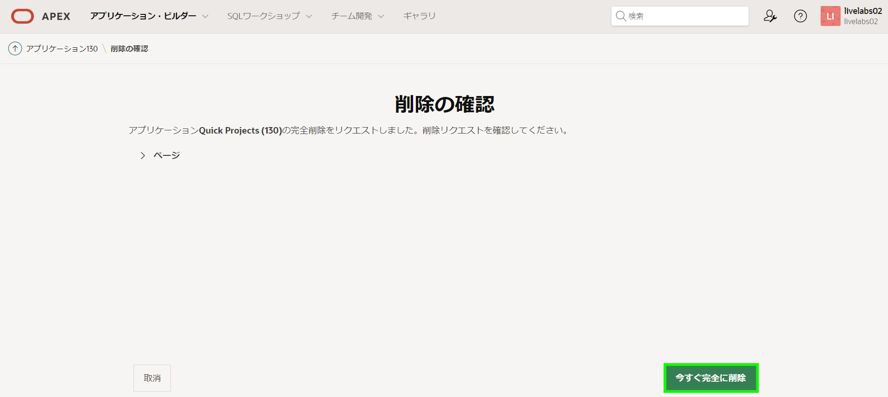  
 

## タスク2:ブループリントをロードする 
Create Application Wizardを使用すると、開発者は以前に生成されたアプリケーション定義(_Blueprints_と呼ばれる)をロードできます。この機能を利用すると、以前のProjectsアプリケーションのブループリントをロードし、マイルストーンページを変更してからアプリケーションを再生成できます。

1. App Builderのホームページから、**App Builder**メニューを開き、**Create**をクリックします。

   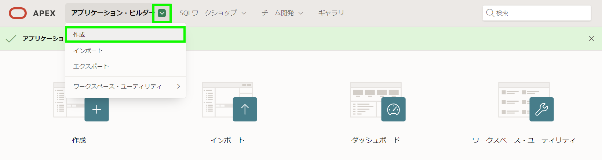  

2. Create an Applicationページで、**New Application**をクリックします。

3. Create App Wizardで、**Load Blueprint**をクリックします。

   Quick Projectsに対して、**Load**をクリックします。

   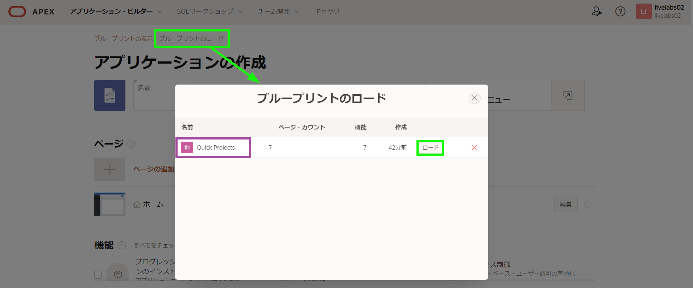

## タスク3:マイルストーンページを更新する
元のページを再ロードしたので、古いマイルストーンページを削除し、新しいページタイプを追加して、新しいページの順序を再設定するだけです。

1. Create an Applicationページで、Pagesの下のMilestonesに対して**Edit**をクリックします。  

   Add Report Pageで、**Delete**をクリックします。

   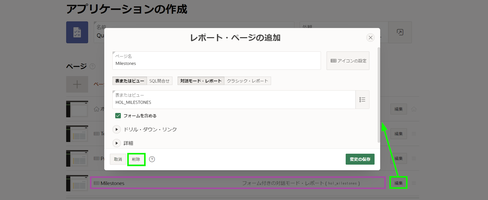

2. **Add Page**をクリックします。  

   Add Pageダイアログで、**Interactive Grid**をクリックします。

   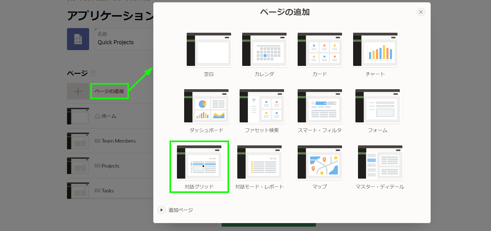  

3. Add Interactive Grid Pageダイアログで、次の内容を入力します。
   - Page Name - Milestonesと入力します。  
   - Table or View - HOL_MILESTONESを選択します。  

   **Add Page**をクリックします。

   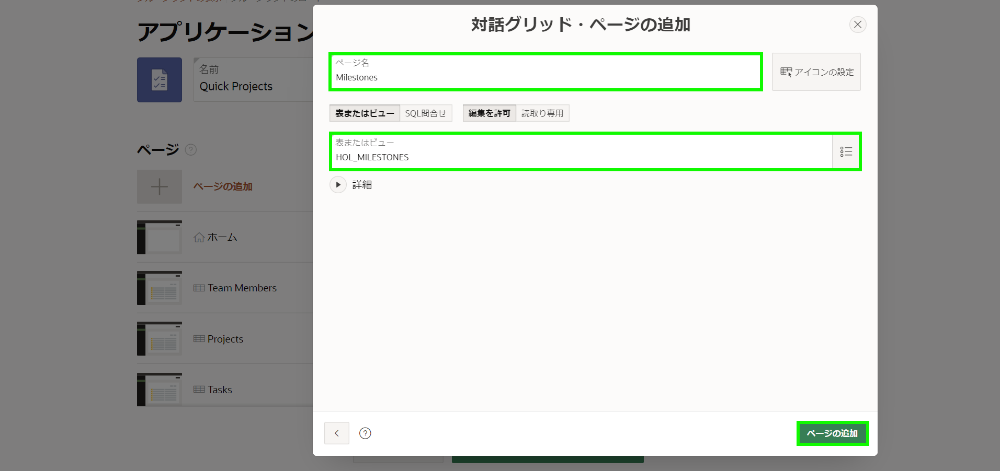  

4. **Milestones – Interactive Grid**ページのハンバーガーをホバーしたときにマウスをクリックし、 Projectsの下までドラッグします。マウスを離します。

   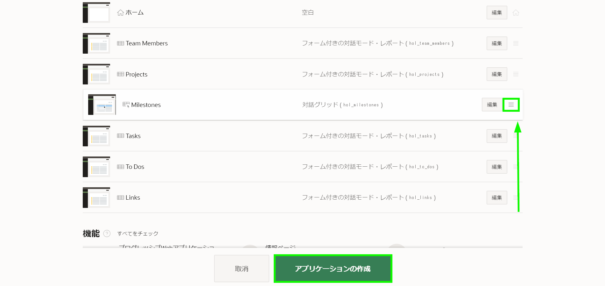  

5. 新しいアプリケーションを生成するには、**Create Application**をクリックします。  

## タスク4:新しいアプリケーションを実行する

1. Page Designerで、**Run Application**をクリックします。  

2. 新しいアプリケーションでMilestonesに移動し、ページを確認します。  

   既存のレコードをダブルクリックするか、Add Rowをクリックして新しいレコードを挿入します。

   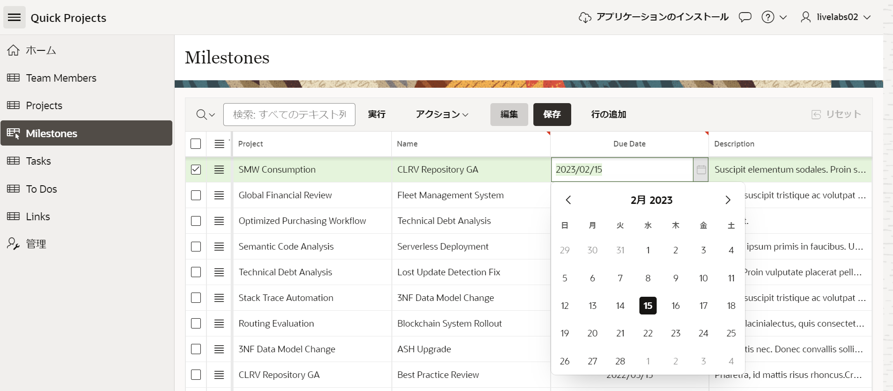  

   *{注:レコードをInteractive Grid内から直接挿入、更新、削除できます。ウィザードはProjectsのリスト値を生成し、Due Dateはポップアップカレンダーを使用し、他の2つのフィールドではテキストエリアを使用してデータをページ上で直接維持します。}*   

## **まとめ**  
blueprintを使用して以前のアプリケーション定義をCreate Application ウィザードにロードする方法を知っています。

## **謝辞**

  - **著者** - Salim Hlayel, Principle Product Manager
  - **寄稿者** - LiveLabs QA Team (Arabella Yao, Product Manager Intern | Dylan McLeod, QA Intern)
  - **最終更新者/日付** - Salim Hlayel, Principle Product Manager, November 2020
