# Oracle Apexワークスペースにサインアップしてください

## 序章

Oracle Application Express（APEX）は、自律データウェアハウス（ADW）や自律トランザクション処理（ATP）サービスを含むOracleデータベースの機能です。

Apex 19.2ワークスペースのプロビジョニングが既にある場合は、このラボをスキップして（ラボ2）[_ 1_]に直接移動できます。

### 頂点ワークスペースとは何ですか？

頂点ワークスペースは、Apexアプリケーションを定義する論理ドメインです。

### ラボの実行場所

このラボは、Apex 19.2がインストールされている任意のOracleデータベースで実行できます。

以下は、Oracle Autonomous Database Cloud ServiceまたはApex.oracle.comサービスのいずれかにサインアップする方法の手順です。

### 目的

Oracle Apexワークスペースにアクセスします。

### あなたは何が必要ですか？

- Oracle Cloudの有料アカウントまたは無料トライアル。

以下のオプションのいずれかをクリックして続行します。

## **オプション1 **：Oracle Autonomousデータベース

この部分では、Oracle Cloud Trialアカウントを作成します。

1.  [_4 _]（_ 5_）をお願いします。

2.  トライアルをリクエストしてすぐに、Oracle Cloud **メールで**開始します。

    

3. サービスができたので、Oracle Cloudアカウントにログインして、さまざまなサービスの作業を開始できます。

   [入力]フィールドに**クラウドアカウント名**を入力し、[次の**]ボタンをクリックします。

   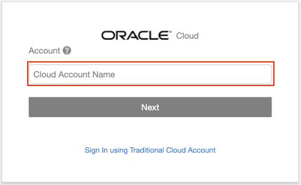

4. 入力フィールドに** username **および**パスワード**を入力し、[**サインイン**]をクリックします。

   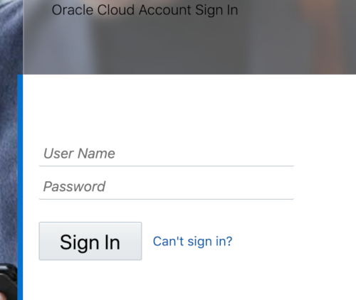

5. Oracle Cloud環境内から、自律的なトランザクション処理データベースサービスのインスタンスを作成します。

   クラウドダッシュボードから、左上隅のナビゲーションメニューアイコンを選択し、[自動トランザクション処理**]を選択します。

   

6. [** [自律]データベースを作成**をクリックします**。

   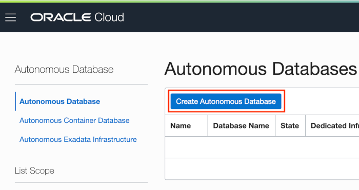

7. **常に無料**オプションを選択し、[管理]パスワードのために** `` _23_``` **を入力し、[自律データベース]をクリックしてください**をクリックします**をクリックします。

   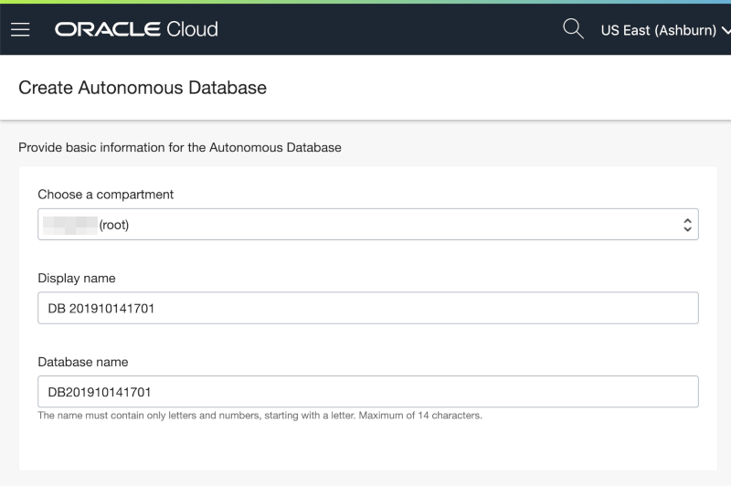
   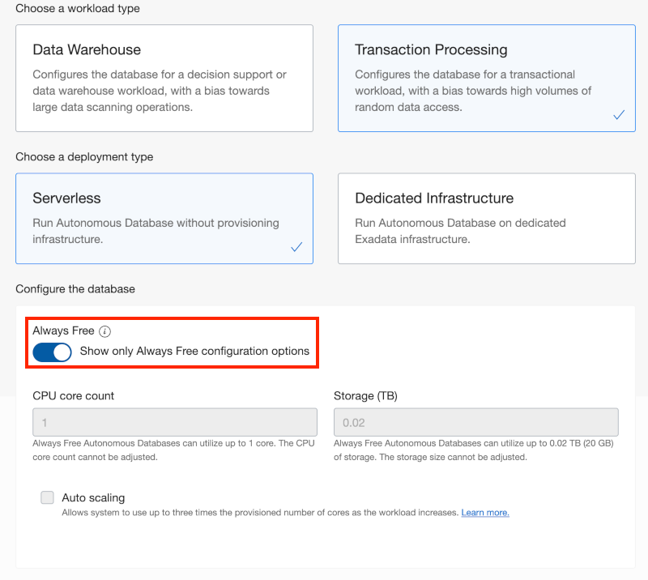
   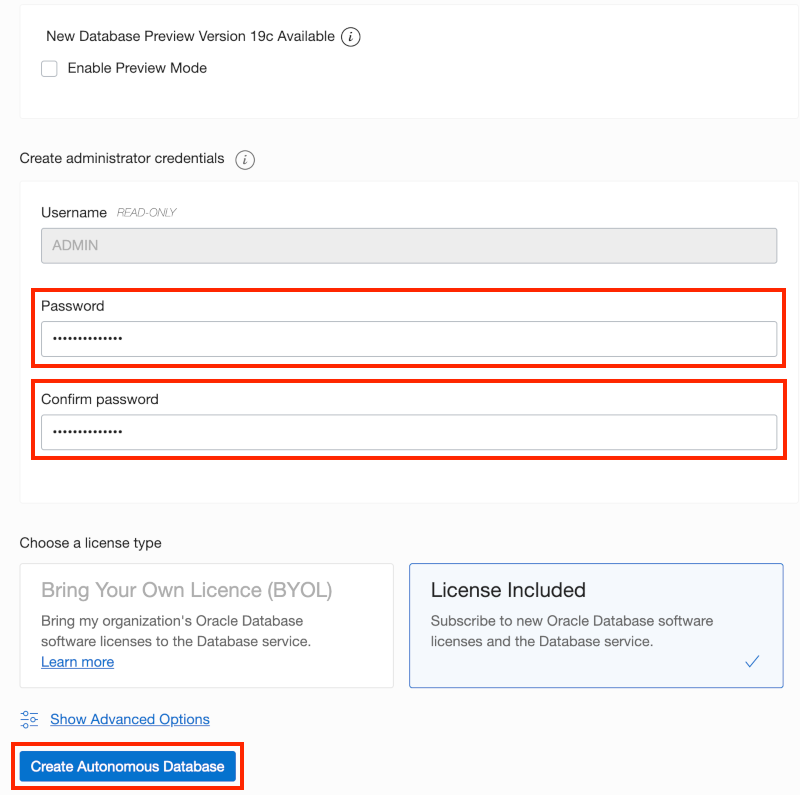

8. ** [自律データベース**の作成]をクリックした後、新しいインスタンスの[自律データベースの詳細]ページにリダイレクトされます。

   ステータスが変更されたら続行します。

   

   に：

   

9. 新しいデータベース内では、Apexはまだ構成されていません。

   **ツール**タブをクリックします。

   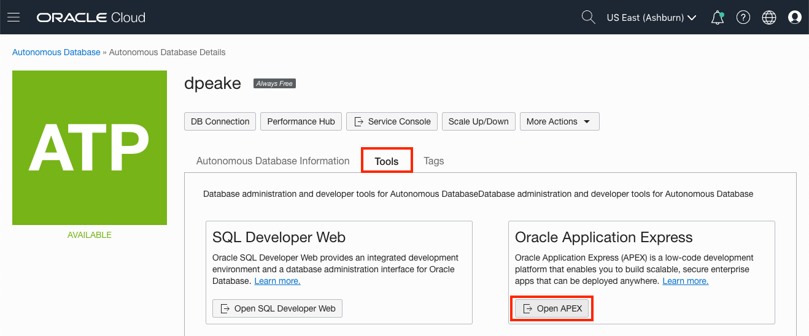

10. 管理サービスのパスワードを入力して、[**管理] **をクリックします**。

    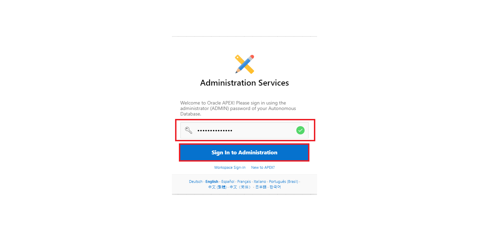

4. [ワークスペースを作成] **をクリックします**。

   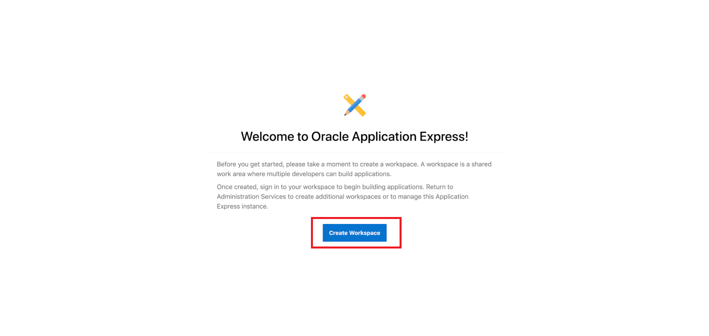

5. [ワークスペースの作成]ダイアログに、次のように入力してください。

   |

   [ワークスペースを作成] **をクリックします**。

   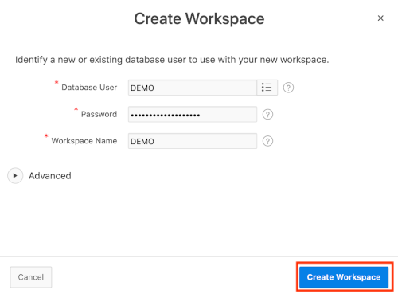

6. PEXインスタンス管理ページで、[成功]メッセージの**デモ**リンクをクリックします。

   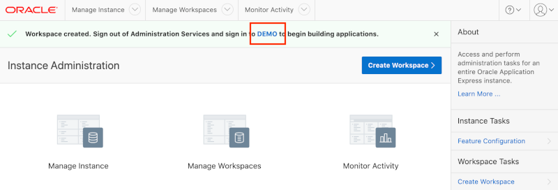

7. [APEX Workspaceログイン]ページで、[_56_`` **を入力します。パスワードを確認してください。**ワークスペースとユーザー名を覚えています**チェックボックスをチェックし、[サインイン**]をクリックします。

   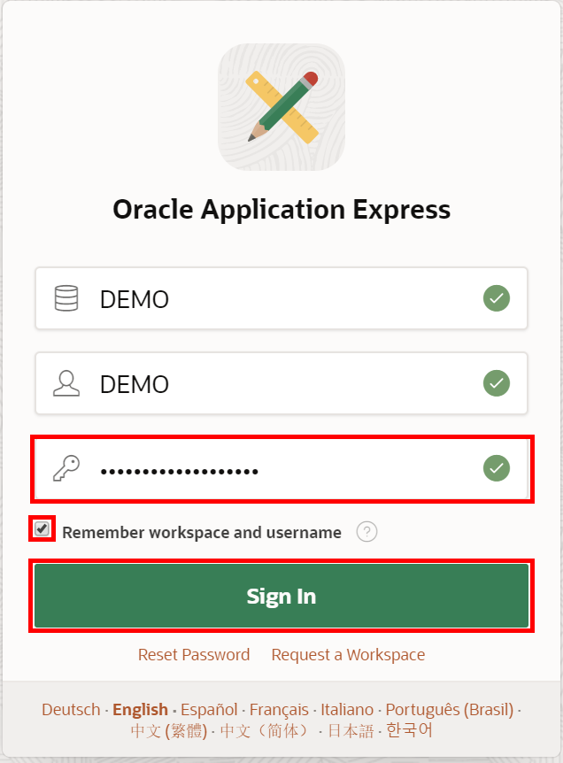

## **オプション2 **：apex.oracle.com

apex.oracle.comにサインアップすることは、作成したいワークスペースの詳細を提供し、承認メールを待つだけの問題です。

1. [_60 _]（_ 61_）に移動します
2. クリック**無料で開始**

   

3. apex.oracle.comの詳細が表示されるまで下にスクロールします。

   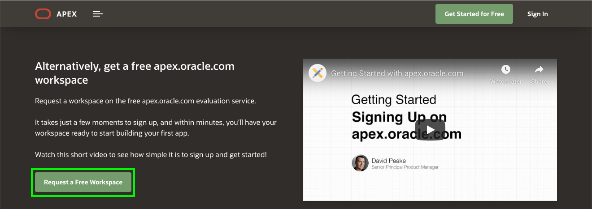

3. リクエストのワークスペースダイアログのリクエストで、識別の詳細を入力します - 名、姓、電子メール、ワークスペース

   [次へ]をクリックします**。

   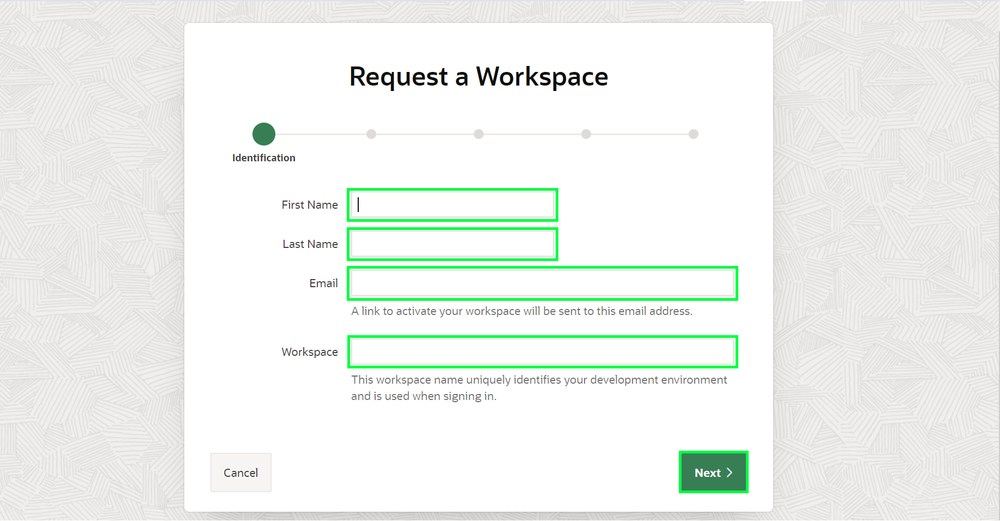

3. 残りのウィザードステップを完了します。

4. あなたのメールをチェック。

   電子メール本文内で、[ワークスペースを作成] **をクリックします**

   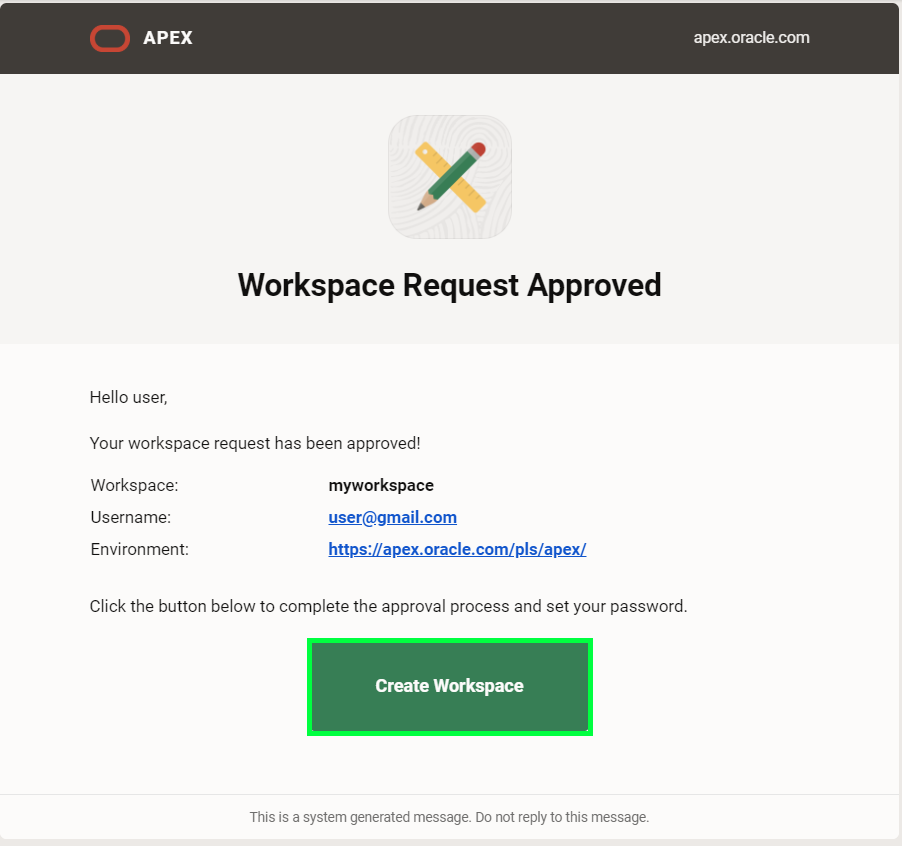

3. [スクリーンのサインインを続ける]をクリックします**。
4. パスワードを入力して、[変更] **の適用**をクリックします。
5. これで、Apex Builderに参加する必要があります。

   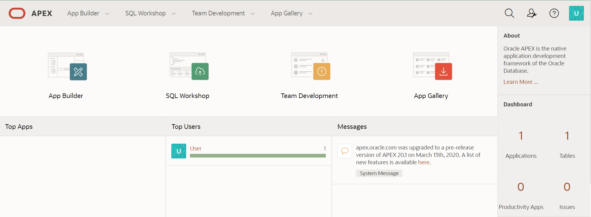


## **まとめ**

これにより、ラボのセットアップが完了します。

[_77 _]（_ 78_）に移動して、頂点ワークスペースにデータ構造を作成します。

## **謝辞**

- **著者**  - サリム・フレイエル、原則プロダクトマネージャー
- **貢献者**  - ロビー・ラッペル、機能的なリード、オラクル・リベラブス
- **最後の更新/日付** -AnooshaPilli、製品マネージャー、DB製品管理、2020年4月
