# テーブルの作成

## はじめに

このラボでは、Quick SQLでデータ構造を定義することによりテーブルを作成する方法を学びます。

所要時間: 10分  

## タスク1: Quick SQLを開く
1. ワークスペースにログインします。  
2. **SQLワークショップ**をクリックします。
3. **SQLスクリプト**をクリックします。

    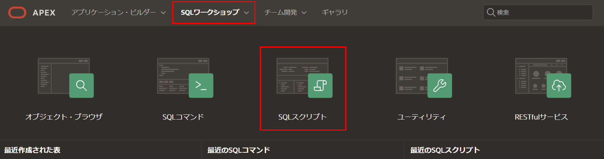

4. **Quick SQL**をクリックします。

    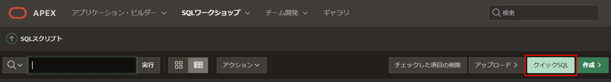

## タスク2: テーブルの省略形を入力する
Quick SQLでは、インデントされたテキストドキュメントからリレーショナルデータモデルのSQLを生成する簡単な方法を提供します。このツールは、SQLテーブル、トリガー、インデックス構造を作成するために必要な時間と労力を削減することを目的としています。

1. Quick SQL(左パネル)に以下を入力します。

    ```
    <copy>big_mac_index  
      country_name  
      country_iso
      currency_code
      local_price num
      dollar_exchange_rate num
      gdp_dollar num
      entry_date</copy>
    ```

    *注意: country_nameやその後の行をインデントすることで、これらが最初の行で定義されたテーブルbig_mac_indexの列であることを示しています。*

    **SQLの生成**をクリックします。

    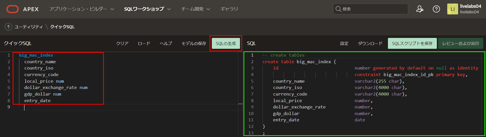

## タスク3: スクリプトを実装する
この段階では、SQLステートメントを作成しました。ただし、最初にステートメントをスクリプトファイルとして保存し、その後スクリプトを実行する必要があります。これにより、定義したデータベースオブジェクトが作成されます。

1. SQL(右パネル)のツールバーで、**SQLスクリプトの保存**をクリックします。  
2. スクリプトの保存ダイアログで、スクリプト名に**remote**を入力します。  
**スクリプトの保存**をクリックします。

    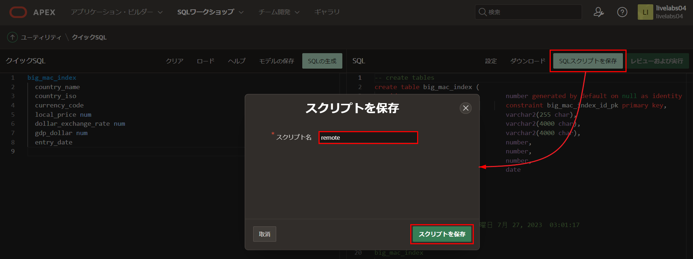

3. SQL(右パネル)のツールバーで、**レビューと実行**をクリックします。スクリプトは、SQLスクリプト内の**スクリプトエディター**に表示されます。

    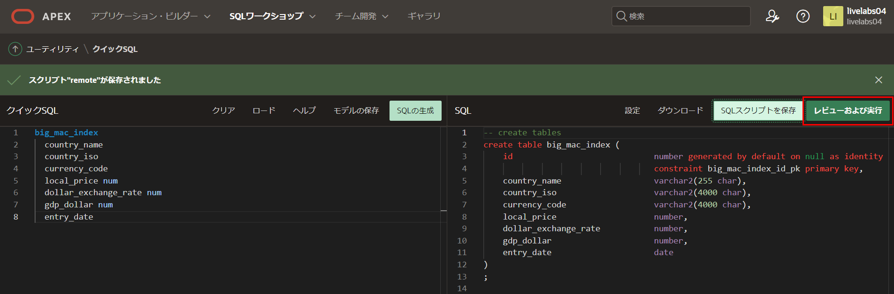

**実行**をクリックします。

    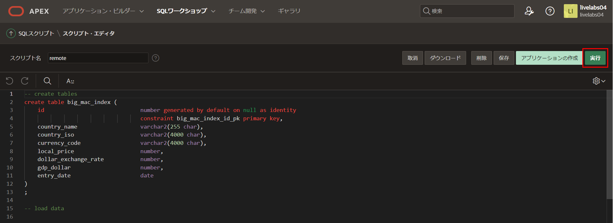

4. スクリプトの実行ページで、**今すぐ実行**をクリックします。
5. スクリプト結果ページに処理されたステートメント、成功したステートメント、エラーのあるステートメントがリストされます。

    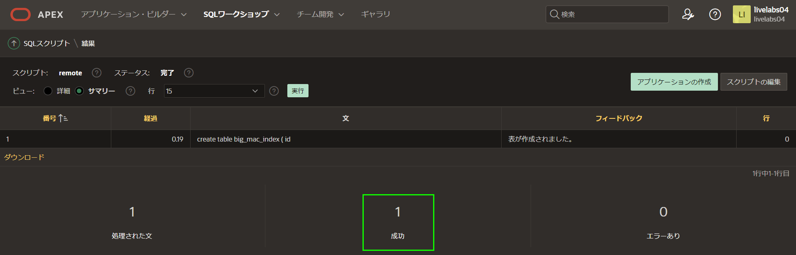

    *注意: 処理されたステートメントが1ではない場合は、Quick SQLに戻り、SQLの生成をクリックし、設定を再度実装して、スクリプトを再保存し、再実行してください。それでも成功したステートメントが1ではない場合は、結果のフィードバック内のエラーを確認してください。*

## タスク4: アプリケーションを作成する

テーブルを作成したので、レポートとフォームを含むアプリケーションをすぐに作成できます。

1. **アプリの作成**をクリックします。

    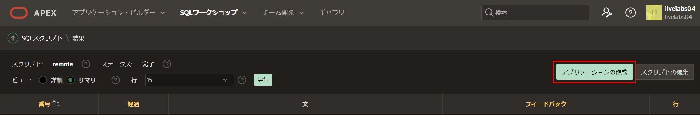

    *注意: SQLスクリプトに戻っていて、「アプリの作成」ボタンが表示されない場合は、次の手順を実行してください。*
    *1. 結果列で、たった今実行したスクリプトの「1」をクリックします。*
    *2. 結果の表示で、拡大鏡をクリックします。*
    上記の結果ページが再び表示されるはずです。

2. スクリプトからのアプリ作成ダイアログで、**アプリケーションの作成**をクリックします。

    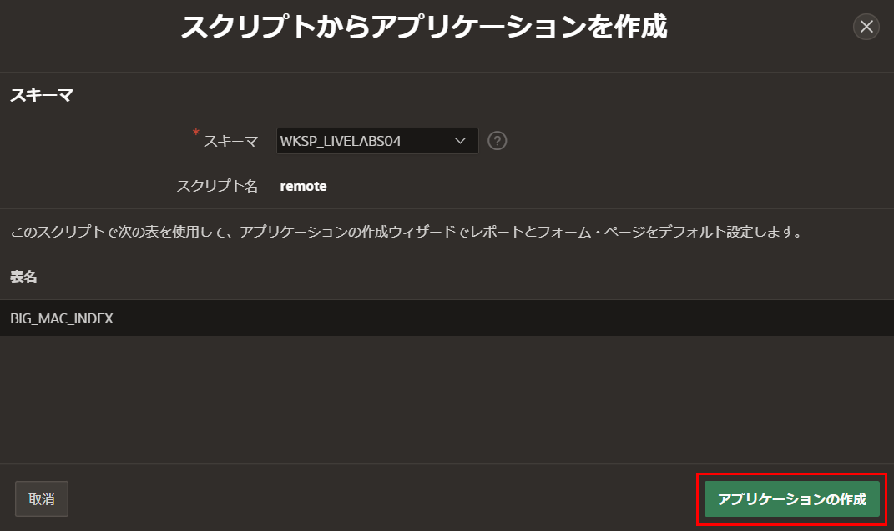

3. アプリケーションの作成ページで、次の項目を入力します。
    - **名前:** **Global Exchange**と入力します
    - **機能:** **すべてチェック** をクリックします

   ページの下部で、**アプリケーションの作成**をクリックします。

    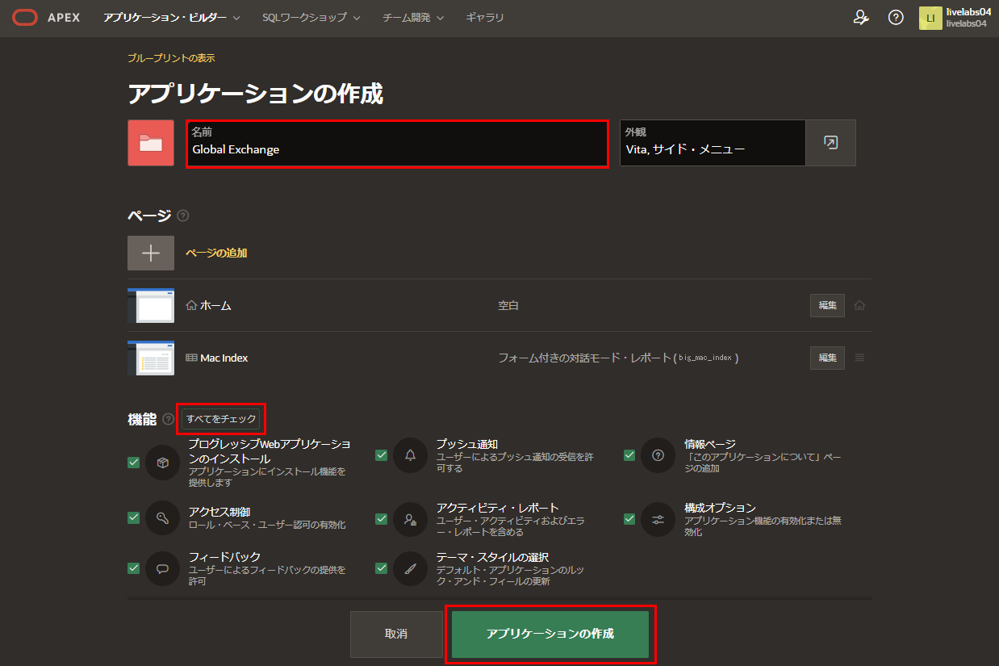  

4. 新しいアプリケーションがページデザイナーに表示されます。
5. **アプリケーションの実行**をクリックします。

    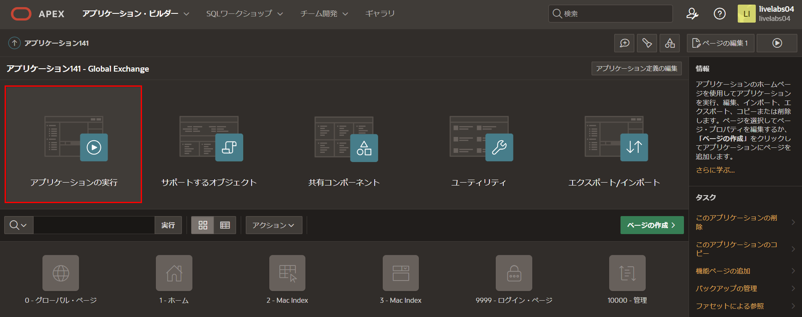

6. ランタイム環境のログインページで資格情報を入力します。

    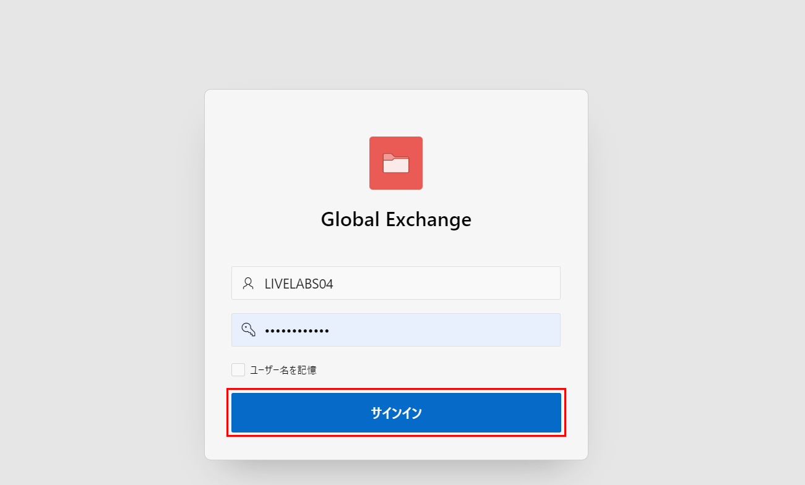  

7. 新しいアプリケーションを操作してみてください。

    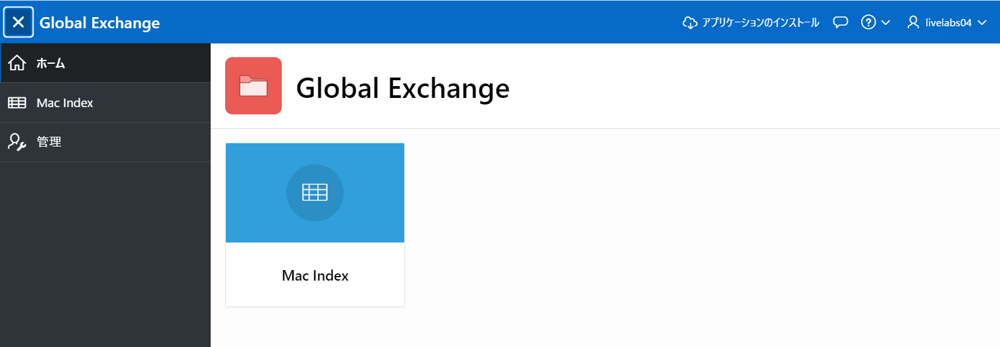

    *注意: Macインデックスをクリックしてもデータが表示されません。次のラボでテーブルにデータを入力するので、手動でデータを入力する必要はありません。*

## **まとめ**
これでラボ2は完了です。Quick SQLを利用してシンプルなテーブルを構築し、その上にアプリケーションを作成する方法がわかりました。[次のラボに進むにはここをクリック](?lab=lab-3-populating-table)

## 謝辞

 - **作成者/投稿者** -  Salim Hlayel, Principle Product Manager
 - **投稿者** - Jaden McElvey, Technical Lead - Oracle LiveLabs Intern
 - **最終更新日** - Salim Hlayel, Principle Product Manager, November 2020

