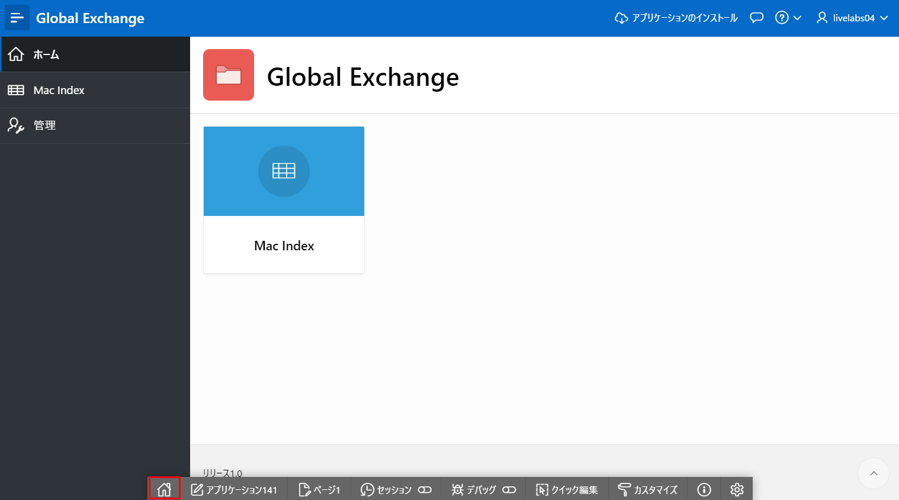
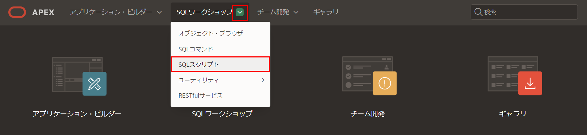
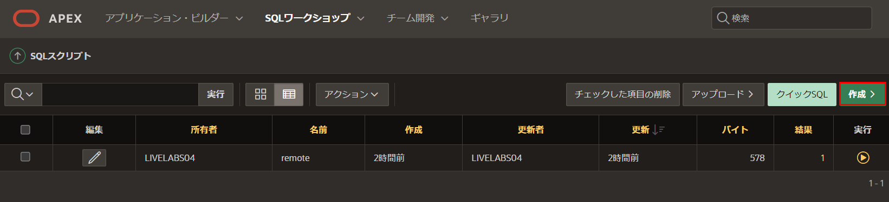
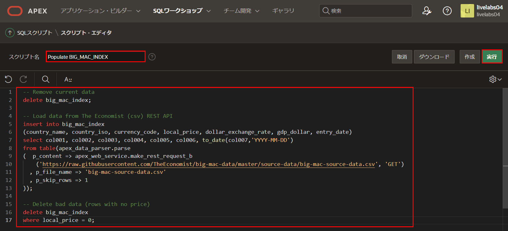
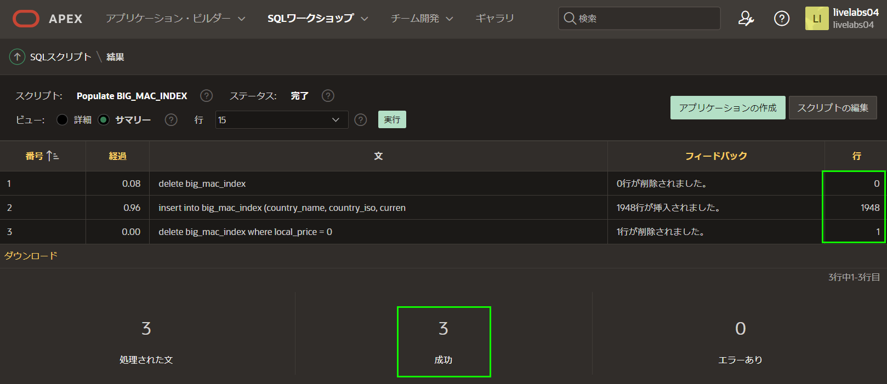
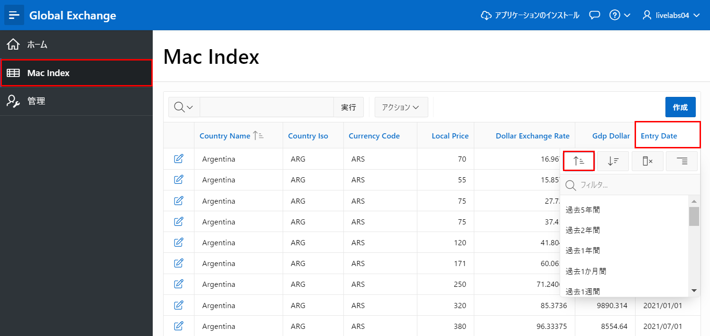
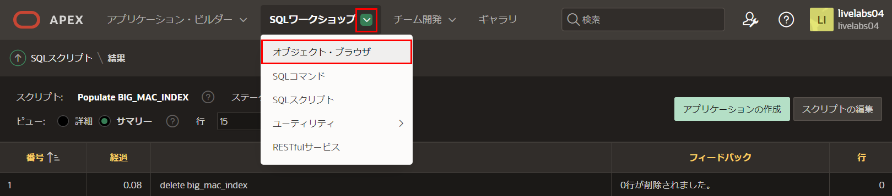
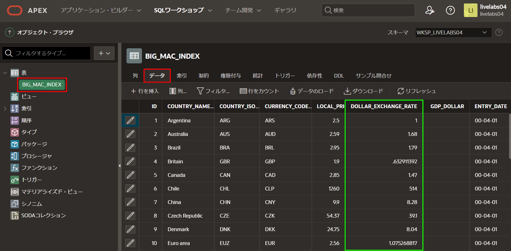

# テーブルにデータを入力する

## はじめに

このラボでは、REST APIを利用してテーブルにデータを挿入する方法を学びます。

所要時間: 5分  

### 背景情報

**apex_data_parser** はPL/SQLパッケージで、コンマ区切り(.csv)を含むさまざまなファイル形式からファイルを簡単に解析するインターフェースを提供します。このパーサーはテーブル関数として実装されているため、開発者はテーブルのようにパーサーの結果にアクセスできます。したがって、パーサーは指定されたファイルから直接行をテーブルに挿入するために INSERT ... SELECT ステートメントを利用できます。

**apex_web_service.make_rest_request_b** はPL/SQL関数で、RESTfulスタイルのWebサービスを呼び出し、結果をBLOBで返します。この関数を apex_data_parser 内で利用することにより、REST API から直接データをテーブルに読み込むことができます。

## タスク1: スクリプトを作成する

一度限りのSQLステートメントではなく、SQLスクリプトを記述することで、SQLステートメントを繰り返し実行できます。

ビッグマックデータは6か月ごとに更新されます。したがって、このスクリプトを1年に2回利用することで、データを最新の状態に保つことができます。

1. ランタイム環境から、デベロッパーツールバー(画面下部)の**ホーム**をクリックします。

2. **SQLワークショップ**をクリックし、**SQLスクリプト**を選択します。 

3. SQLスクリプトページのツールバーで、**作成**をクリックします。

4. スクリプトエディターページで、以下を入力します。
    * **スクリプト名:** **BIG_MAC_INDEXに入力**と入力します  
    * 以下をコピー&ペーストします。

    ```
    <copy>-- Remove current data
    delete big_mac_index;

    -- Load data from The Economist (csv) REST API
    insert into big_mac_index
    (country_name, country_iso, currency_code, local_price, dollar_exchange_rate, gdp_dollar, entry_date)
    select col001, col002, col003, col004, col005, col006, to_date(col007,'YYYY-MM-DD')
    from table(apex_data_parser.parse
    (  p_content => apex_web_service.make_rest_request_b
        ('https://raw.githubusercontent.com/TheEconomist/big-mac-data/master/source-data/big-mac-source-data.csv', 'GET')
      , p_file_name => 'big-mac-source-data.csv'
      , p_skip_rows => 1
    ));

    -- Delete bad data (rows with no price)
    delete big_mac_index
    where local_price = 0;</copy>    
    ```

5. **実行**をクリックします。

6. スクリプトの実行ページで、**今すぐ実行**をクリックします。
7. スクリプト結果ページに、処理されたステートメント、成功したステートメント、エラーのあるステートメントがリストされます。  
2020年11月の結果では、**1658行挿入済み**および**1行削除済み**が表示されるはずです(スクリプトを実行する日によって、挿入/削除された行数が異なる場合があります)。

*注意: 3つのステートメントが正常に処理されたことが表示されない場合は、テーブル定義とテーブル入力のスクリプトを確認してください。*

## タスク2: データを確認する

データを確認する方法はいくつかあります。

1. ランタイム環境のタブまたはウィンドウに移動します。
2. アプリケーションメニューから**Macインデックス**をクリックします。  
レポート上で**入力日**をクリックし、**昇順に並べ替え**をクリックすると、最新のデータが表示されます。

*注意: ドル換算レートの値の多くは単に1と表示されています。*
3. APEXビルダーのタブまたはウィンドウで、**SQL ワークショップ**をクリックし、**オブジェクトブラウザー**を選択します。

4. オブジェクトブラウザー内のテーブルリストで、**BIG_MAC_INDEX** をクリックします。  
中央のペインで、**データ**をクリックします。

注意: DOLLAR_EXCHANGE_RATE列の小数点以下の桁数を確認してください。次のラボで、データが適切に表示されるようにします。

## **まとめ**

これでラボ3は完了です。**apex_data_parser** と **apex_web_service.make_rest_request_b** を利用して、RESTエンドポイントに基づいてOracleデータベース内のテーブルにデータを入力する方法がわかりました。[次のラボに進むにはここをクリック](?lab=lab-4-improving-report)

## 謝辞

 - **作成者/投稿者** -  Salim Hlayel, Principle Product Manager
 - **投稿者** - Jaden McElvey, Technical Lead - Oracle LiveLabs Intern
 - **最終更新日** - Madhusudhan Rao, Apr 2022

