# レポートの改善

## はじめに
このラボでは、インタラクティブレポートを操作して、表示されるデータを改善し、ユーザーがデータを解析しやすくする方法を学びます。

所要時間: 15分  

### 背景情報
BIG_MAC_INDEXテーブルにデータがロードされたので、マクドナルドのビッグマックの現地価格と米ドルとの為替レートを確認できるようになりました。 

どの国についても、その国のビッグマックの現地価格を、同じ期間の米国のビッグマックの現地価格で割ることで、ビッグマックの価格に基づいて両国間の相対的な為替レートを計算できます。

その後、ドル換算レートから相対的な為替レートを引き、ドル換算レートで割ると、米ドルに対して通貨が過大評価されているか(プラス)、過小評価されているか(マイナス)を判断できます。

これは米ドルに対する通貨の過大評価や過小評価を正確に判断するものではありませんが、ほとんどの国で入手できる製品を用いたかなりの近似値となります。

## タスク1: レポートクエリを更新する
アプリケーションの生成時には標準のテーブル列が利用されていました。SQLクエリに変換し、SQLを更新することで、相対的な為替レートを含めることができ、人々がデータを確認しやすくなります。

1. オブジェクトブラウザーから、APEXビルダーのツールバーで、**アプリケーションビルダー**をクリックし、**データベースアプリケーション**を選択します。

    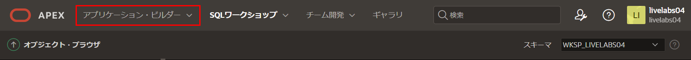

2. アプリケーションリストで、**Global Exchange**をクリックします。 

    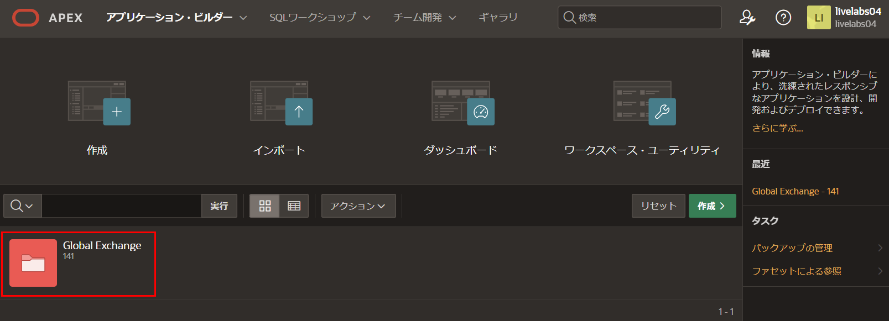

3. アプリのホームページから、**2 – Macインデックス**をクリックすると、ページデザイナーがロードされ、レポートページであるページ2に移動します。

    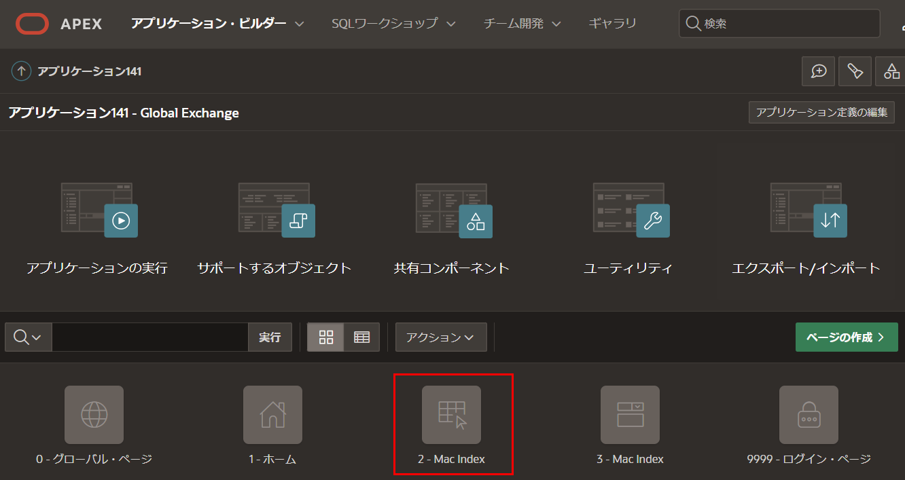  

4. ページデザイナー内で、レンダリングツリー(左側のペイン)の、コンテンツ本文の下の**ビッグマックインデックス**(これがレポート領域です)をクリックします。

    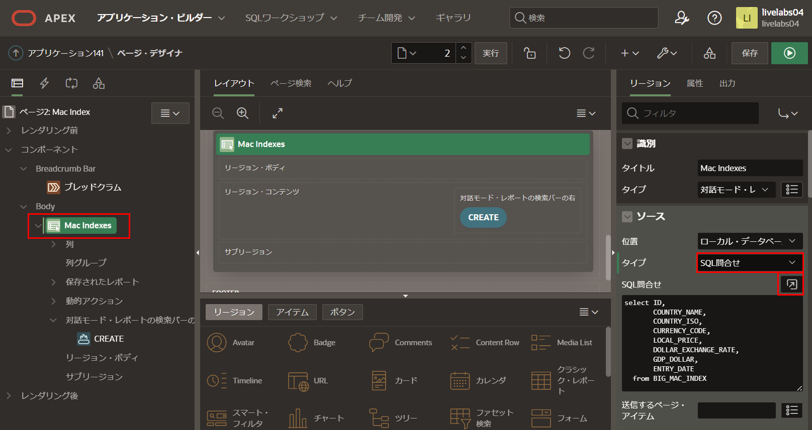

    プロパティエディタ(右側のペイン)に次の内容を入力します。
    - **ソース > タイプ:** **SQLクエリ** を選択
    - **ソース - SQLクエリ:** **コードエディター**アイコンをクリックし、以下をカット&ペーストします。

    ```
    <copy>select  ID,
                COUNTRY_NAME,
                COUNTRY_ISO,
                CURRENCY_CODE,
                LOCAL_PRICE,
                DOLLAR_EXCHANGE_RATE,
                ENTRY_DATE,
                (local_price / (select local_price from big_mac_index u
                                where u.entry_date = l.entry_date
                                and u.country_iso = 'USA'
                               )
                ) relative_exchange_rate
    from BIG_MAC_INDEX l</copy>
    ```

    **検証**をクリック - 検証成功が表示されます。
    **OK**をクリックします。

    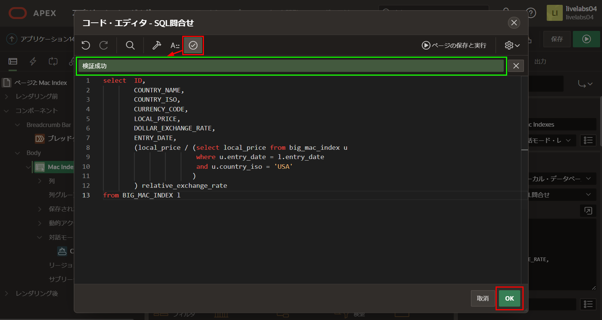

    *注: gdp_dollar列は不要なので削除しました。内側の選択は、相対的な為替レートを計算するために、同じ日付の米国の価格を取得するために使用されています。*

## タスク2: レポート列を更新する
個々のレポート列には、データを適切に表示するためのより良い書式マスクが必要です。

1. レンダリングツリー(左側のペイン)で、**列**をクリックします。
   列のリスト内で、**LOCAL_PRICE**をクリックします。

   プロパティエディタ(右側のペイン)で、表示 > 書式マスクの選択アイコンをクリックします。
   書式マスクのピックダイアログで、**5,234.10**を選択します。

   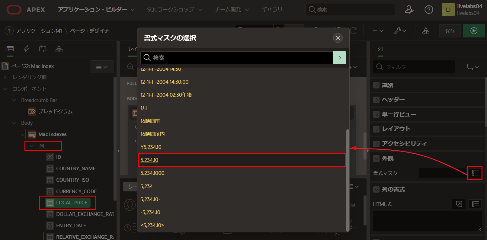

2. レンダリングツリー(左側のペイン)で、列のリスト内の**DOLLAR_EXCHANGE_RATE**をクリックします。

   プロパティエディタ(右側のペイン)で、表示 > 書式マスクの選択アイコンをクリックします。
   書式マスクのピックダイアログで、**5,234.1000**を選択します。

3. レンダリングツリー(左側のペイン)で、列のリスト内の**RELATIVE_EXCHANGE_RATE**をクリックします。

   プロパティエディタ(右側のペイン)で、表示 > 書式マスクの選択アイコンをクリックします。
   書式マスクのピックダイアログで、**5,234.1000**を選択します。


## タスク3: データ入力コンポーネントを削除する
データは外部ソース(エコノミストのREST API)から取得されるため、アプリケーションのユーザーは既存のレコードを更新や削除したり、新しいレコードを作成したりできないはずです。

1. 編集アイコンを削除して、エンドユーザーがレコードを更新や削除できないようにします。

   レンダリングツリー(左側のペイン)で、列の下の**属性**をクリックします。
   プロパティエディタ(右側のペイン)で、リンク > リンク列について、**リンク列を除外**を選択します。

   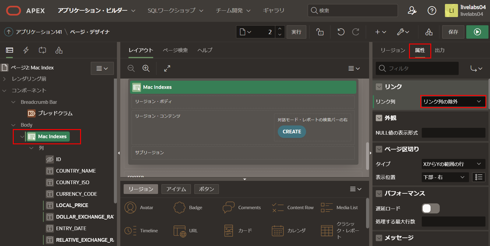

2. 作成ボタンを削除して、エンドユーザーが新しいレコードを追加できないようにします。

   レンダリングツリー(左側のペイン)で、領域ボタンの下の**作成**を右クリックし、**削除(Del)**を選択します。

   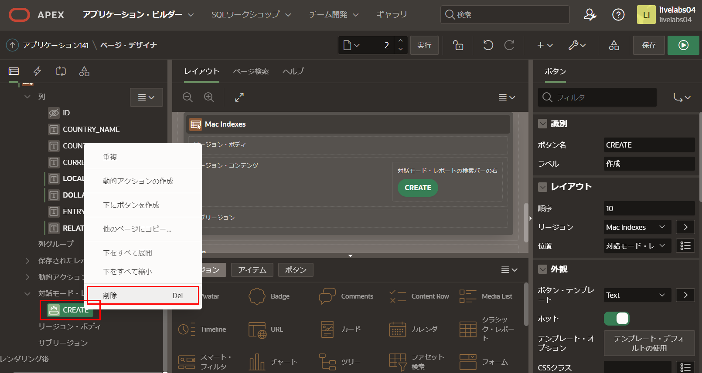

3. ビッグマックインデックスのフォームページ全体を削除するのがベストですが、必須ではありません。
   ページ3に移動する前に、ページ2で行った変更を保存する必要があります。

   ページデザイナーのツールバーで、ページ2を選択した状態で、**保存**をクリックします。
   ページデザイナーのツールバーで、ページセレクターまたは下矢印を使用して、**ページ3 - ビッグマックインデックス**に移動します。

   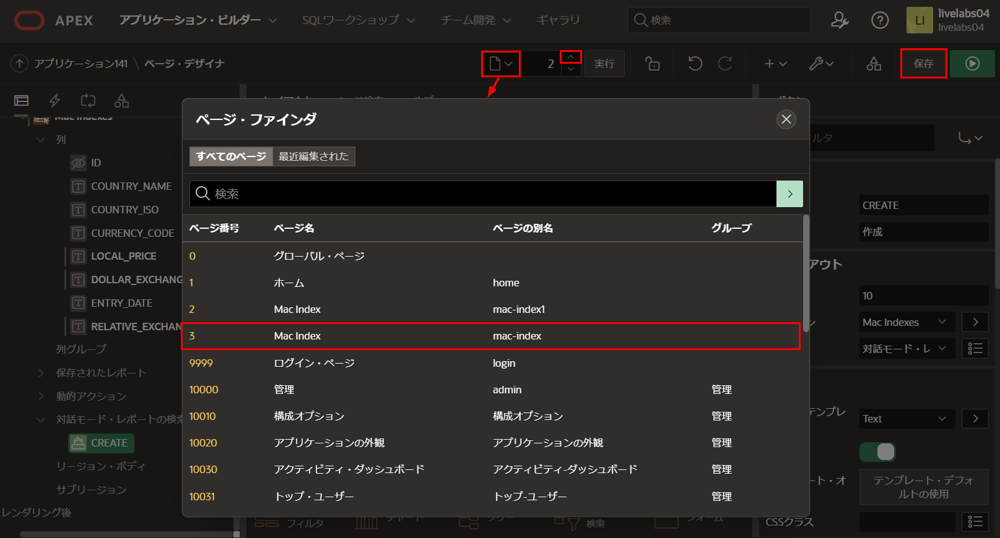

4. ページ3: ビッグマックインデックスで、ページデザイナーのツールバーで**ユーティリティ**(レンチ)をクリックし、**ページの削除**を選択します。

   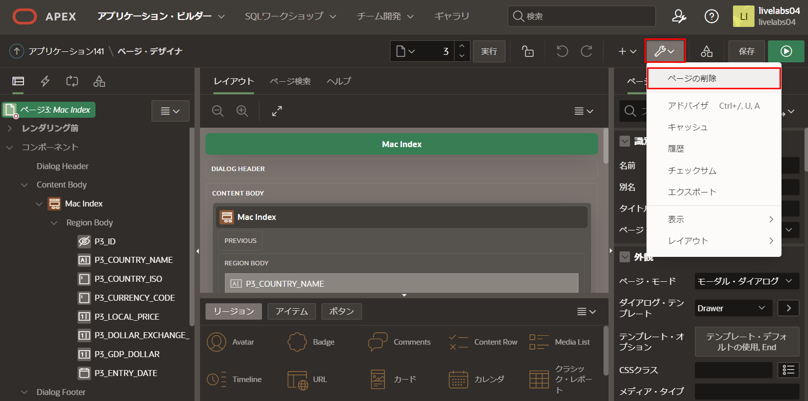

5. 確認ページの削除ページで、**ページの完全削除**をクリックします。

   *注: ページデザイナーはページ1: ホームの表示に戻ります。*

## タスク4: レポート列の並べ替え
列の表示順序を変更するには、レポートを実行して、ランタイム環境で列の順序を再配置する必要があります。

1. ページデザイナーのツールバーで、**保存して実行**をクリックします。

   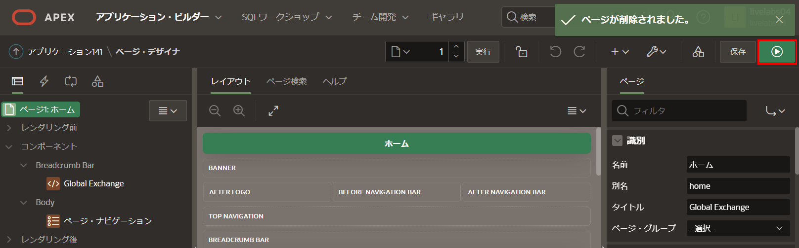

2. ランタイム環境で、**アクション**をクリックし、次に**列**をクリックします。

   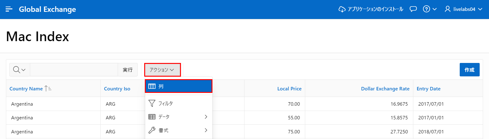

3. 列の選択ダイアログで、**エントリ日**を選択し、**トップ**をクリックします。

   **適用**をクリックします。

   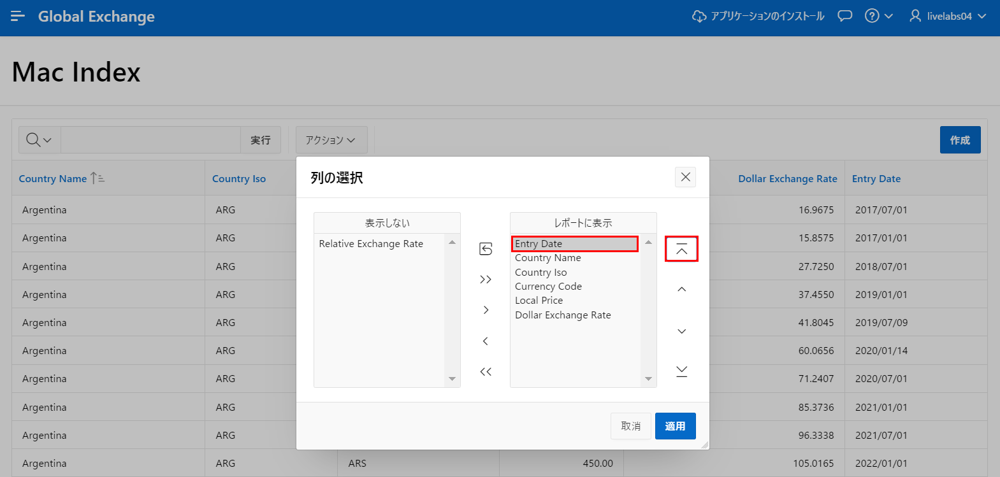

   
## タスク5: 計算を追加する

リージョンのSQLクエリに列を追加する代わりに、ランタイム環境から計算列を定義することもできます。

このレポートには、ドルの為替レートと相対的な為替レートの列があります。ドルの為替レートから相対的な為替レートを差し引いて、それをドルの為替レートで割ると、通貨の評価を計算できます。結果に100をかけてパーセンテージで表示するのが最適です。

1. ランタイム環境で、**アクション**をクリックし、**データ**を選択して、**計算**をクリックします。

   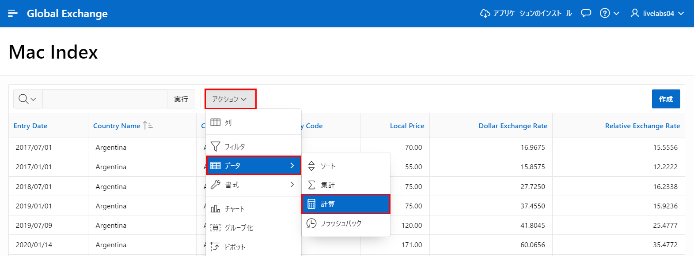

2. 計算ダイアログで、次の内容を入力します。
   - **列ラベル:** **Difference %** と入力
   - **書式マスク:** **5,234.10** を選択
   - **計算式:** 次の内容を入力します。

    ```
    <copy>
    (I - F) * 100 / F
    </copy>
    ```

   **適用**をクリックします。

   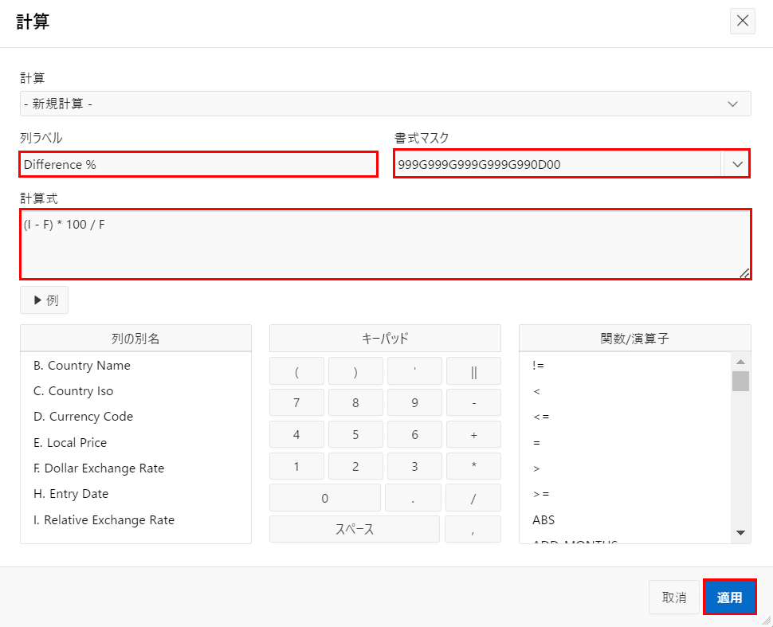

   *注: Fは列の下にリストされているドル為替レートを参照し、Iは相対的な為替レートを参照しています*

## タスク6: レポートを保存する
現在、ランタイム環境で行った変更はあなたにしか見えません。さらに、ランタイム環境からログアウトして再ログインした場合、変更は失われます。修正されたレポートをすべての人が確認できるようにするには、レポートを「プライマリ」レポートとして保存する必要があります。

1. ランタイム環境で、**アクション**をクリックし、**レポート**を選択して、**レポートの保存**をクリックします。

   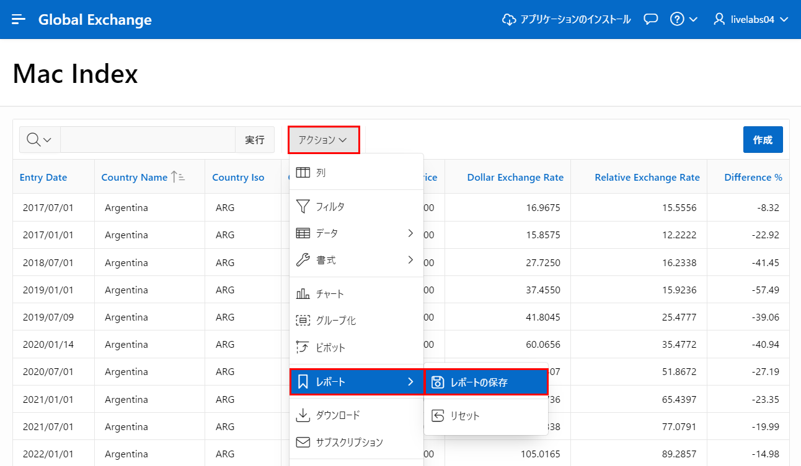

2. レポートの保存ダイアログで、保存(開発者にのみ表示)の場合、**デフォルトのレポート設定として**を選択します。

   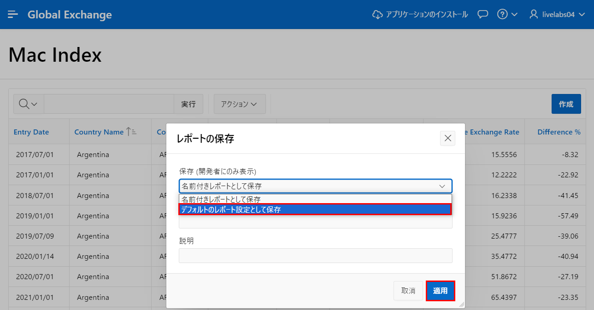
   
3. デフォルトレポートの保存ダイアログで、**適用**をクリックします。

   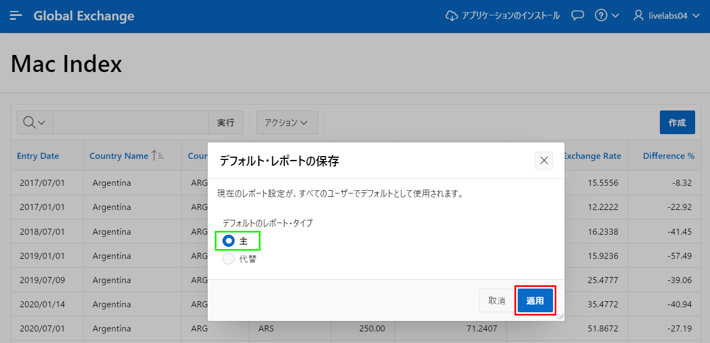

## **まとめ**
これでラボ4は完了です。このラボでは、SQLクエリをレポートの基礎として利用する方法、列の表示方法を改善する方法、不要なページ要素を削除する方法、レポートレイアウトを操作する方法、そしてそれをすべての人が利用できるように保存する方法を学びました。[ここをクリックしてラボ5に移動](?lab=lab-5-adding-chart)

## 謝辞

 - **作成者/投稿者** -  Salim Hlayel, Principle Product Manager
 - **投稿者** - Jaden McElvey, Technical Lead - Oracle LiveLabs Intern
 - **最終更新日** - Salim Hlayel, Principle Product Manager, November 2020

