# チャートの追加

## はじめに
このラボでは、アプリケーションにチャートページを追加する方法を学びます。

所要時間: 5分

### 背景情報
ビッグマックインデックスには、過去20年間の各国のデータが含まれています。したがって、時間の経過とともに各国の為替レートの傾向をより視覚的に表すために、国ごとのチャートを作成することが非常に有益です。

はじめに、オーストラリア(COUNTRY_ISO = 'AUS')のドル為替レートを表示するチャートを作成します。次に、追加のデータシリーズを追加します。

## タスク1: 新しいページの作成 

1. ランタイム環境で、画面下部の**デベロッパーツールバー**をクリックし、**アプリケーション###**をクリックします。

   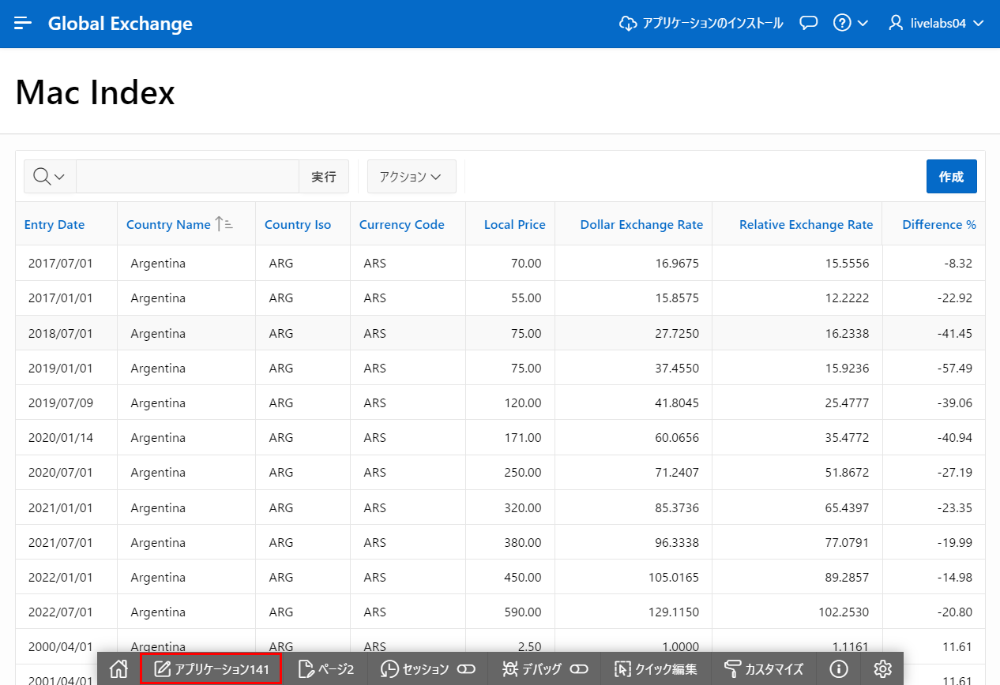

2. アプリケーションホームページで、**ページの作成**をクリックします。

   ページの作成ダイアログで、ページタイプの場合、**チャート**をクリックします。

   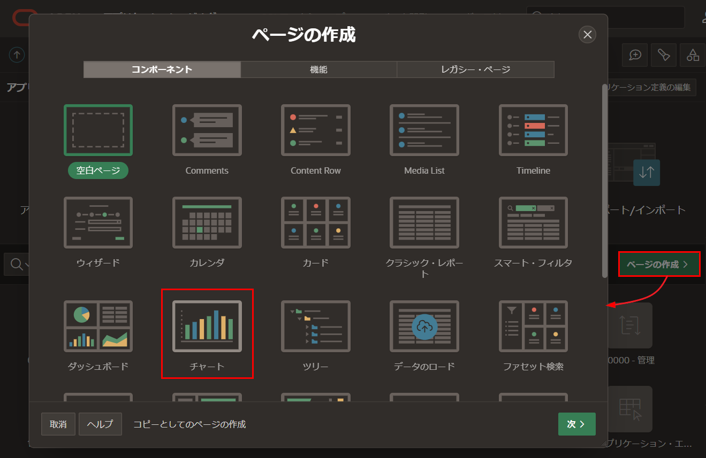

3. チャートの作成ダイアログで、チャートタイプの場合、**折れ線**をクリックします。

   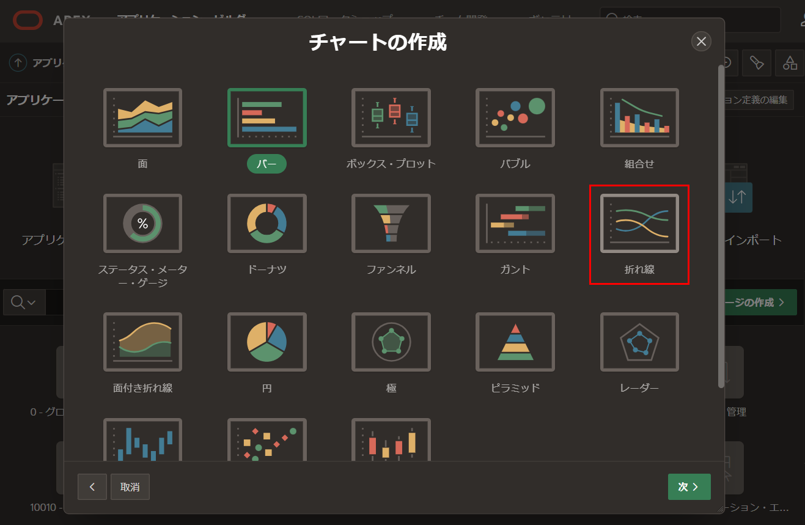
   
4. ページとリージョンの属性ダイアログで、次の項目を入力します。
   - **ページ名:** **Country Chart**と入力
   - **パンくず:** **パンくず**を選択
   
   **次へ**をクリックします。

   
   
5. ナビゲーションメニューダイアログで、ナビゲーション設定の場合、**新しいナビゲーションエントリーの作成** をクリックします。

   **次へ**をクリックします。

   

6. ソースダイアログで、次の項目を入力します。
   - **ソースタイプ:** **SQLクエリ**をクリック
   - **SQLクエリ:** 次のSQLをコピー&ペースト

        ```
        <copy>select entry_date
        , dollar_exchange_rate
        from big_mac_index l
        where country_iso = 'AUS'
        order by entry_date</copy>
        ```
   **次へ**をクリックします。

   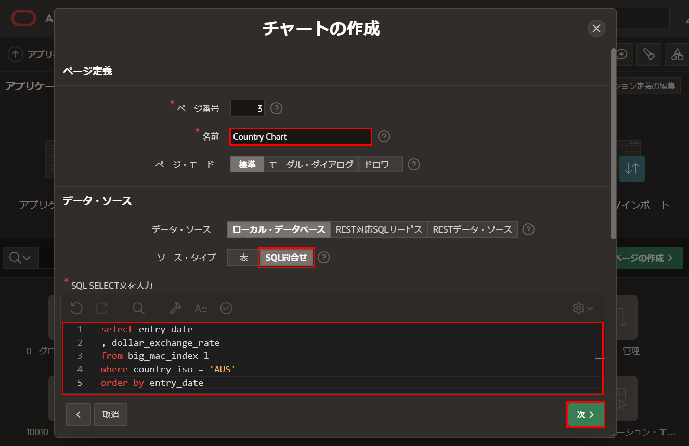
   
7. 列マッピングダイアログで、次の項目を入力します。
   - **ラベル列:** **ENTRY_DATE**を選択
   - **値列:** **DOLLAR_EXCHANGE_RATE**を選択
   
   **作成**をクリックします。

   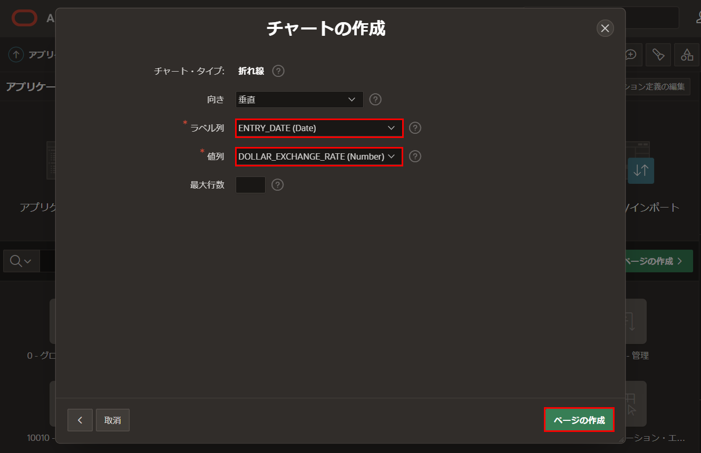
   
8. ページデザイナーツールバーで、**保存して実行**をクリックします。

   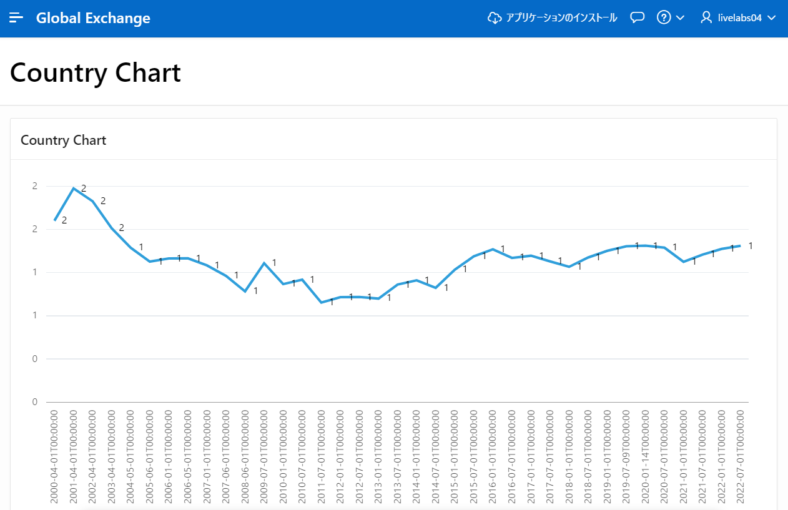
   
## タスク2: チャートの属性を調整する
最初のチャートの外観からわかるように、まだ調整の余地があります。属性を更新することで改善できます。
   
1. ランタイム環境で、画面下部のデベロッパーツールバーから、**クイック編集**をクリックします。
   チャート領域の上にマウスを置くと、青い枠で囲まれます。チャートをクリックします。

   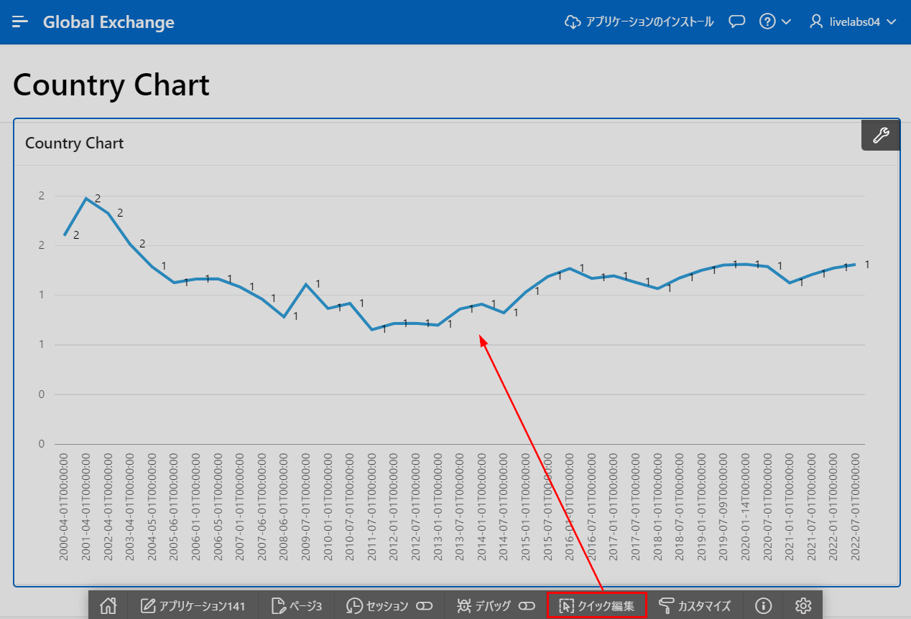
   
   または、APEXアプリケーションビルダータブまたはウィンドウに戻り、ページ4に移動します。
   
2. ページデザイナー内で、レンダリングツリー(左パネル)の**Country Chart**の下にある**属性**をクリックします。

   プロパティエディタ(右パネル)に次の項目を入力します。
   
   - **設定 > 時間軸の種類:** **混合周波数**を選択
   - **凡例 > 表示:** **はい**をクリック

   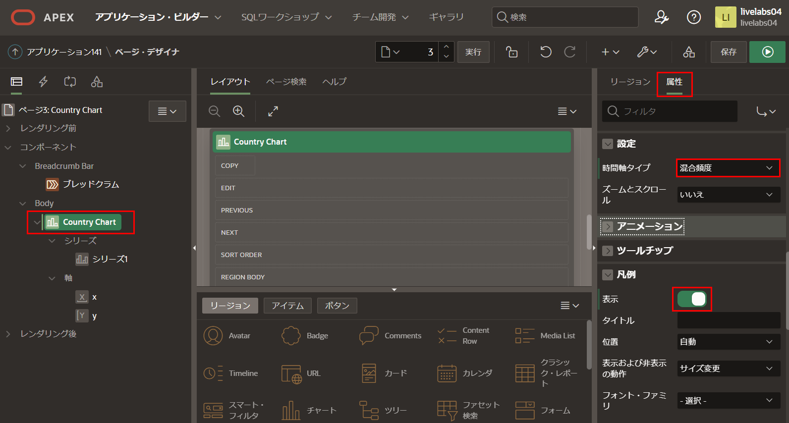

## タスク3: チャートのデータシリーズを更新する

既存のチャートライン(データシリーズ)を更新し、さらにデータシリーズを追加しましょう。

1. ページデザイナーで、レンダリングツリー(左パネル)の**Country Chart**の下の**Series 1**をクリックします。

   プロパティエディタ(右パネル)に次の項目を入力します。

   - **識別 > 名前:** **Dollar Exchange Rate**と入力
   - **ラベル > 表示:** **いいえ**をクリック

   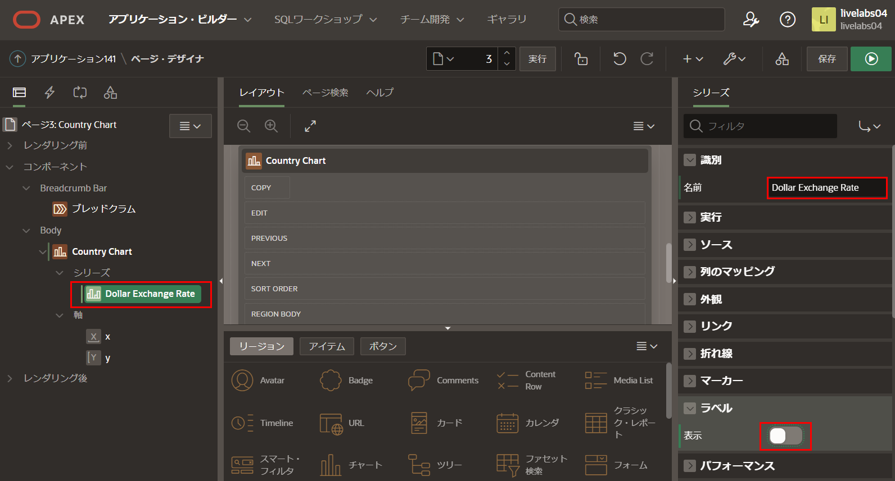

   - **軸 > y**を選択
   - **値 > 小数点以下の桁数**に**1**を入力すると、チャートのラベルに読みやすい小数点値が表示されます。

   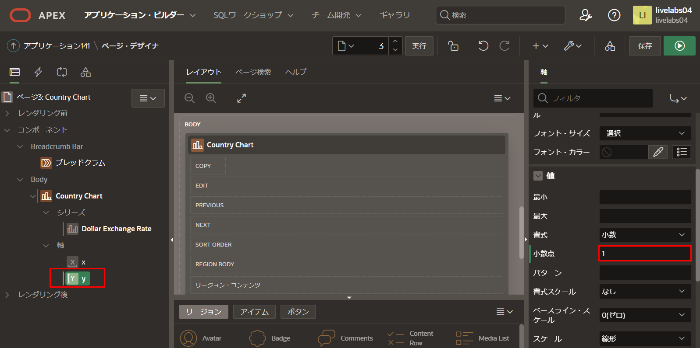

2. 次の2つのデータシリーズは最初のものと非常に似ているため、既存のデータシリーズを複製するのが最も簡単です。

   レンダリングツリー(左パネル)の**Country Chart**の下で、**Dollar Exchange Rate**を右クリックし、**複製**をクリックします。

   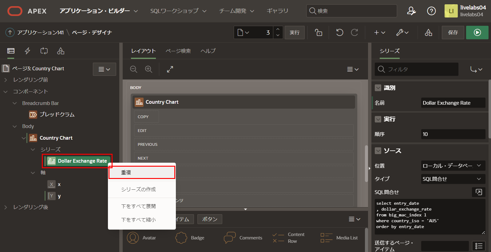   

3. 上記の手順を繰り返して、3番目のデータシリーズを作成します。
   *注: 現在、Dollar Exchange Rate、Dollar Exchange Rate_1、Dollar Exchange Rate_2 または Dollar Exchange Rate_1_1の3つのデータシリーズがあるはずです。3番目のデータシリーズの作成に使用したデータシリーズによって異なります。*
   
4. 2番目のチャートライン(データシリーズ)は、相対為替レートを表示します。

   レンダリングツリー(左パネル)の**Country Chart**の下で、2番目のデータシリーズをクリックします。
   プロパティエディタ(右パネル)に次の項目を入力します。
   
   - **識別 > 名前:** **Relative Exchange Rate**と入力
   - **ソース > SQLクエリ:** 次のSQLをコピー&ペースト

    ```
    <copy>select entry_date
        , (local_price / (select local_price from big_mac_index u
                          where u.entry_date = l.entry_date
                          and u.country_iso = 'USA'
                         )
          ) relative_exchange_rate
        from BIG_MAC_INDEX l
        where country_iso = 'AUS'
        order by entry_date</copy>
    ```

   - **列マッピング > 値:** **RELATIVE_EXCHANGE_RATE** を選択

   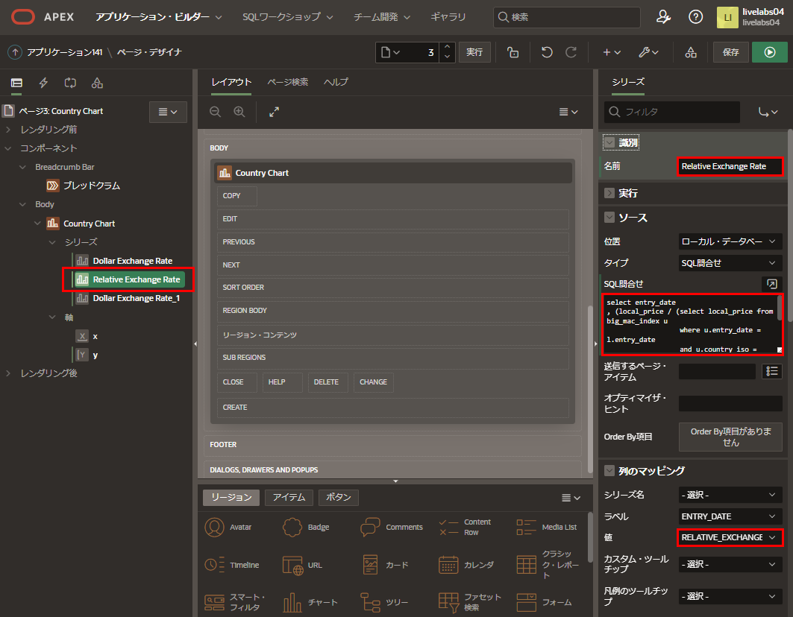

5. 3番目のチャートライン(データシリーズ)は、通貨と米ドルとのパーセンテージ差を表示します。

   レンダリングツリー(左パネル)の**Country Chart**の下で、3番目のデータシリーズをクリックします。
   プロパティエディタ(右パネル)に次の項目を入力します。

   - **識別 > 名前:** **Percentage Difference (Y2)**と入力
   - **ソース > SQLクエリ:** 次のSQLを切り取り&ペースト:

   ```
        <copy>select entry_date
        , ((  local_price / (select local_price from big_mac_index u
                             where u.entry_date = l.entry_date
                             and u.country_iso = 'USA'
                            )
            - dollar_exchange_rate
           ) * 100 / dollar_exchange_rate
          ) percentage_difference
        from BIG_MAC_INDEX l
        where country_iso = 'AUS'
        order by entry_date</copy>
    ```

   - **列マッピング > 値:** **PERCENTAGE_DIFFERENCE**を選択
   - **表示 > Y2軸に割り当て:** **はい**をチェック

   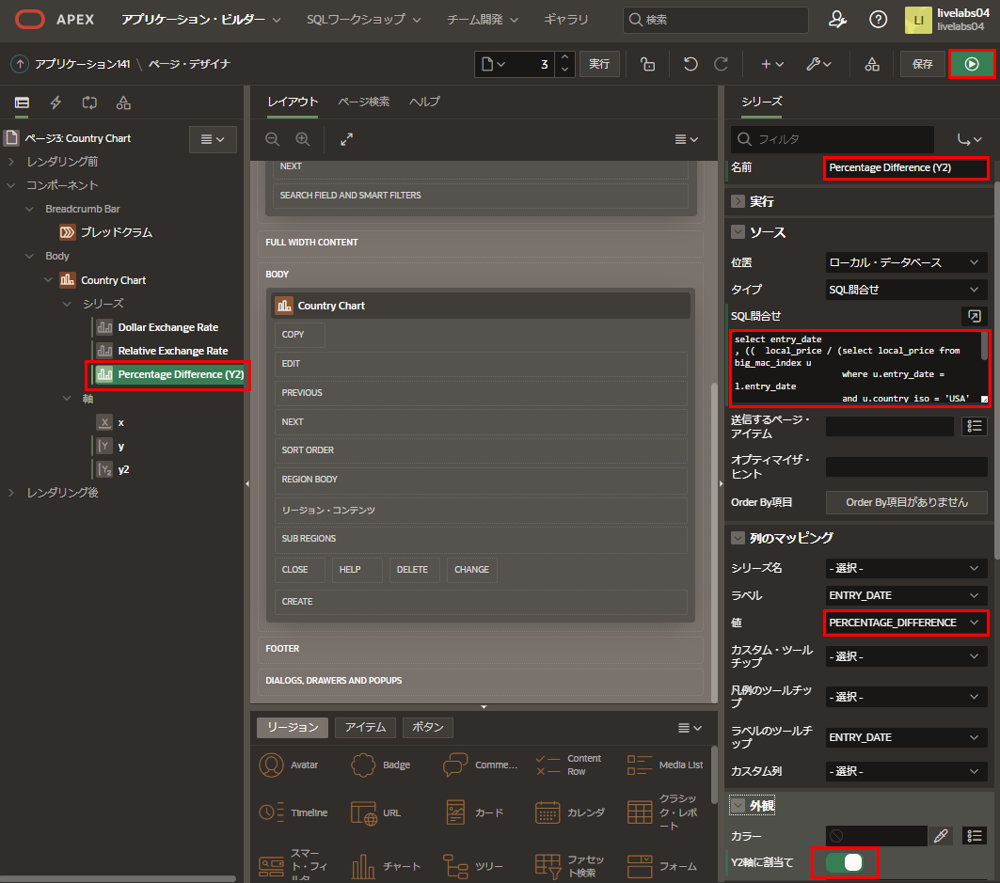

   *注: 「Y2軸に割り当て」にチェックしないと、チャートは適切に表示されず、次のページのようには見えません。*

6. ページデザイナーで、ツールバーの**保存して実行**をクリックします。

   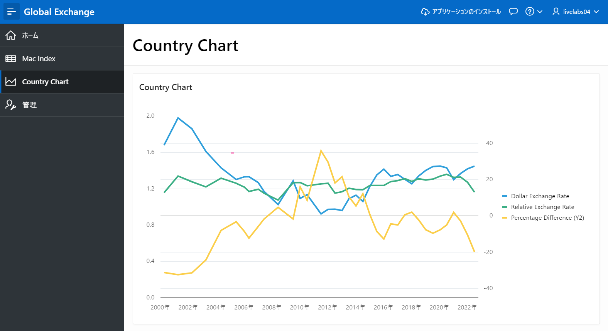
   
## **まとめ**

これでLab 5は完了です。このLabでは、複数のデータシリーズを追加してチャートを作成および変更する方法を学びました。[次のLab 6に進むにはここをクリック](?lab=lab-6-adding-chart-criteria)

## 謝辞

 - **作成者/投稿者** -  Salim Hlayel, Principle Product Manager
 - **投稿者** - Jaden McElvey, Technical Lead - Oracle LiveLabs Intern
 - **最終更新日** - Salim Hlayel, Principle Product Manager, November 2020

