# チャートの条件を追加する

## はじめに

このラボでは、ページアイテムを追加し、ページアイテムをチャートのデータシリーズで利用し、クライアントサイドのインタラクティブ性を定義する方法を学びます。

所要時間: 5分 

### 背景情報

チャートには現在、オーストラリアのISOコード(AUS)がハードコーディングされています。国のリストを持つ選択リストを追加し、チャートのデータシリーズをこのページアイテムを利用するように変更することで、任意の国の為替レート履歴を簡単に確認できるようになります。

選択リストでの国の変更時にチャートを更新するには、ダイナミックアクションを利用する必要があります。ダイナミックアクションは、特定のアクション(選択リストの変更)に基づいて、指定された機能(更新)を、指定された要素(チャート領域)で実行するクライアントサイドのインタラクティブ性を定義します。

チャートが選択リストの更新された値を適切に利用するためには、そのページアイテムをチャートのレンダリング時に送信する必要があります。

## タスク1: ページアイテムを追加する

1. ランタイム環境で、開発者ツールバー(画面下部)の**ページXを編集**をクリックします。

2. ページデザイナーで、ギャラリー(中央パネルのレイアウトの下)の**Country Chart**、**アイテム**をクリックします。
   **選択リスト**をクリックしてマウスボタンを押したままにします。
   アイテムをCountry Chartリージョン内のアイテムセクションに来るまでドラッグします。
   アイテムセクションが展開され濃い黄色のボックスが表示されたら、アイテムをドロップします(マウスボタンを離します)。

   *注: 選択リストをCountry Chartリージョンにドラッグすることを確認してください。*

   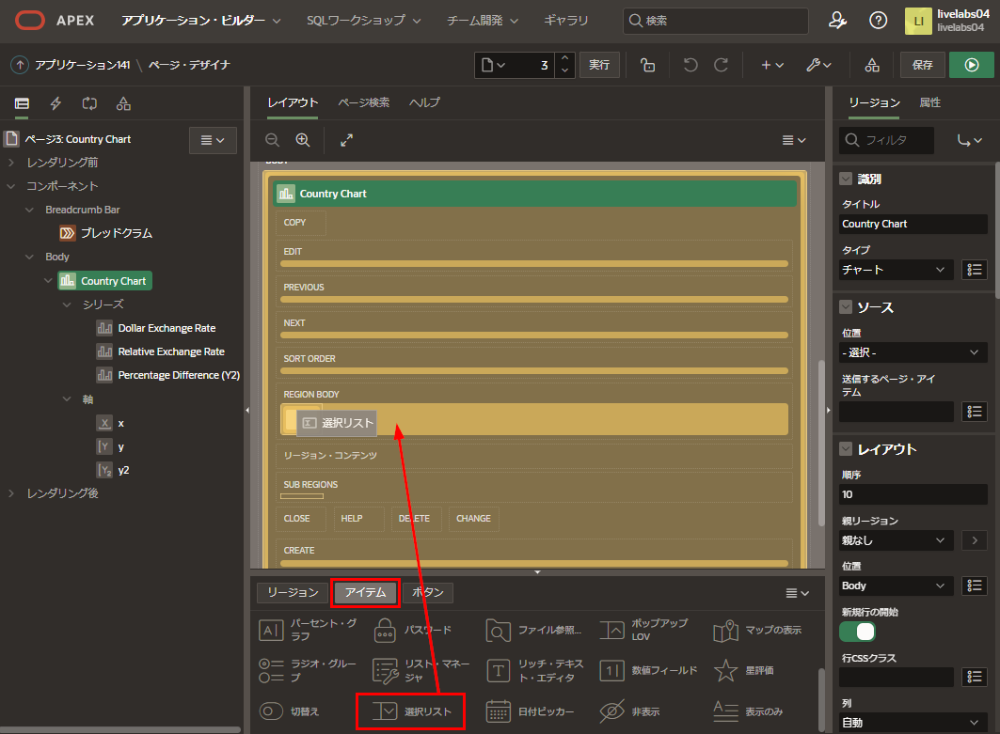
   
3. プロパティエディタ(右パネル)で、以下を更新します。
   - **識別 > 名前:** **P3_COUNTRY**と入力
   - **リストオブバリュー > タイプ:** **SQLクエリ**を選択
   - **リストオブバリュー > SQLクエリ:** 次のSQLを切り取り&ペースト

      ```
      <copy>select distinct country_name d, country_iso r  
      from big_mac_index  
      order by 1</copy>
      ```

     - **LOV > 追加値の表示:** **いいえ** をクリック
     - **LOV > ヌル値の表示:** **国を選択 -** と入力

    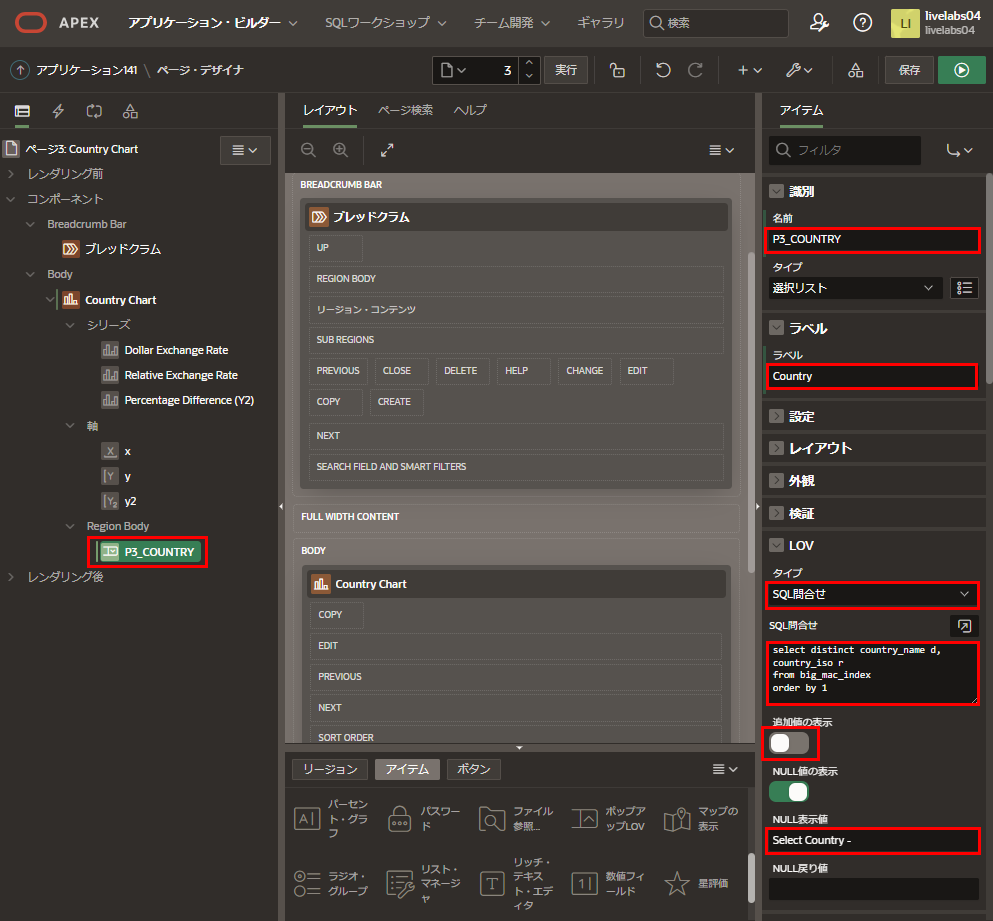

    

## タスク2: ダイナミックアクションを追加する

新しいアイテムから国が選択されたときにチャートを更新するには、ダイナミックアクションを定義する必要があります。

1. レンダリングツリー(左パネル)で、**P3_COUNTRY** を右クリックし、**ダイナミックアクションの作成**を選択します。

   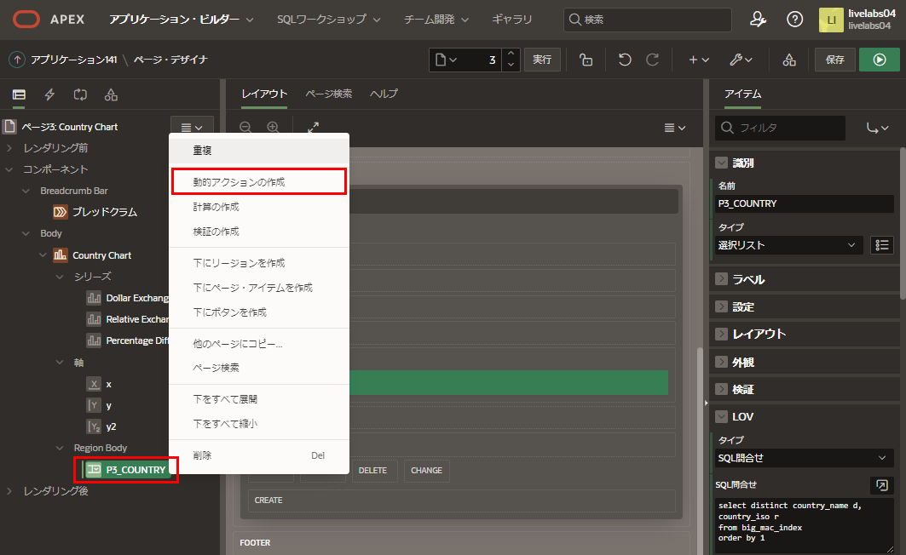

2. プロパティエディタ(右パネル)で、識別 > 名前に **チャートの更新** と入力します。

   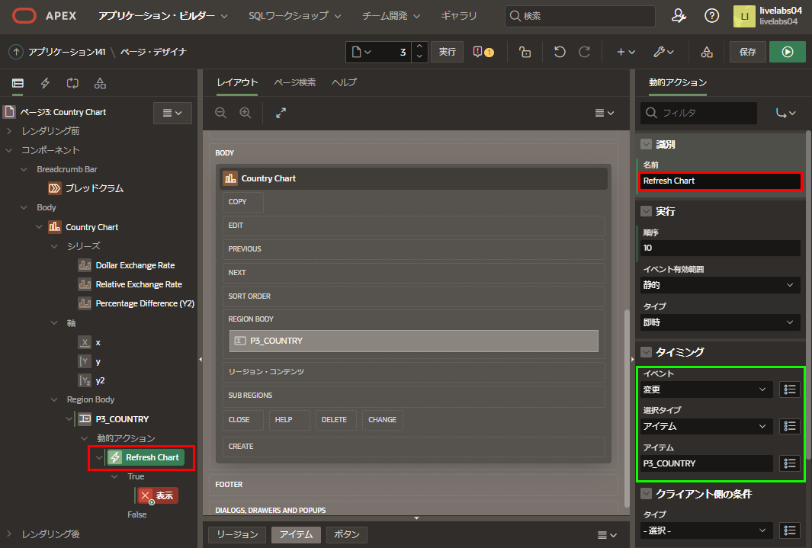
   
3. レンダリングツリー(左パネル)で、ダイナミックアクション > Trueの下の**表示**をクリックします。

   プロパティエディタ(右パネル)に以下を入力します。

   - **識別 > アクション:** **更新**を選択
   - **影響を受ける要素 > 選択タイプ:** **リージョン**を選択
   - **影響を受ける要素 > リージョン:** **Country Chart**を選択

   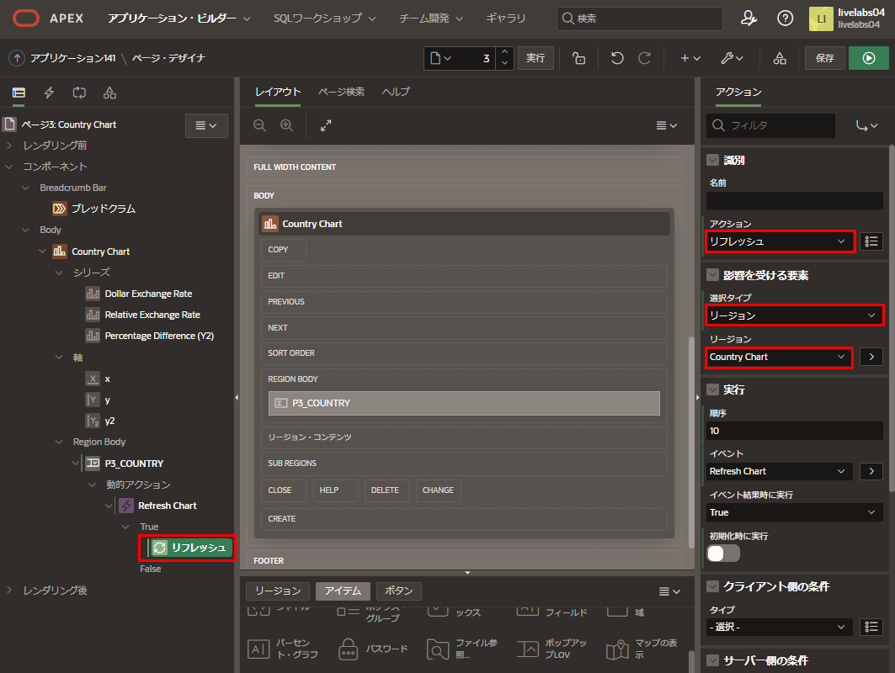
   
## タスク3: チャートを更新する

現在、3つのチャートシリーズすべてに国がハードコーディングされています。アイテムの値を使用できるようにするには、セッションステートに設定する必要があります。各シリーズごとにこれを行うのではなく、チャートに対して一度設定できます。アイテムがセッションステートになったら、各チャートシリーズのwhere条件で利用できます。

1. レンダリングツリー(左パネル)のコンテンツボディの下で、**Country Chart**をクリックします。

   プロパティエディタ(右パネル)のソース > 提出するページアイテムで、**P3_COUNTRY**を選択します。

   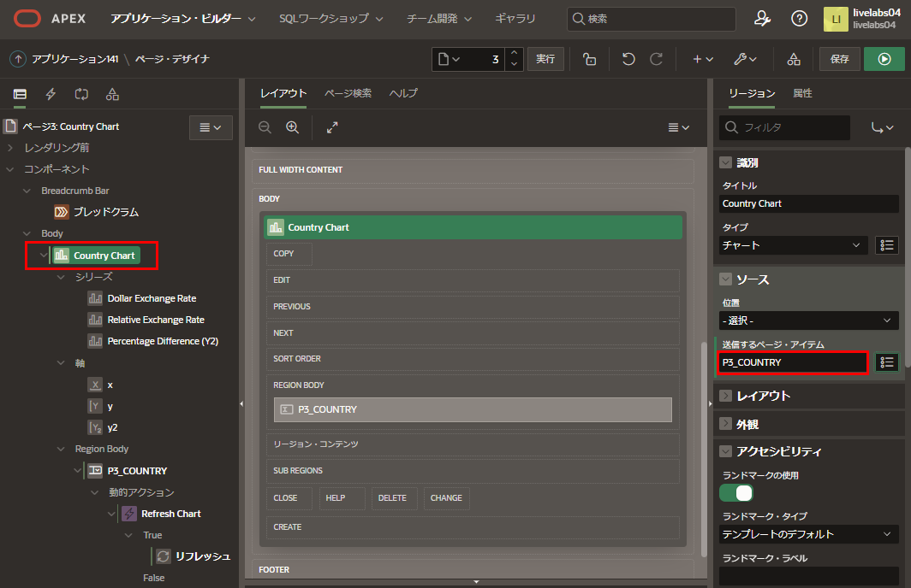
   
2. レンダリングツリー(左パネル)のシリーズの下で、**Dollar Exchange Rate**をクリックします。

   プロパティエディタ(右パネル)のソース > SQLクエリで、**'AUS'**を**:P3_COUNTRY**に置換します。

   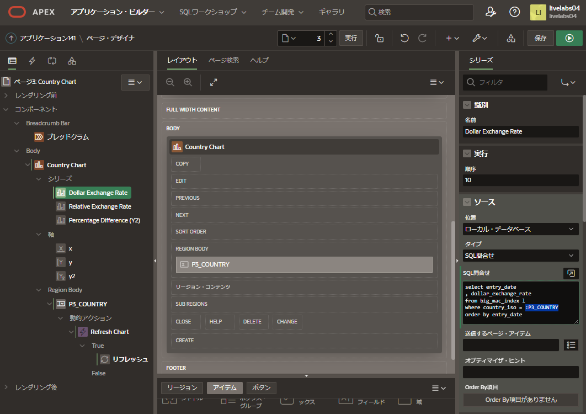

3. レンダリングツリー(左パネル)のシリーズの下で、**Relative Exchange Rate**をクリックします。
   プロパティエディタ(右パネル)のソース > SQLクエリで、**'AUS'**を**:P3_COUNTRY**に置換します。
   
4. レンダリングツリー(左パネル)のシリーズの下で、**Percentage Difference**をクリックします。
   プロパティエディタ(右パネル)のソース > SQLクエリで、**'AUS'**を**:P3_COUNTRY**に置換します。
   
## タスク4: チャートページを改善する

1. ページデザイナーで、ツールバーの**保存して実行**をクリックします。

2. ランタイム環境で、異なる国を選択します。

   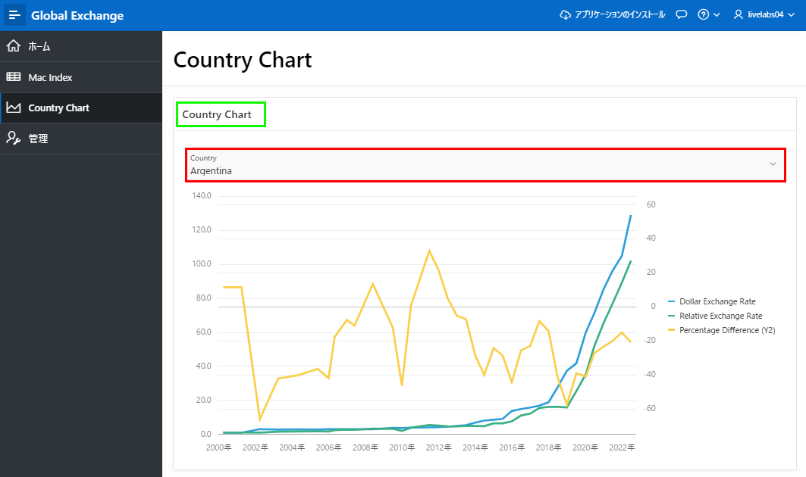
   
3. ランタイム環境を確認すると、リージョン名が非表示になる必要があります。これはライブテンプレートオプションを使用してランタイム環境から行うことができます。

   ランタイム環境で、開発者ツールバーの**クイック編集**をクリックします。
   マウスを上に動かして、チャートの周りに青いアウトラインが表示されるまで移動します。
   チャートリージョンの右上隅にある**レンチ**アイコンをクリックします。

   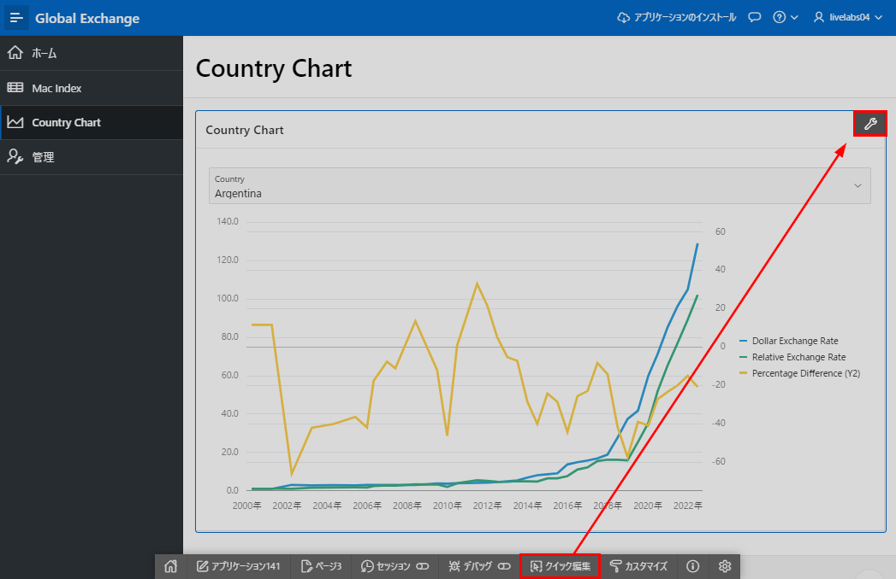
   
4. ライブテンプレートオプションのダイアログで、ヘッダーを**非表示だがアクセス可能**に選択します。
   *注: エンドユーザーが支援技術を使用している場合、リージョン名がアナウンスされます。*
   
   **保存**をクリックします。
   
   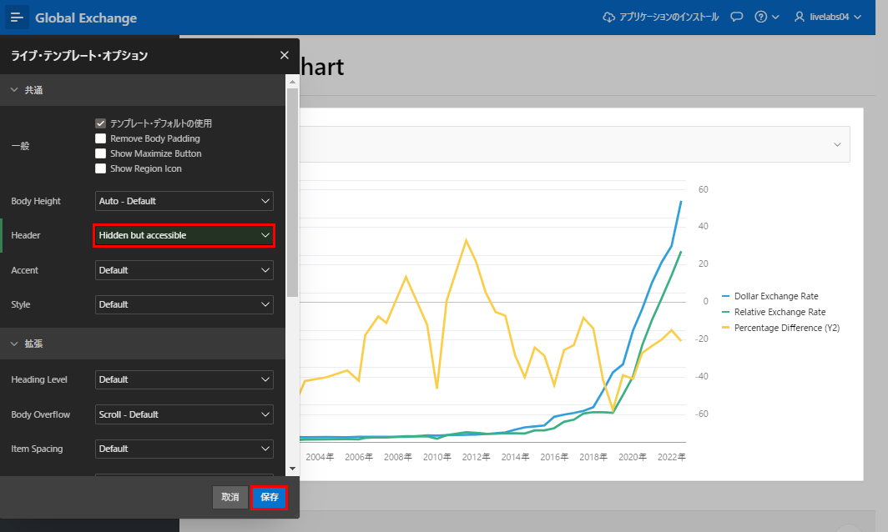
   
5. ランタイム環境で、異なる国を選択します。

   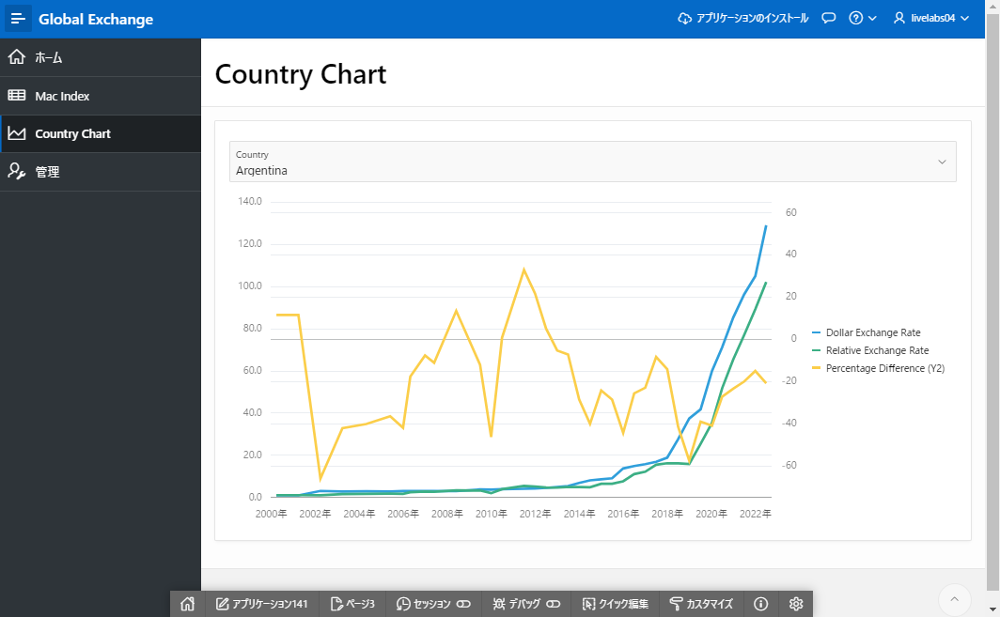
   
## **まとめ**

これでLab 6とワークショップは完了です。このラボでは、アイテムの作成、ダイナミックアクションの定義、ユーザー入力フィールドに基づくリージョンの更新方法を学びました。


## 謝辞

 - **作成者/投稿者** -  Salim Hlayel, Principle Product Manager
 - **投稿者** - Jaden McElvey, Technical Lead - Oracle LiveLabs Intern
 - **最終更新日** - Salim Hlayel, Principle Product Manager, November 2020

