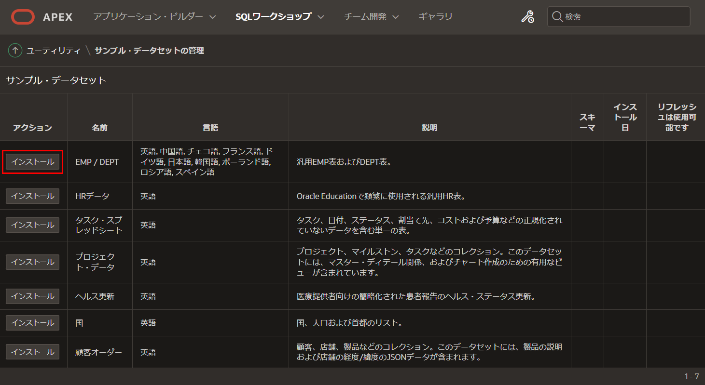
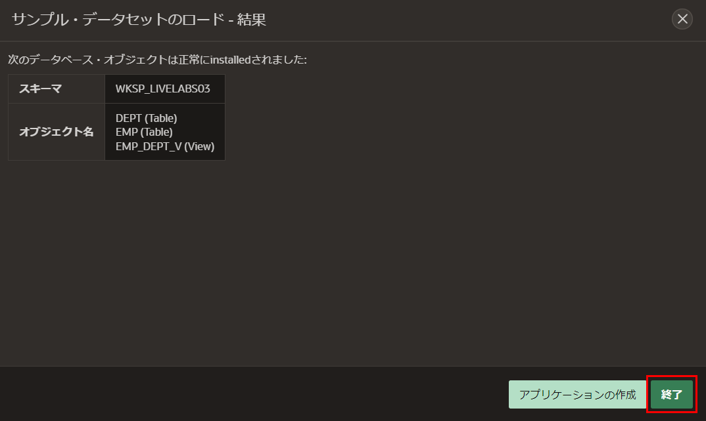
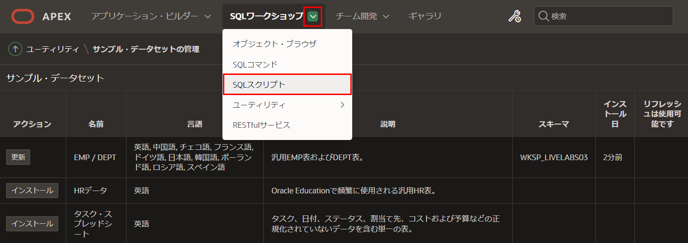
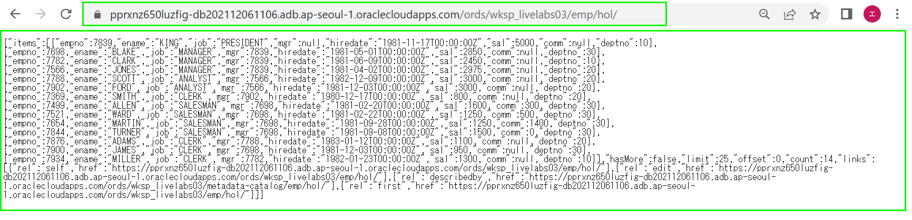

# データベースオブジェクトのREST有効化
## はじめに
このラボでは、スキーマとデータベースオブジェクトをRESTで有効にする方法を学びます。
推定時間: 10分 
### 背景情報
このラボでは、EMPとDEPTテーブルを作成し、それらをRESTで有効にし、同じスキーマ内でアプリケーションを構築します。通常、リモートデータベーススキーマ内のデータベースオブジェクトをRESTで有効にし、それらのRESTエンドポイントを使用して、RESTデータソースを定義します。

APEXアプリケーションでRESTデータソースが定義されると、APEXエンジンはローカルデータベースオブジェクトを呼び出す代わりに、リモートデータベースからデータを検索するRESTエンドポイントを呼び出します。 PUT、POST、DELETEハンドラも定義されている場合、APEXアプリケーションはリモートデータベースオブジェクトで更新、挿入、削除も実行できます。
## タスク1: サンプルテーブルの作成
このラボでは一般的なEMPとDEPTテーブルを使用しています。これらは簡単にサンプルデータセットを使用してインストールできます。
1. ワークスペースにログインします。  
2. メインメニューで、**SQLワークショップ**を選択し、**ユーティリティ**を選択し、**サンプルデータセット**をクリックします。
     
3. サンプルデータセットのリストで、**EMP / DEPT**行の**インストール**をクリックします。
     
4. **サンプルデータセット管理**ダイアログで、**次へ**をクリックします。
     
5. **サンプルデータセットの読み込み**ダイアログで、**データセットのインストール**をクリックします。
     
6. **サンプルデータセットの読み込み - 結果**ダイアログで、**終了**をクリックします。
     注意: テーブルに直接アプリケーションを作成する必要はありません。 
      

## タスク2: データベースオブジェクトのREST有効化  
次のSQLスクリプトを実行すると、スキーマをRESTで有効にし、EMPおよびDEPTテーブルとEMP\_DEPT\_Vビューのモジュールと適切なハンドラーを作成します。

または、SQLワークショップ> RESTfulサービスに移動してスキーマをRESTで有効にすることもできます。次に、SQLワークショップ>オブジェクトブラウザーに移動し、各テーブル/ビューをクリックし、RESTを選択してRESTサービスを定義します。ただし、SQLワークショップ>オブジェクトブラウザーを使用して作成されたハンドラーは、呼び出されるたびにデータディクショナリ検索を利用します。これは、手動で作成されたサービス、特にapex.oracle.comのようなサービスよりも効率的ではありません。 極めて大きなデータディクショナリを持っています。apex.oracle.comには20,000以上のスキーマがあります。

1. メインメニューで、**SQLワークショップ**を選択し、**SQLスクリプト**をクリックします。 

       

2. **SQL Scripts**ページで、**作成**をクリックします。

       

3. **スクリプトエディタ**に次の内容を入力します。
    - **スクリプト名:** **EMPおよびDEPTのRESTエンドポイントの定義**と入力します。
    - **スクリプトエディター:** 次の内容を切り取って貼り付けます。

    ```
    <copy>begin
        ords.enable_schema;
    end;
    /

    begin
    ords.delete_module(
        p_module_name => 'emp.rest' );
    ords.define_module(
        p_module_name => 'emp.rest',
        p_base_path => '/emp/' );

    ords.define_template(
        p_module_name => 'emp.rest',
        p_pattern     => 'hol/' );
    ords.define_template(
        p_module_name => 'emp.rest',
        p_pattern     => 'hol/:empno' );

    ords.define_handler(
        p_module_name => 'emp.rest',
        p_pattern     => 'hol/',
        p_method      => 'GET',
        p_source_type => ords.source_type_collection_feed,
        p_source      => 'select * from emp' );
    ords.define_handler(
        p_module_name => 'emp.rest',
        p_pattern     => 'hol/:empno',
        p_method      => 'GET',
        p_source_type => ords.source_type_collection_item,
        p_source      => 'select * from emp where empno = :empno' );
    ords.define_handler(
        p_module_name => 'emp.rest',
        p_pattern     => 'hol/',
        p_method      => 'POST',
        p_source_type => ords.source_type_plsql,
        p_source      => 'begin insert into emp (empno, ename, job, mgr, hiredate, sal, comm, deptno)
            values (:empno,:ename,:job,:mgr,:hiredate,:sal,:comm,:deptno);:forward_location:=:empno;:status_code:=201;end;' );
    ords.define_handler(
        p_module_name => 'emp.rest',
        p_pattern     => 'hol/:empno',
        p_method      => 'PUT',
        p_source_type => ords.source_type_plsql,
        p_source      => 'begin update emp set ename=:ename, job=:job, mgr=:mgr, hiredate=:hiredate, sal=:sal, comm=:comm, deptno=:deptno
            where empno=:empno; :forward_location:=:empno;:status_code:=200;end;' );
    ords.define_handler(
        p_module_name => 'emp.rest',
        p_pattern     => 'hol/:empno',
        p_method      => 'DELETE',
        p_source_type => ords.source_type_plsql,
        p_source      => 'begin delete emp where empno=:empno;:status_code:=200;htp.p(''{"status":"success"}'');end;' );
    end;
    /

    begin
    ords.delete_module(
        p_module_name => 'dept.rest' );

    ords.define_module(
        p_module_name => 'dept.rest',
        p_base_path => '/dept/' );

    ords.define_template(
        p_module_name => 'dept.rest',
        p_pattern     => 'hol/' );
    ords.define_template(
        p_module_name => 'dept.rest',
        p_pattern     => 'hol/:deptno' );

    ords.define_handler(
        p_module_name => 'dept.rest',
        p_pattern     => 'hol/',
        p_method      => 'GET',
        p_source_type => ords.source_type_collection_feed,
        p_source      => 'select * from dept' );
    ords.define_handler(
        p_module_name => 'dept.rest',
        p_pattern     => 'hol/:deptno',
        p_method      => 'GET',
        p_source_type => ords.source_type_collection_item,
        p_source      => 'select * from dept where deptno = :deptno' );
    ords.define_handler(
        p_module_name => 'dept.rest',
        p_pattern     => 'hol/',
        p_method      => 'POST',
        p_source_type => ords.source_type_plsql,
        p_source      => 'begin insert into dept (deptno, dname, loc)
            values :deptno,:dname,:loc);:forward_location:=:deptno;:status_code:=201;end;' );
    ords.define_handler(
        p_module_name => 'dept.rest',
        p_pattern     => 'hol/:deptno',
        p_method      => 'PUT',
        p_source_type => ords.source_type_plsql,
        p_source      => 'begin update dept set dname=:dname, loc=:loc
            where deptno=:deptno; :forward_location:=:deptno;:status_code:=200;end;' );
    ords.define_handler(
        p_module_name => 'dept.rest',
        p_pattern     => 'hol/:deptno',
        p_method      => 'DELETE',
        p_source_type => ords.source_type_plsql,
        p_source      => 'begin delete dept where deptno=:deptno;:status_code:=200;htp.p(''{"status":"success"}'');end;' );
    end;
    /

    begin
    ords.delete_module(
        p_module_name => 'empdeptv.rest' );

    ords.define_module(
        p_module_name => 'empdeptv.rest',
        p_base_path => '/empdeptv/' );

    ords.define_template(
        p_module_name => 'empdeptv.rest',
        p_pattern     => 'hol/' );
    ords.define_template(
        p_module_name => 'empdeptv.rest',
        p_pattern     => 'hol/:empno' );

    ords.define_handler(
        p_module_name => 'empdeptv.rest',
        p_pattern     => 'hol/',
        p_method      => 'GET',
        p_source_type => ords.source_type_collection_feed,
        p_source      => 'select * from emp_dept_v' );
    ords.define_handler(
        p_module_name => 'empdeptv.rest',
        p_pattern     => 'hol/:empno',
        p_method      => 'GET',
        p_source_type => ords.source_type_collection_item,
        p_source      => 'select * from emp_dept_v where empno = :empno' );
    end;
    /<copy>
    ```
     *注意: スクリプトを次のURLからも切り取って貼り付けることができます。*  [https://www.oracle.com/technetwork/developer-tools/apex/application-express/apex-hol-rest-enable-5478504.txt](https://www.oracle.com/technetwork/developer-tools/apex/application-express/apex-hol-rest-enable-5478504.txt)

    **実行**をクリックします。

    

4. **スクリプトの実行**ページで、**今すぐ実行**をクリックします。
5. 結果は4つのステートメントが成功裏に処理されたことを示すはずです。

     

## タスク3: RESTサービスの確認  

1. メインメニューで、**SQLワークショップ**を選択し、**RESTfulサービス**をクリックします。

       

3. **ORDS RESTful Services**ページで、**Modules**を展開し、**emp.rest**を展開し、**hol/**を展開します。         
     **GET**をクリックします。

     コピー先のクリップボードアイコン(または手動で完全なURLをコピー)をクリックします。

       

4. ブラウザーで新しいタブ/ウィンドウを開き、完全なURLを貼り付けます。このタブを開いたままにするか、後で必要になるためこのURLに注目してください。

       

     *注意: ブラウザーによっては、上記の形式で表示される代わりに生のJSONドキュメントのみが表示される場合があります。*  

## **まとめ**
これでLab 2が完了しました。データベースオブジェクトをRESTで有効にし、必要なすべてのハンドラーを含める方法を知っています。[Lab 3に移動するにはここをクリック](?lab=lab-3-defining-rest-data-sources)。  

## **謝辞**

 - **作成者/投稿者** -  Salim Hlayel, Principal Product Manager
 - **投稿者** - Oracle LiveLabs Team (Arabella Yao, Product Manager Intern | Jaden McElvey, Technical Lead | Jeffrey Malcolm Jr, Intern)
 - **最終更新日** - Ankita Beri ,Product Manager, June 2023
