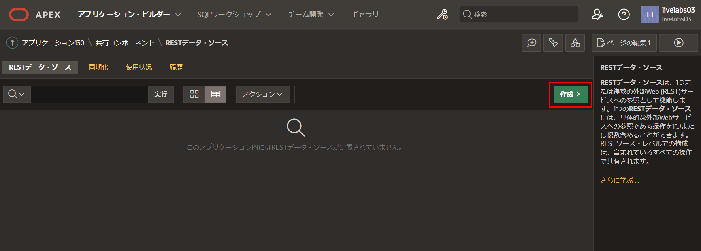
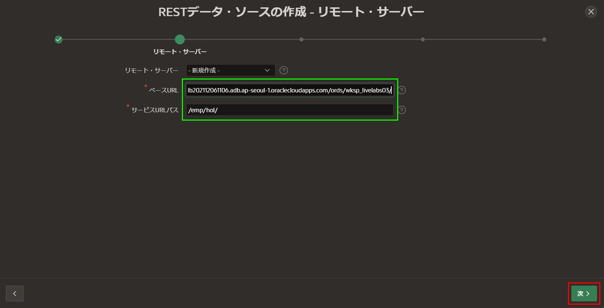
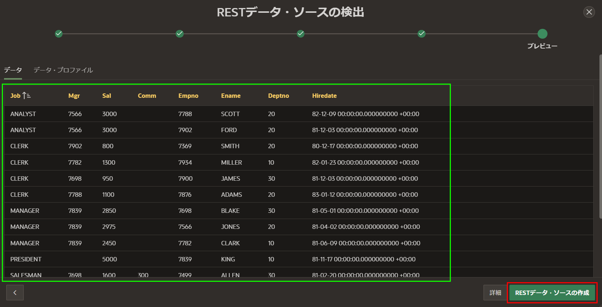
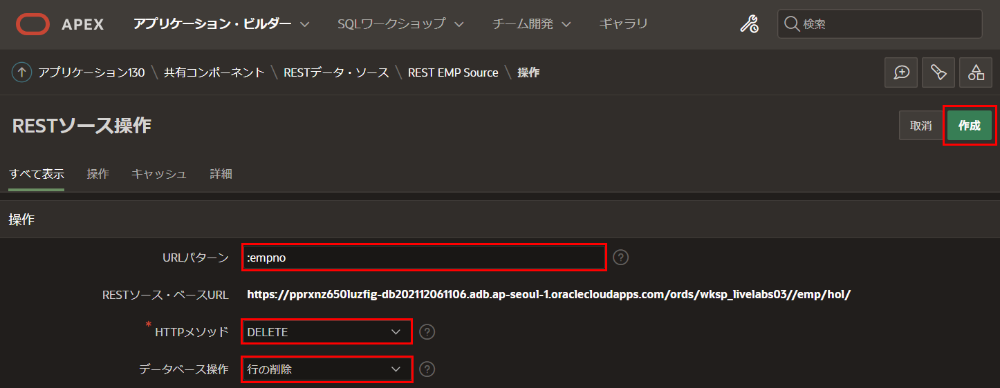
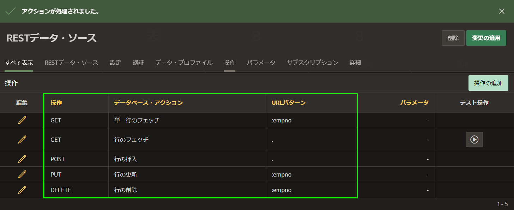

# RESTデータソースの定義

## はじめに
このラボでは、前のラボで作成したREST APIをRESTデータソースの基礎として使用する方法を学びます。  

推定時間: 10分  

## タスク1: アプリの作成   
通常の開発環境では、REST APIを定義したリモートデータベースからログアウトし、アプリケーションを構築するローカルデータベースにログインします。ただし、このラボでは同じワークスペースを使用しているため、ログアウトして再ログインする必要はありません。

1. **APEX Builder**タブまたはウィンドウに戻ります。  

2. **App Builder**ツールバーで、**App Builder**をクリックし、**Create**をクリックします。  

       

3. **Create Application**ページで、**New Application**をクリックします。  

       

4. **Create an Application**ページで、**Name**に**REST Employees**と入力します。  

     **Create Application**をクリックします。  

       

     *注意: この段階では、RESTデータソースをまだ定義していないため、ページを追加する必要はありません。*

## タスク2: EMPのRESTデータソースの追加

1. アプリケーションのホームページで、**Shared Components**をクリックします。  

       

2. **Data Sources**の下で、**REST Data Sources**をクリックします。  

       

3. **REST Data Sources**ページで、**作成**をクリックします。  

       

4. **メソッド**をクリックします。*デフォルト: スクラッチから*

       

5. **RESTデータソースウィザード**で、**General**ダイアログに次の内容を入力します。  
    - **RESTデータソースタイプ:** **ORACLE REST Data Services**を選択します。  
    - **名前:** **REST EMPソース**と入力します。  
    - **URLエンドポイント:** 前にテストしたREST URIを入力します。  

     *注意: URLエンドポイントは、https://{cloud_url}/ords/{{your_schema}}/emp/hol/*のようになります。  

     **次へ**をクリックします。  

     

6. **リモートサーバー**ダイアログで、**ベースURL**と**サービスURLパス**を確認します。  
     **次へ**をクリックします。  

       

7. **認証**ダイアログで、**検出**をクリックします。  

     - **認証が必要:** 無効化/グレーアウト  

         

8. **プレビュー**ダイアログで、**RESTデータソースの作成**をクリックします。 

       

## タスク3: オペレーションの追加
上記で使用したURLエンドポイントの場合、**RESTデータソースの作成**操作により、**GET**および**POST**操作が定義されていることが判明しました。個々の従業員レコードの**GET**、**PUT**、**DELETE**のハンドラーも定義しました。したがって、これらのハンドラーのための追加操作を追加することが重要です。操作を追加しないと、選択レコードの選択、レコードの更新、レコードの削除などの関連機能が含まれない可能性があります。  

1. **REST Data Sources**ページで、**REST EMP Source**をクリックします。  

       

2. **REST EMP Source**ページで、**Add Operation**をクリックします。操作を表示するにはスクロールダウンが必要な場合があります。  

     

3. **RESTソースオペレーション**ページで、次の内容を入力します。  
     - **URLパターン:** **:empno**と入力します(先頭のコロンを含む!)  
     - **HTTPメソッド:** **GET**を選択します。  
     - **データベース操作:** **Fetch single row**を選択します。  

    **作成**をクリックします。  

       

4. **REST EMP Source**ページで、**Add Operation**をクリックします。  

     **RESTソース操作**ページで、次の内容を入力します。  
     - **URLパターン:** **:empno**(先頭のコロンを含む!)と入力します。  
     - **HTTPメソッド:** **PUT**を選択します。  
     - **データベース操作:** **Update row**を選択します。  

   **作成**をクリックします。  

       

5. **REST EMP Source**ページで、**Add Operation**をクリックします。  

     **RESTソース操作**ページで、次の内容を入力します。  
     - **URLパターン:** **:empno**(先頭のコロンを含む!)と入力します。  
     - **HTTPメソッド:** **DELETE**を選択します。  
     - **データベース操作:** **Delete row**を選択します。  

   **作成**をクリックします。  

       
     

## **まとめ**
これでLab 3が完了しました。アプリケーション内でRESTデータソースを定義し、完全なCRUD操作に必要な操作を追加する方法を知っています。[Lab 4に移動するにはここをクリック](?lab=lab-4-creating-pages)。 

## **謝辞**

 - **作成者/投稿者** -  Salim Hlayel, Principle Product Manager
 - **投稿者** - Oracle LiveLabs Team (Arabella Yao, Product Manager Intern | Jaden McElvey, Technical Lead | Jeffrey Malcolm Jr, Intern)
 - **最終更新日** - Ankita Beri, Product Manager, June 2023
