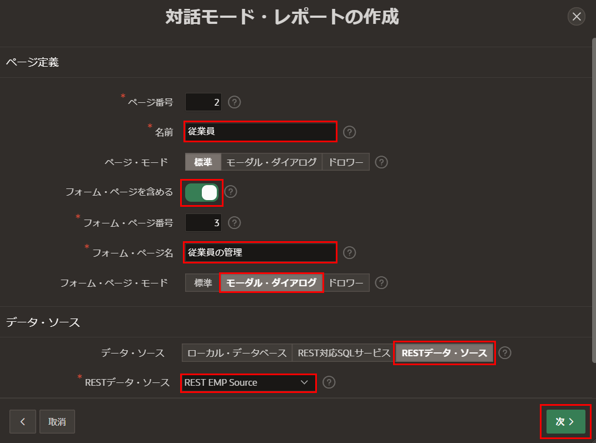
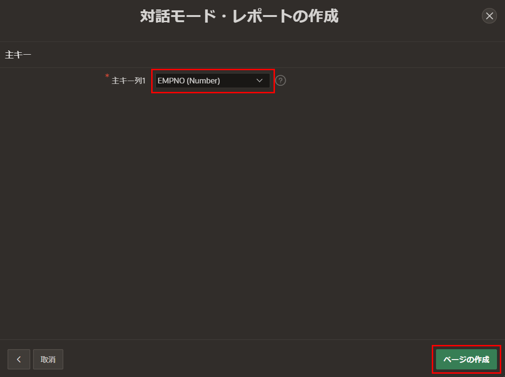
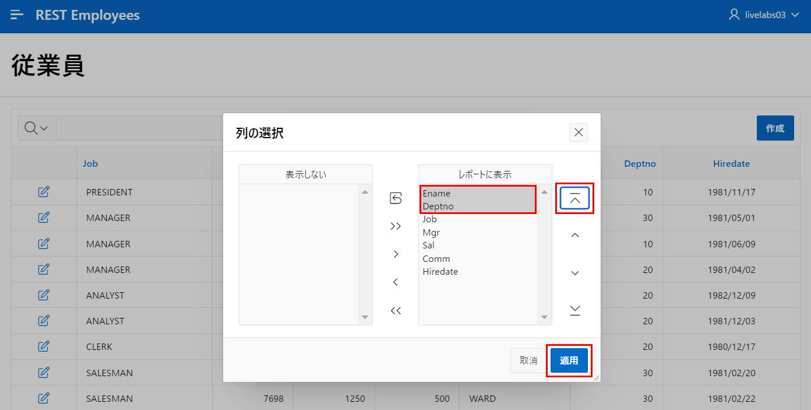
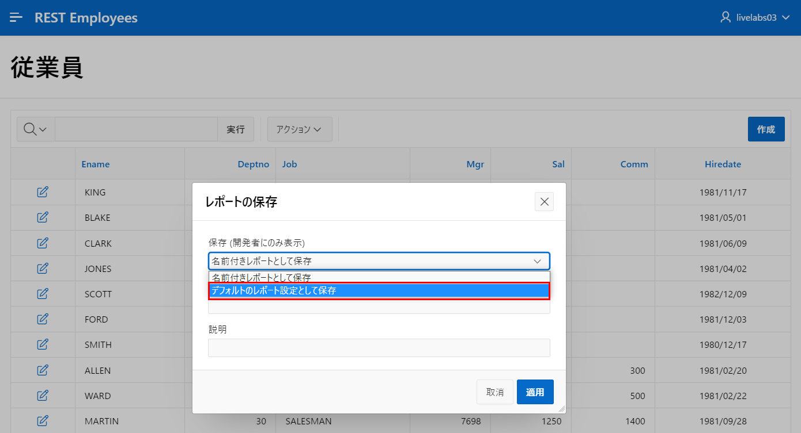
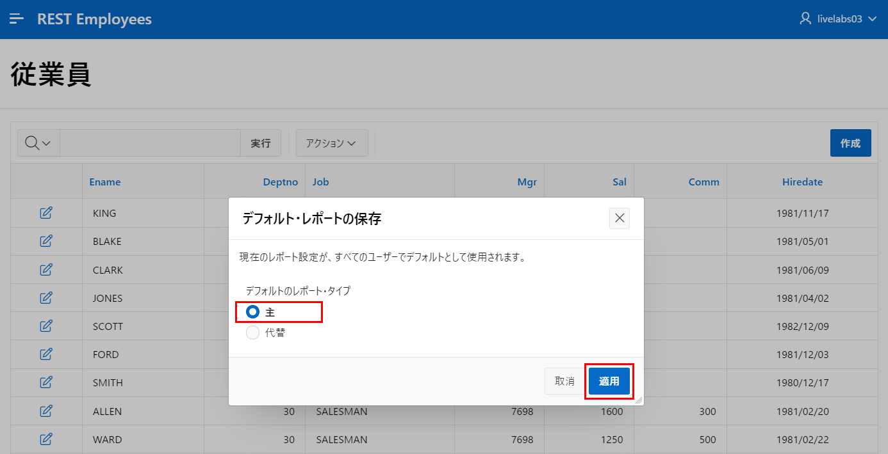
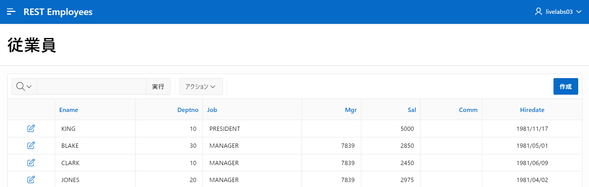
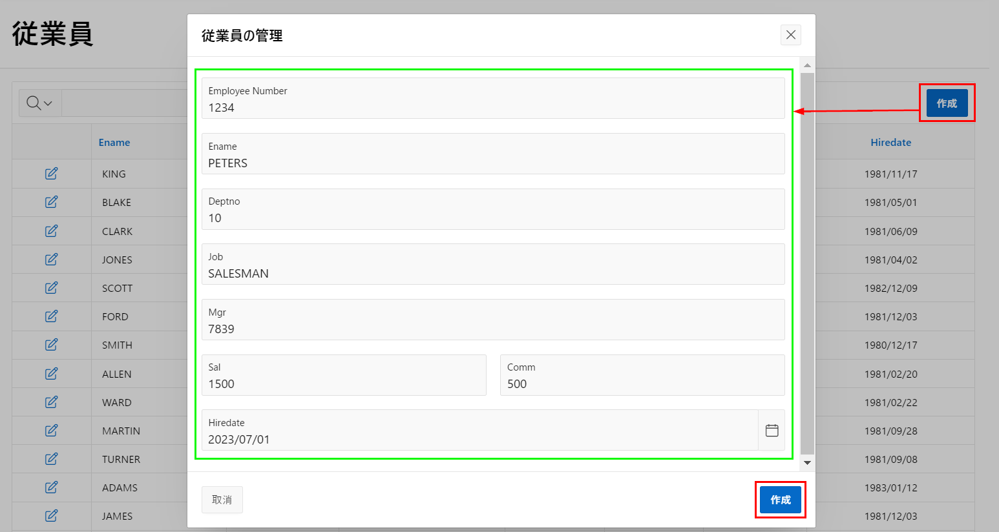
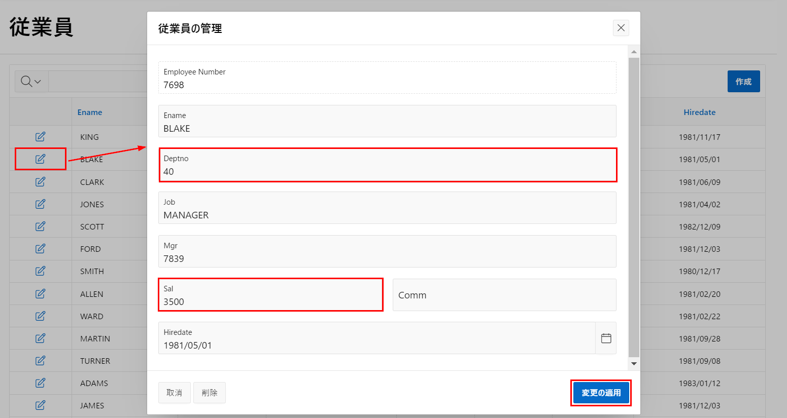

# ページの作成

## はじめに
このラボでは、アプリケーション内のレポートとフォームの作成の基礎としてRESTデータソースを使用する方法を学びます。

推定時間: 15分  

## タスク1: ページ作成ウィザードの使用  

1. アプリケーションのホームページに戻ります。     
     **ページ作成**をクリックします。  

     **ページの作成**ダイアログで、**インタラクティブレポート**をクリックします。  

       

2. **インタラクティブレポート**ダイアログで、**ページ属性**に次の内容を入力します。
     - **名前:** **従業員**と入力します。  
     - **フォームページを含める:** 有効にします。  
     - **フォームページ名:** **従業員の管理**と入力します。  
     - **フォームページモード:** **モーダルダイアログ**をクリックします。  
     - **データソース:** **RESTデータソース**を選択します。  
     - **RESTデータソース:** **REST EMPソース**を選択します。  

     **次へ**をクリックします。  

       

3. **インタラクティブレポート**ダイアログで、**主キーコラム**で**EMPNO(数値)**を選択し、**作成**をクリックします。  

     

## タスク2: レポートの改善
生成されたページの場合、デフォルトの列順序は最適ではありません。列を簡単に並べ替えてレポートのレイアウトを保存できます。  

1. ページデザイナーから、右上の**保存して実行**ボタンをクリックします。  

       

2. **ログインページ**で、ユーザー資格情報を入力します。  
     * **ユーザー名:** `DEMO`  
     * **パスワード:** `SecretPassw0rd `  

3. **従業員**を確認します。  

       

4. **従業員レポート**ページで、**アクション**をクリックし、**列**をクリックします。 

       

5. **Select Columns**ダイアログで、ENAMEとDEPTNOが最初の2つの列になるように列をシャッフルします。列を選択して**Top**矢印を使用します。  
     **適用**をクリックします。  

       

6. レポートレイアウトを保存して、すべてのユーザーにこのように表示されるようにする必要があります。  

     **アクション**をクリックし、**レポート**を選択し、**レポートの保存**をクリックします。  

       

7. **レポートの保存**ダイアログで、**開発者のみに表示される**保存の場合は、**デフォルトのレポート設定として**を選択します。  

       

8. **デフォルトのレポート保存**ダイアログで、**Primary**を選択して**適用**をクリックします。  

     

## タスク3: フォームページの更新
レコードを編集するためのフォームページもいくつか改善が必要です。  

1. 行の編集アイコンをクリックします。  
     フォームページが表示されます。  

     デベロッパーツールバーで、**ページ3の編集**をクリックします。       
     ページデザイナーが現在のページの場合に表示されます。  

       

     *注意: デベロッパーツールバーはApp Builderからアプリを実行する場合にのみ表示されるため、エンドユーザーには表示されません。*  

2. 従業員番号(EMPNO)アイテムは現在隠されています。これはテーブルの主キーとして定義されているためです。ただし、ユーザーはレコードを挿入するときに値を入力できる必要があります。  

     ページデザイナー内で、レンダリングタブ(左パネル)でアイテム**P3\_EMPNO**をクリックします。  

     プロパティエディター(右パネル)で、次の内容を入力します。  

     - **Identification>Type:** **Number Field**を選択します。  
     - **Label>Label:** **Employee Number**と入力します。  

       

3. 従業員番号はテーブルの主キーであるため、既存のレコードを表示する場合にのみ読み取り専用である必要があります。したがって、アイテムを読み取り専用にする必要があります。  

     プロパティエディター(右パネル)で、**P3\_EMPNO**が選択されている場合は、次の内容を入力します。  
     - **Read Only>Type:** **Item is NOT NULL**を選択します。 
     - **Read Only>Item:** **P3\_EMPNO**を選択します。  

        

4. ジョブと名前のアイテムは現在テキストエリアとして定義されていますが、どちらもそれほど大きな値にはなりません。したがって、テキストフィールドに変更する必要があります。  

     レンダリングタブ(左パネル)で、アイテム**P3\_JOB**をクリックします。        
     {Control}キーを押しながら**P3\_NAME**をクリックします。  

     プロパティエディター(右パネル)で、**Identification>Type**で**Text Field**を選択します。  

       

5. アイテムの順序を改善する必要があります。これはレンダリングツリーまたはレイアウトのいずれかでアイテムをドラッグアンドドロップすることで簡単に実現できます。  

     レンダリングツリーで、アイテム**P3\_ENAME**をクリックします。       
     **P3\_ENAME**を**P3\_EMPNO**の下にドラッグします。  

      

6. レンダリングタブ(左パネル)で、アイテム**P3\_DEPTNO**をクリックします。       
     **P3\_DEPTNO**を**P3\_ENAME**の下にドラッグします。  

7. 手数料(COMM)アイテムは給与(SAL)と同じ行に配置する必要があります。  

     レイアウト(中央パネル)で、**P3\_COMM**を選択します。        
     既存のアイテムの右側に大きな暗黄色の箱が表示されるまでアイテムをドロップしないでください。**P3\_SAL**の隣にドラッグします。  

     *注意: 既存のアイテムの右側に大きな暗黄色の箱が表示されるまでアイテムをドロップしないでください。*    

       

8. ツールバーで、**保存**をクリックします。  

       

## タスク4: レコードの挿入  

1. ランタイム環境に戻ります。  

       

2. ブラウザを再読み込みします。

3. **従業員レポート**ページで、**作成**をクリックします。  

     **従業員の管理**ページで、次の内容を入力します。  

     - **従業員番号:** **1234**と入力します。  
     - **エナメ:** **PETERS**と入力します。  
     - **Deptno:** **10**と入力します。  
     - **仕事:** **SALESMAN**と入力します。  
     - **Mgr:** **7839**と入力します。  
     - **給与:** **1500**と入力します。  
     - **手数料:** **500**と入力します。  
     - **雇用日:** 任意の日付を選択します。  

     **作成**をクリックします。  

       

4. **従業員レポート**ページで、新しいレコードを見つけます。  

       

## タスク5: レコードの更新  

1. **従業員レポート**ページで、**BLAKE**を見つけ、編集アイコンをクリックします。  

     **従業員の管理**ダイアログで、次の内容を更新します。  

     - **Deptno:** **40**と入力します。  
     - **Sal:** **3500**と入力します。  

     **変更の適用**をクリックします。  

       

2. **従業員レポート**ページで、BLAKEの**Deptno**と**Sal**を確認します。

## タスク6: レコードの削除  

1. **従業員レポート**ページで、**TURNER**を見つけ、編集アイコンをクリックします。  

     **従業員の管理**ダイアログで、**削除**をクリックします。  
     削除確認ダイアログで、**削除**をクリックします。  

       

2. **従業員レポート**ページで、レコードを確認してTURNERが表示されなくなったことを確認します。  

       

## **まとめ**
これでLab 4が完了しました。RESTエンドポイントを利用してレポートとフォームを開発し、完全なCRUD操作を可能にする方法を知っています。[Lab 5に移動するにはここをクリック](?lab=lab-5-defining-list-values)。

## **謝辞**

 - **作成者/投稿者** -  Salim Hlayel, Principal Product Manager
 - **投稿者** - Oracle LiveLabs Team (Arabella Yao, Product Manager Intern | Jaden McElvey, Technical Lead | Jeffrey Malcolm Jr, Intern)
 - **最終更新日** - Ankita Beri ,Product Manager, June 2023
