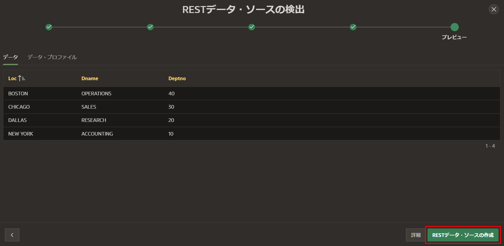
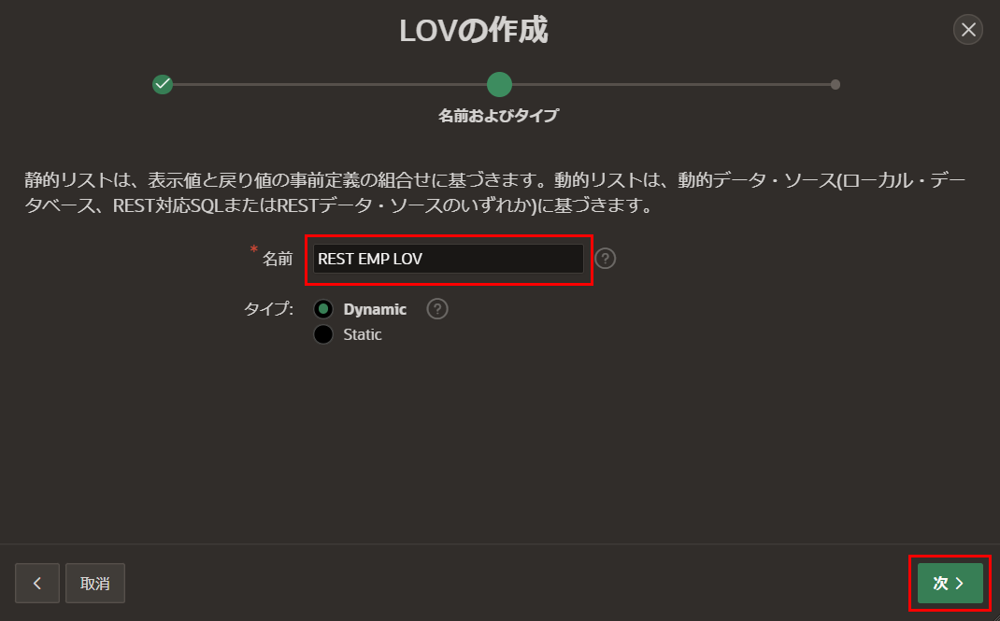
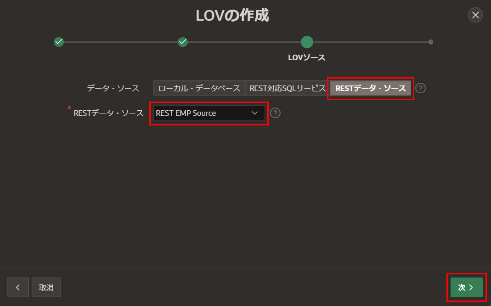
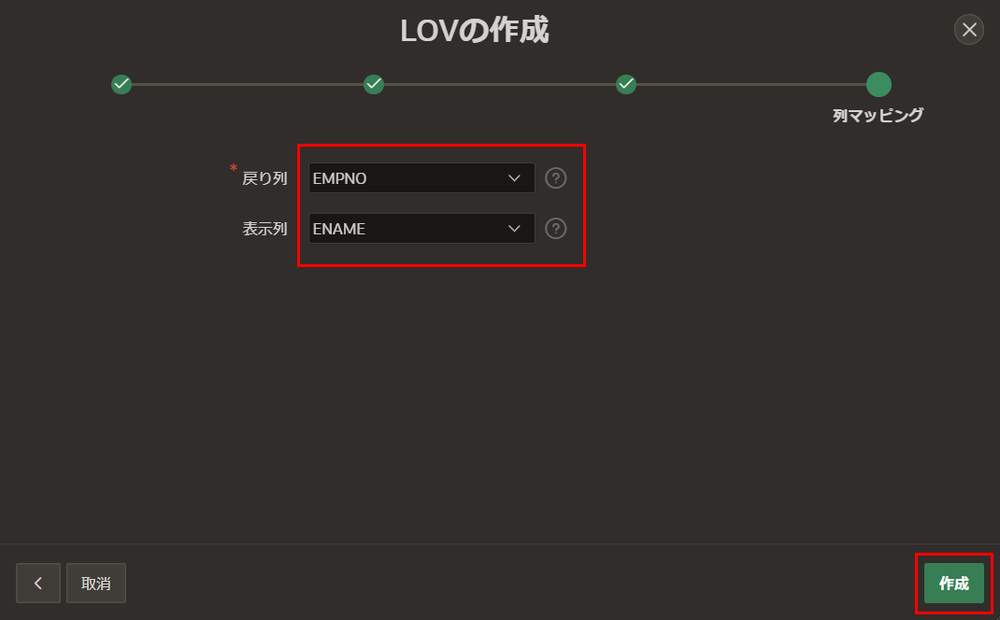
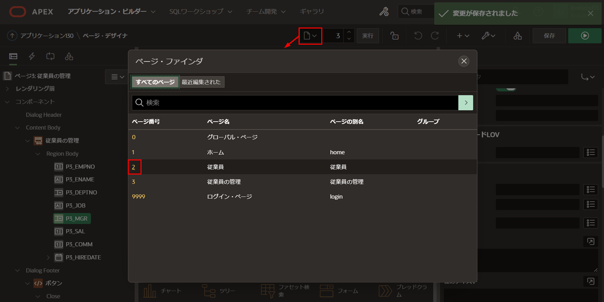
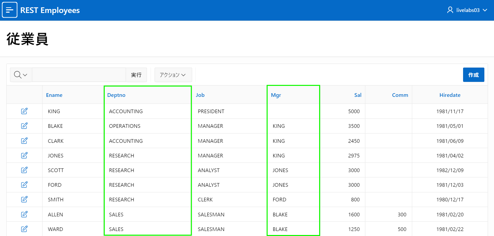
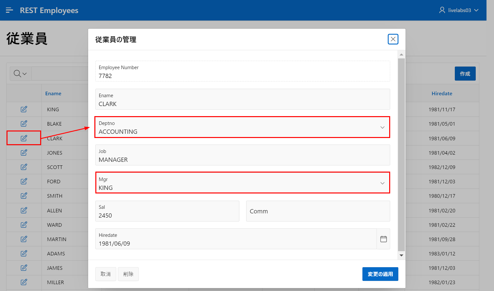

# 値のリストの定義  

## はじめに  
このラボでは、アプリケーション内で使用するためのリストの値の基礎としてRESTデータソースを利用する方法を学びます。  

推定時間: 10分  

### 情報  

最初のワークスペースでスクリプトを実行したときに、EMPとDEPTの両方のテーブルに対するRESTハンドラーを作成しました。すでにEMPテーブルのRESTデータソースを作成しています。DEPTテーブルのRESTデータソースも作成すると、Shared Componentsにそれぞれのリストの値を簡単に定義できます。これらはページ内で表示されるデータを改善し、データ入力と品質を大幅に改善するために利用できます。  

## タスク1: DEPTのRESTデータソースの追加  

1. アプリケーションビルダーに戻ります。  
2. App Builderのホームページに移動します。  
3. アプリケーションを選択します。  
4. アプリケーションのホームページで、**Shared Components**をクリックします。    

       

5. **Shared Components**ページで、**Data Sources**の下の**REST Data Sources**をクリックします。  

     

6. **REST Data Sources**ページで、**作成**をクリックします。  

    **Create REST Data Source - Method**ダイアログで、**次へ**をクリックします。*デフォルト: スクラッチから*  

      

7. **Create REST Data Source - General**ダイアログで、次の内容を入力します。  

    - **RESTデータソースタイプ:** **ORACLE REST Data Services**を選択します。  
    - **名前:** **REST DEPT Source**と入力します。  
    - **URLエンドポイント:** dept.restハンドラーのREST URIを入力します。https://{cloud\_url}/ords/{your_workspace}/**dept**/hol/のようなものです。  

    URLエンドポイントは、Lab 2のステップ3で入力したURLと同じですが、`emp`が`dept`に置き換えられています。  

    **次へ**をクリックします。  

      

8. **リモートサーバー**ダイアログで、**ベースURL**と**サービスURLパス**を確認します。  
     **次へ**をクリックします。  

       

     *注意: 同じベースパスを持つRESTデータソースをすでに定義しているため、REST EMPソースの場合はベースURLを更新できません。*  

9. **認証**ダイアログで、**検出**をクリックします。  
     認証が必要 = いいえ  

10. **プレビュー**ダイアログで、**RESTデータソースの作成**をクリックします。  

     

## タスク2: 値のリストの作成  
リストの値の基礎として使用できるRESTデータソースがあります。  

1. **REST Data Sources**ページから、パンくずリストで、**Shared Components**をクリックします。  

       

2. **Shared Components**ページで、**Other Components**の下の**List of Values**をクリックします。  

       

3. **List of Values**ページで、**作成**をクリックします。  

     **Create List of Values - Source**ダイアログで、**次へ**をクリックします。       
     *デフォルト: スクラッチから*  

       

4. **名前とタイプ**ダイアログで、**名前**に**REST EMP LOV**と入力します。       
     **次へ**をクリックします。  

       

5. **リストの値のソース**ダイアログで、次の内容を入力します。  

     - **データソース:** **RESTデータソース**をクリックします。  
     - **RESTデータソース:** **REST EMP Source**を選択します。  

     **次へ**をクリックします。  

     

6. **列のマッピング**ダイアログで、次の内容を入力します。  

     - **返還列:** **EMPNO**を選択します。  
     - **表示列:** **ENAME**を選択します。  

     **作成**をクリックします。  

       

7. 部署のリストの値を作成するには、上記と同じです。  

     **List of Values**ページで、**作成**をクリックします。       
     **Create List of Values - Source**ダイアログで、**次へ**をクリックします。       
     *デフォルト: スクラッチから*  

8. **名前とタイプ**ダイアログで、**名前**に**REST DEPT LOV**と入力します。       
     **次へ**をクリックします。  

9. **リストの値のソース**ダイアログで、次の内容を入力します。  

     - **データソース:** **RESTデータソース**をクリックします。  
     - **RESTデータソース:** **REST DEPT Source**を選択します。  

     **次へ**をクリックします。  

10. **列のマッピング**ダイアログで、次の内容を入力します。  

     - **返還列:** **DEPTNO**を選択します。  
     - **表示列:** **DNAME**を選択します。  

     **作成**をクリックします。

## タスク3: フォームの更新  
従業員の管理フォームページをよく確認すると、部署番号(DEPTNO)と管理者(MGR)のアイテムが数値のアイテムであり、エンドユーザーに名前のリストから選択する代わりに関連する数値を知っていることを期待していることがわかります。  

1. **Lists of Values**ページから、アプリケーションビルダーのツールバーで、**ページ3の編集**をクリックします。  

       

2. ページデザイナーから、レンダリングツリー(左パネル)で**P3_DEPTNO**をクリックします。  

     プロパティエディター(右パネル)で、次の内容を入力します。  

     - **Identification>Type:** **Select List**を選択します。  
     - **List of Values>Type:** **Shared Component**を選択します。  
     - **List of Values>List of Values:** **REST DEPT LOV**を選択します。  
     - **List of Values>Display Extra Values:** チェックを外します。  

       

3. ページデザイナーから、レンダリングツリー(左パネル)で**P3_MGR**をクリックします。  

     プロパティエディター(右パネル)で、次の内容を入力します。  

     - **Identification>Type:** **Select List**を選択します。  
     - **List of Values>Type:** **Shared Component**を選択します。  
     - **List of Values>List of Values:** **REST EMP LOV**を選択します。  
     - **List of Values>Display Extra Values:** チェックを外します。  

4. ページデザイナーツールバーで、**保存**をクリックします。  

     

## タスク4: レポートの更新  
同様に、従業員レポートには名前ではなく数値が表示されます。  

1. ページデザイナーでページ2に移動します。       
     ページデザイナーツールバーで、ページセレクターまたはページ番号の横の下矢印を使用します。  

       

2. これはレポートであるため、アイテムではなく列を修正する必要があります。  

     レンダリングツリー(左パネル)で、列をクリックし、**MGR**をクリックします。  

     プロパティエディター(右パネル)で、次の内容を入力します。  

     - **タイプ:** **プレーンテキスト(リストの値に基づく)**を選択します。  
     - **リストの値:** **REST EMP LOV**を選択します。  
     - **ヘッディング>配置:** **左寄せ**をクリックします。  
     - **レイアウト>列の配置:** **左寄せ**をクリックします。  

       

3. レンダリングツリー(左パネル)で、列の下の**DEPTNO**をクリックします。  

     プロパティエディター(右パネル)で、次の内容を入力します。  

     - **タイプ:** **プレーンテキスト(リストの値に基づく)**を選択します。  
     - **リストの値:** **REST DEPT LOV**を選択します。  
     - **ヘッディング>配置:** **左寄せ**をクリックします。  
     - **レイアウト>列の配置:** **左寄せ**をクリックします。  

     **保存**をクリックします。   

4. アプリケーションのランタイム環境に移動します。  
5. ブラウザを更新します。  

       

6. 任意のレコードの編集アイコンをクリックします。       
     部署を選択します。        
     管理者を選択します。  

       

## **まとめ**  
これでLab 5とワークショップが完了しました。RESTエンドポイントに対してリストの値を定義し、アプリケーション内でそれらを利用する方法を知っています。  

## さらに詳しく - 役立つリンク

- [APEX on Autonomous](https://apex.oracle.com/autonomous)  
- [APEXコラテラル](https://apex.oracle.com)  
- [チュートリアル](https://apex.oracle.com/en/learn/tutorials)  
- [コミュニティ](https://apex.oracle.com/community)  
- [外部サイト+ Slack](http://apex.world)

## **謝辞**

 - **作成者/投稿者** -  Salim Hlayel, Principal Product Manager
 - **投稿者** - Oracle LiveLabs Team (Arabella Yao, Product Manager Intern | Jaden McElvey, Technical Lead | Jeffrey Malcolm Jr, Intern)
 - **最終更新日** - Ankita Beri ,Product Manager, June 2023
